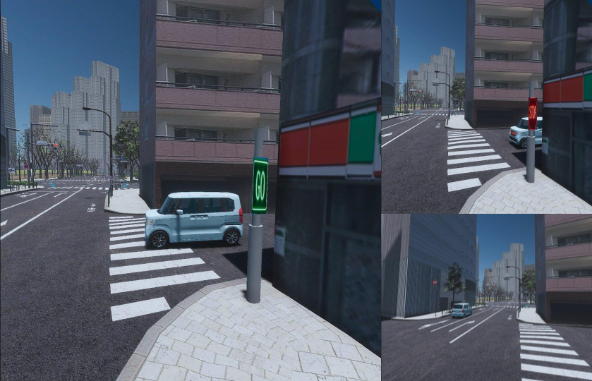
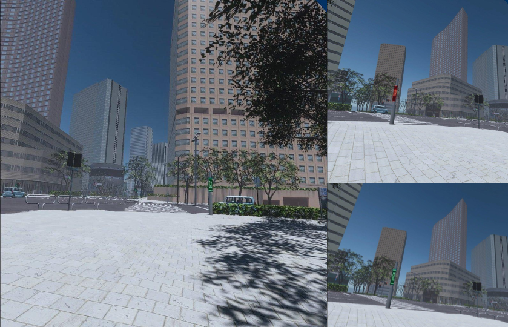
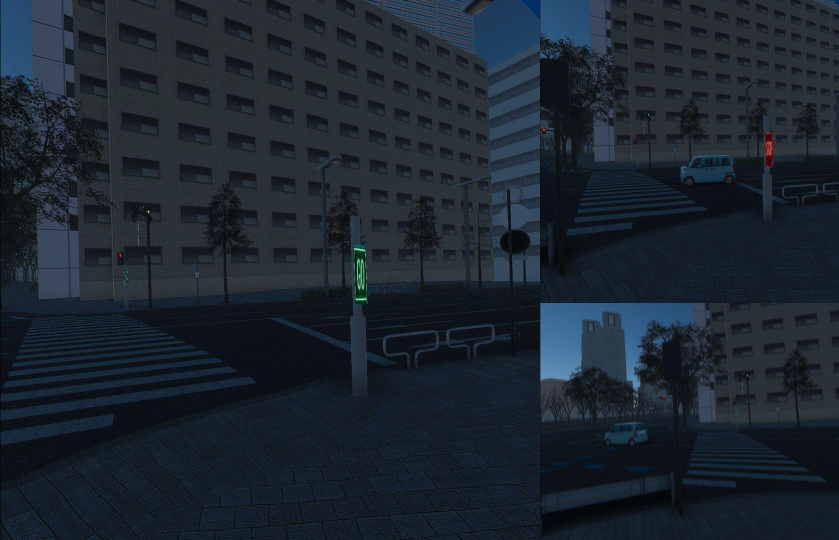

# Smartpole-VR-AWSIM

This is a fork of [tier4/AWSIM](https://tier4.github.io/AWSIM/GettingStarted/QuickStartDemo/) adapted to support **VR-based simulations of Smartpole Interaction Units (SPIUs)**.  
The goal is to simulate infrastructure-to-human interaction experiences and evaluate **perceived safety, clarity, and timing of eHMIs** (external Human-Machine Interfaces) provided by SPIUs in urban environments.

 
*VR scenarios simulating infrastructure-to-human interactions with smartpoles, including blind spots, intersections, and pedestrian crossings*

---

## 🔍 Purpose

This project extends AWSIM to enable:
- **Immersive first-person VR experiences** of smartpole-based external HMI signals.
- **Human-in-the-loop evaluations** for safety perception and usability testing.
- **Scenario experimentation** using ROS 2-based simulation, Autoware compatibility, and Unity rendering.

Ideal for researchers and developers working on:
- Infrastructure-based eHMI interactions with pedestrians using VR
- Collective perception with different road participants
- Smart city and V2X deployment studies
- Safety evaluation of infrastructure HMI systems

---

## 🌟 Features

- Unity-based 3D simulation with VR support
- Scenarios involving **smartpole interactions**, traffic lights, and vulnerable road users
- AWSIM itself runs on Ubuntu 22.04 and Windows 10/11, but VR scenarios are mainly supported on Windows 10/11
- Forked and compatible with the latest [Autoware](https://github.com/autowarefoundation/autoware)
- Fully integrated with ROS 2 communication
- VR Scenarios tested on Oculus Quest 2 and 3

---

## 🚀 Getting Started

Start with the base AWSIM tutorial:

👉 [Quick Start Demo](https://tier4.github.io/AWSIM/GettingStarted/QuickStartDemo/)

Then, check out the SPIU-specific VR simulation guide (coming soon).

### Available VR Scenarios

The project includes four specialized VR scenarios located in `Assets/AWSIM/Scenes/Main/`:

1. **BlindSpotVRScenario**
   - Focuses on simulating blind spot situations where pedestrians might be hidden from vehicle drivers
   - Tests how smartpole-based eHMIs can help prevent accidents in areas with limited visibility
   - Includes buildings, vehicles, and pedestrians positioned to create blind spot situations

*Blind Spot VR Scenario showing smartpole eHMIs helping with visibility in occluded areas*

2. **FourWayIntersectionVRScenario**
   - Complex urban intersection simulation
   - Tests smartpole interactions in a typical four-way intersection setting
   - Includes traffic lights, multiple lanes, and various road users (pedestrians, vehicles, cyclists)
   - Perfect for evaluating how eHMIs can improve safety and communication at busy intersections

*Four Way Intersection VR Scenario demonstrating smartpole eHMIs at a complex urban intersection*

3. **DeliveryRobotVRScenario**
   - Focuses on interactions between pedestrians and delivery robots
   - Tests how smartpole-based eHMIs can facilitate safe coexistence between pedestrians and autonomous delivery robots
   - Includes sidewalks, delivery robots, and pedestrian paths

*Delivery Robot VR Scenario showing interactions between pedestrians and autonomous delivery robots*

4. **NightTimeVRScenario**
   - Nighttime version of the simulation
   - Tests how eHMIs perform in low-light conditions
   - Includes appropriate lighting conditions and nighttime-specific challenges
   - Important for evaluating the visibility and effectiveness of eHMIs during dark hours

*Night Time VR Scenario showing smartpole eHMIs in low-light conditions*

Each scenario is designed to test different aspects of smartpole-based eHMIs:
- Different lighting conditions (day/night)
- Various traffic situations (intersections, blind spots)
- Different types of road users (pedestrians, vehicles, delivery robots)
- Various environmental conditions (visibility, traffic density)

These scenarios work together to provide a comprehensive testing environment for evaluating:
- Safety perception
- Clarity of communication
- Timing of eHMI signals
- Effectiveness in different real-world situations

### Running VR Simulations on Oculus Quest

To run the VR scenarios on Oculus Quest:

1. **Prerequisites**
   - Windows PC
   - Oculus Quest 2 or newer
   - USB-C cable for PC connection
   - Oculus Link software installed

2. **Setup Steps**
   - Connect your Oculus Quest to your PC using the USB-C cable
   - Enable Oculus Link in your Quest settings
   - Open the project in Unity
   - Select your desired VR scenario from `Assets/AWSIM/Scenes/Main/`
   - Click the Play button in Unity

3. **Controls**
   - Move your head to see the different directions in the scene

4. **Performance Tips**
   - Ensure your PC meets the minimum VR requirements
   - Close unnecessary background applications
   - Adjust graphics settings in Unity if needed
   - Use a high-quality USB-C cable for optimal performance

---

## 📚 Documentation

- [AWSIM Docs](https://tier4.github.io/AWSIM/)
- SPIU-VR Extensions (TBD)

---

## 📄 License

This repository inherits the AWSIM license:
- **Code**: Apache 2.0
- **Assets**: CC BY-NC

See [LICENSE](./LICENSE) for details.

---

## 📬 Contact

日本語/English OK  
Email: TBD  
Discord: TBD  
Twitter: TBD

---

*Smartpole-VR-AWSIM is an experimental extension for human-centered smart infrastructure research. Contributions are welcome!*
