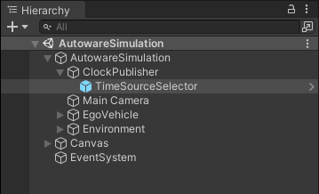
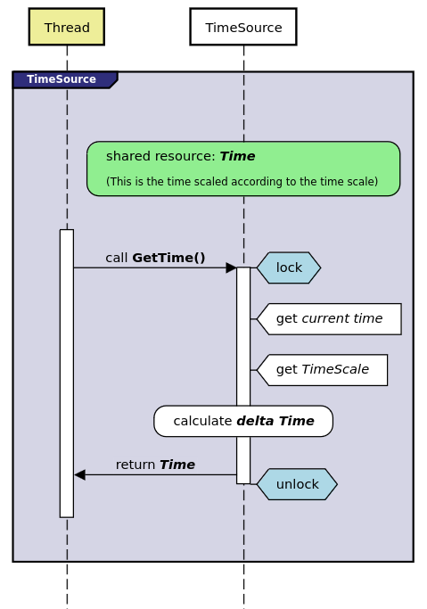

## Introduction

`ClockPublisher` allows the publication of the simulation time from the clock operating within AWSIM. The current time is retrived from a `TimeSource` object via the `SimulatorROS2Node`. The AWSIM provides convenient method for selecting the appropriate time source type as well as the flexibility to implement custom `TimeSources` tailored to specific user requirements.

## Setup

To enable the publication of the current time during simulation execution, `ClockPublisher` must be included as a component within the scene. Moreover, to allow the `TimeSource` to be set or changed, the `TimeSourceSelector` object must also be present in the active scene.

#### Selecting Time Source

The desired `TimeSource` can be selected in two ways:

- **Inspector Selection:** `TimeSource` type can be conveniently choosen directly from the editor interface.

- **JSON Configuration File:** Alternatively, the `TimeSource` type can be specified in the JSON configuration file via the _TimeSource_ field. The supported values for this field can be found in the [list of available time sources](#list-of-time-sources) in the _"String Value for JSON Config"_ column.

#### List of Time Sources

| Type | String Value for JSON Config | Driven by | Start Value | Affected by Time Scale | Remarks |
|:-|:-|:-|:-|:-|:-|
| UNITY | unity | UnityEngine.Time | 0 | yes | |
| SS2 | ss2 | externally | depends on external source | no | used by the [scenario simulator v2](../../ScenarioSimulation/PreparingTheConnectionBetweenAWSIMAndScenarioSimulator/) |
| DOTNET_SYSTEM | system | System.DateTime | UNIX epoch| yes| starts with UNIX epoch time and progresses with System.DateTime scaled by AWSIM time scale |
| DOTNET_SIMULATION | simulation | System.DateTime | 0 | yes | starts with zero value and progresses with System.DateTime scaled by AWSIM time scale |
| ROS2 | ros2 | ROS2.Clock | UNIX epoch (by default)| no | uses ROS 2 time |

## Architecture

The `ClockPublisher` operates within a dedicated thread called the _'Clock'_ thread. This design choice offers significant advantages by freeing the publishing process from the constraints imposed by [fixed update limits](../../ROS2/ROS2ForUnity/index.md#upper-limit-to-publish-rate). As a result, `ClockPublisher` is able to consistently publish time at a high rate, ensuring stability and accuracy.

### Accessing Time Source

Running the clock publisher in a dedicated thread introduced the challenge of accessing shared resources by different threads. In our case, the _Main Thread_ and _Clock Thread_ compete for `TimeSoruce` resources. The diagram below illustrates this concurrent behaviour, with two distinct threads vying for access to the `TimeSource`:

- **Main Thread**: included publishing message by sensors (on the diagram blueish region labeled sensor loop),
- **Clock Thread**: included clock publisher (on the diagram blueish region labeled clock loop).

Given multiple sensors, each with its own publishing frequency, alongside a clock running at 100Hz, there is a notable competition for `TimeSource` resources. In such cases, it becomes imperative for the `TimeSource` class to be thread-safe.

### Thread-Safe Time Source

The `TimeSource` synchronization mechanism employs a mutex to lock the necessary resource for the current thread. The sequence of actions undertaken each time the `GetTime()` method is called involves:

- acquiring the lock,
- getting the current time, e.g. system time since epoch, _(this may be different for each type of time source)_,
- obtaining the current simulation time-scale,
- calculating the delta time since previous call, influenced by the time scale,
- returning the current time,
- releasing the lock.

### Extensions

There are two additional classes used to synchronise the _UnityEngine_ `TimeAsDouble` and `TimeScale` values between threads:

- `TimeScaleProvider`: facilitates the synchronisation of the simulation time scale value across threads,
- `TimeAsDoubleProvider`: provides access to the _UnityEngine_ `TimeAsDouble` to the threads other than the main thread.