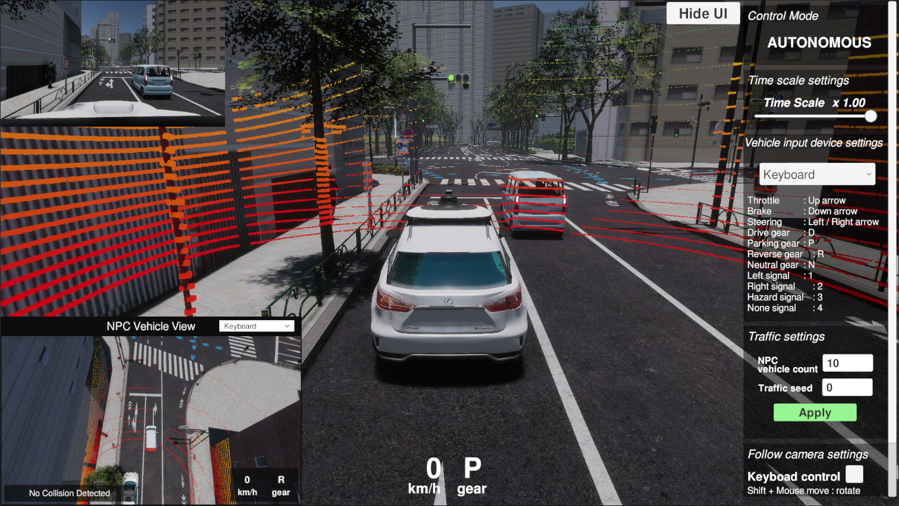
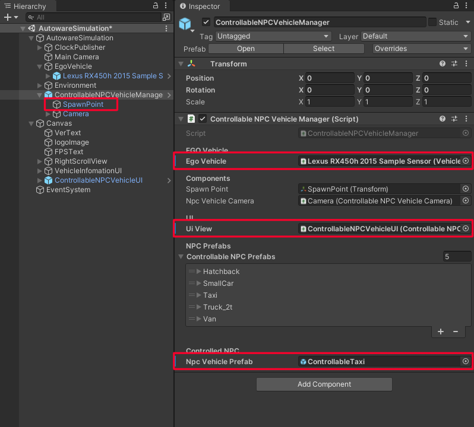

The ControllableNPC feature allows the user to control a NPC vehicle, when EGO is in Autonomous mode. The user can set the type of NPC vehicle to control and the spawn location of this vehicle. In addition, a dedicated UI view shows the controlled NPC from a bird's-eye view. 



## Prefabs

There are two prefabs for this feature:

- `ControllableNPCVehicleManager.prefab`
- `ControllableNPCVehicleUI.prefab` 

These prefabs should be added to the *Unity* scene and they are located at:
```
Assets/AWSIM/Prefabs/ControllableNPCs/*
```

## Components

The main components for this feature are as follows:

- [`ControllableNPCVehicleManager`](#controllablenpcvehiclemanager)

    It is the manager component and it is meant to be placed on the *Unity* scene. It handles all elements required by the controllable NPC vehicle, including spawning the selected vehicle, and initializing its camera view. Additionally, it serves as an intermediary between the vehicle object and the `ControllableNPCVehicleUI`, facilitating tasks such as retrieving collision information and passing it to the UI view.
    
- `ControllableNPCVehicleUI` 
  
    This component displays the UI for controllable NPC vehicle. The UI view includes:

    - a top-down camera view of the controlled vehicle,
    - an info about current speed and gear shift of controlled vehicle,
    - an info about collisions with other vehicles,
    - a dropdown menu to select the input device.

### ControllableNPCVehicleManager

`ControllableNPCVehicleManager` requires configuration steps before use. There are four items to look at:

- `EGO Vehicle` - must be assigned to the current EGO vehicle.
- `UI View` - must be assigned to the `ControllableNPCVehicleUI` component.
- `NPC Vehicle Prefab` - specifies which controllable NPC vehicle will be spawned. Select one prefab from the list of available [`controllable NPC vehicles`](../Vehicles/index.md#prefabs). _It can also be specified in the JSON configuration file._
- `SpawnPoint` - specifies the location where a controllable NPC vehicle will be spawned. Move the SpawnPoint gameobject to desired position and rotation. _It can also be specified in the JSON configuration file._



#### JSON Configuration

The `NPC Vehicle Prefab` and `SpawnPoint` can also be specified in JSON file. The `ControllableNpc` field must be present in the JSON file with the members:

- "Name": name of the prefab to be spawned,
- “Position” : initial location of the spawned prefab,
- “EulerAngles”: initial rotation of the spawned prefab.

!!! note "JSON configuration"
    The JSON configuration is loaded on the Awake() method, so it overrides the values in `ControllableNPCVehicleManager`

