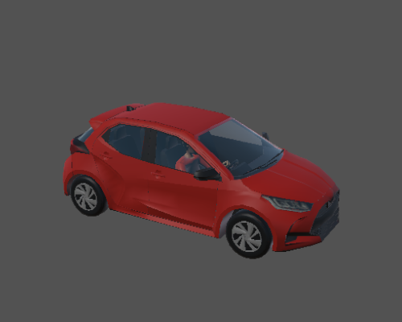
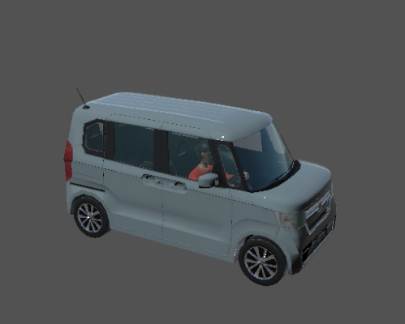
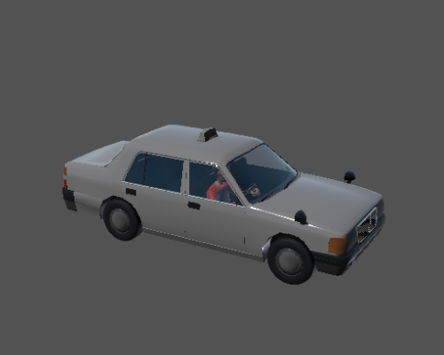
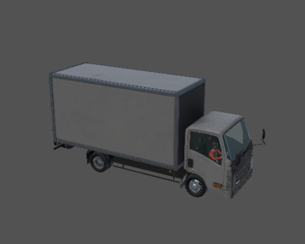
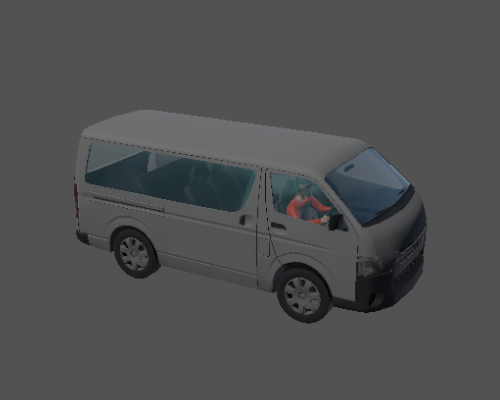
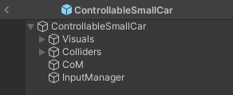
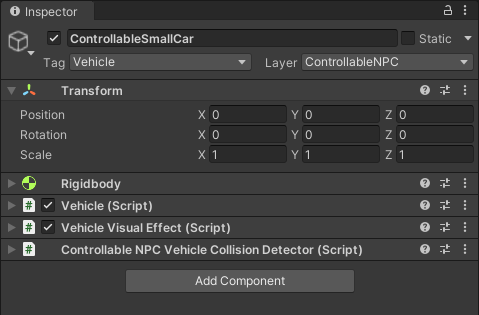
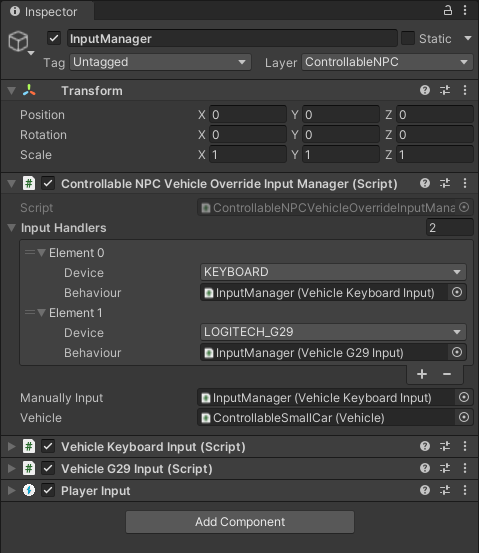

#　ControllableNPC Vehicle

## Introduction

`ControllableNPCVehicle` is a non-EGO vehicle that can be controlled by the user.

## Prefabs
Prefabs can be found under the following path:

```
Assets/AWSIM/Prefabs/ControllableNPCs/Vehicles/*
```

The table shows the available prefabs of the vehicles:

|              |        Hatchback         |         SmallCar         |           Taxi           |          Truck           |           Van            |
| :----------: | :----------------------: | :----------------------: | :----------------------: | :----------------------: | :----------------------: |
| *Appearance* |  |  |  |  |  |
|   *Prefab*   |    `ControllableHatchback.prefab`    |    `ControllableSmallCar.prefab`     |     `ControllableTaxi.prefab`     |    `ControllableTruck_2t.prefab`     |       `ControllableVan.prefab`       |
| *Name for JSON* | Hatchback | SmallCar | Taxi | Truck_2t | Van |


_ControllableNPCVehicle_ prefab has the following content:



It contains:

- Visuals - collection of visual elements of the vehicle,
- Colliders - collection of colliders of the vehicle, such as body mesh collider and wheels colliders,
- CoM - center of mass used by rigidbody,
- InputManager - object with [`ControllableNPCVehicleOverrideInputManager`](#controllablenpcvehicle-overrideinputmanager)

## Components

The controllable NPC vehicle uses some functionality of the EGO vehicle. Therefore, the prefab composition and included components are similar to the EGO vehicle and they are as follows:

- `Vehicle` script - provides the ability to set the acceleration of the vehicle and the steering angle of its wheels. It is the same as the [Vehicle script](../../Vehicle/EgoVehicle/index.md#vehicle-script) attached to EGO vehicle.
- `VehicleVisualEffect` script - provides the ability to simulate vehicle lights, such as turn signals, brake lights, and hazard light. It is the same as the [Vehicle Visual Effect script](../../Vehicle/EgoVehicle/index.md#vehicle-visual-effect-script) attached to EGO vehicle.
- `ControllableNPCVehicleCollisionDetector` script - detects when the controllable NPC vehicle collides with other objects, such as other vehicle.



!!! note "Controllable NPC Vehicle"
    Controllable NPC vehicle does not contain any sensors and it does not support autonomous mode.

## ControllableNPCVehicle OverrideInputManager

This component collects input data from a selected input device, such as the keyboard, and applies it to the `Vehicle` script. It supports input devices such as: the keyboard and Logitech G29. [AWSIM supported input devices](../../Vehicle/VehicleInput/index.md#awsim-supports-these-device-inputs)




