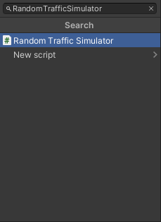
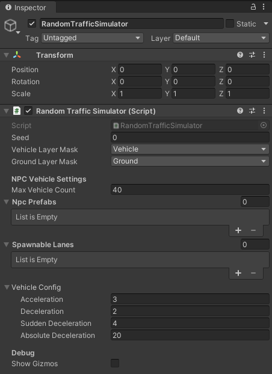
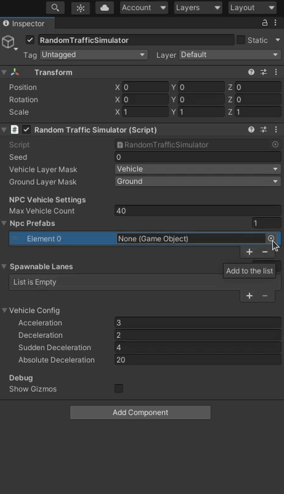
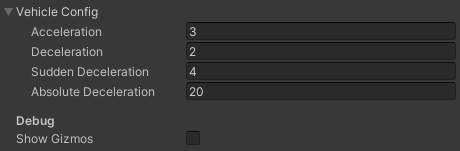

To add a Random Traffic to your scene you need the Random Traffic Simulator Script.

1. Create a new *Game Object* as a child of `Environment` and call it `RandomTrafficSimulator`.

    

1. Click a button `Add Component` in the `Inspector` to add a script.

    

1. A small window should pop-up.
Search for `RandomTrafficSimulator` script and add it by double clicking it or by pressing enter.

    

## Basic Configuration
After clicking on the newly created `RandomTrafficSimulator` object in the Scene tree you should see something like this in the `Inspector` view.

Random Traffic Simulator, as the name suggests, generates traffic based on random numbers.
To replicate situations you can set a specific [seed](https://en.wikipedia.org/wiki/Random_seed).

You can also set `Vehicle Layer Mask` and `Ground Layer Mask`.
It is important to set these layers correctly, as they are a base for vehicle physics.
If set incorrectly the vehicles may fall through the ground into the infinity.

## Add NPCVehicles
Random Traffic Simulator Script moves, spawns and despawns vehicles based on the configuration.
These settings can to be adjusted to your preference.

1. Setting Max Vehicle Count.

    This parameter sets a limit on how many vehicles can be added to the scene at one time.

2. NPC Prefabs

    These are models of vehicles that should be spawned on the scene, to add NPC Prefabs please follow these steps:

    1. To do this click on the "+" sign and in the new list element at the bottom and click on the small icon on the right to select a prefab.

        <!--  -->

    2. Change to the `Assets` tab in the small windows that popped-up.

        <!--  -->

    3. Search for the Vehicle prefab you want to add, e.g. `Hatchback`.

        <!--  -->

    

    Available NPC prefabs are shown in the [NPC Vehicle section](../../../../../Components/Traffic/NPCs/Vehicle/).

    !!! tip "Control NPC Vehicle spawning"
        Random Traffic Simulator Script will **on random** select one prefab from `Npc Prefabs` list every time when there  are not enough vehicles on the scene (the number of vehicles on the scene is smaller than the number specified in the `Max Vehicle Count` field).
        
        You can control the odds of selecting one vehicle prefab over another by adding more than one instance of the same prefab to this list.

## Add spawnable lanes
Spawnable lanes are the lanes on which new vehicles can be spawned by the Random Traffic Simulator Script.
Best practice is to use beginnings of the lanes on the edges of the map as spawnable lanes.

!!! warning
    Make sure you have a lanelet added into your scene.
    The full tutorial on this topic can be found [here](../LoadItemsFromLanelet/).

Adding spawnable lanes is similar to [Adding NPC Prefabs](#add-npcvehicles).

1. Add an element to the `Spawnable Lanes` list by clicking on the "+" symbol or by selecting number of lanes directly.

    

2. Now you can click on the small icon on the right of the list element and select a *Traffic Lane* you are interested in.

    

    Unfortunately all Traffic Lanes have the same names so it can be difficult to know which one to use.
    Alternatively you can do the following to add a traffic lane by visually selecting it in the editor:

    - Lock `RandomTrafficSimulator` in the Inspector view.

        

    - Select the *Traffic Lane* you are interested in on the Scene and as it gets highlighted in the Hierarchy view you can now drag and drop this Traffic Lane into the appropriate list element.

        

## Vehicles configuration

The last thing to configure is the behavior of NPCVehicles.
You can specify acceleration rate  of vehicles and three values of deceleration.

- Acceleration

    This value is used for every acceleration the vehicle performs (after stop line or traffic lights).

- Deceleration

    This deceleration value is used for most casual traffic situations like slowing down before stop line.

- Sudden Deceleration

    This deceleration rate is used for emergency situations - when using standard deceleration rate is not enough to prevent some accident from happening (e.g. vehicle on the intersection didn't give way when it was supposed to).

- Absolute Deceleration

    This deceleration rate is a last resort for preventing a crash from happening.
    When no other deceleration is enough to prevent an accident this value is used.
    This should be set to the highest value achievable by a vehicle.

!!! question
    This configuration is common for all vehicles managed by the `Random Traffic Simulator Script`.

!!! success
    The last thing that needs to be done for `RandomTraffic` to work properly is to add intersections with traffic lights and configure their sequences. Details [here](../../../../../Components/Environment/AddNewEnvironment/AddRandomTraffic/AddTrafficIntersection/).
