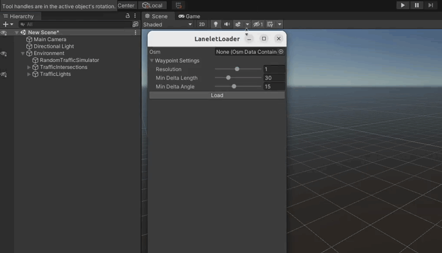
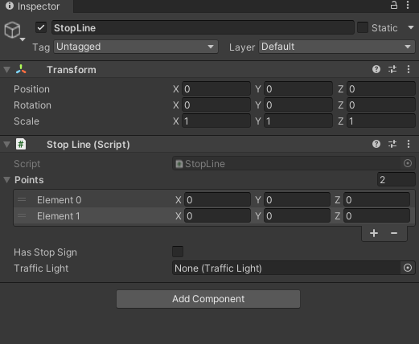
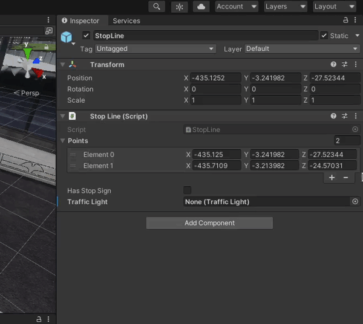
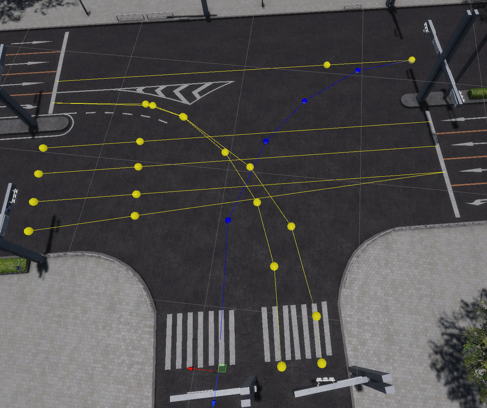
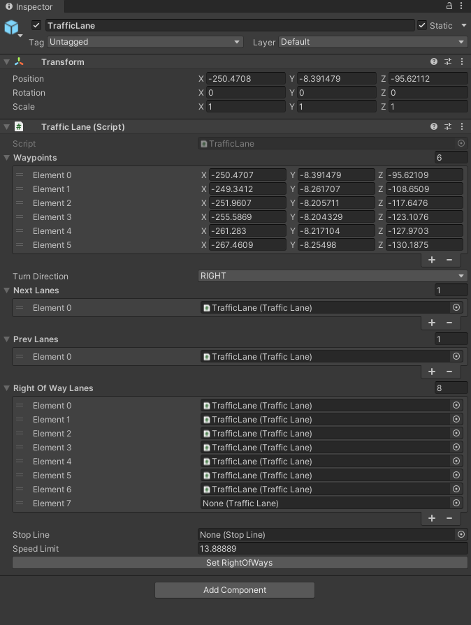
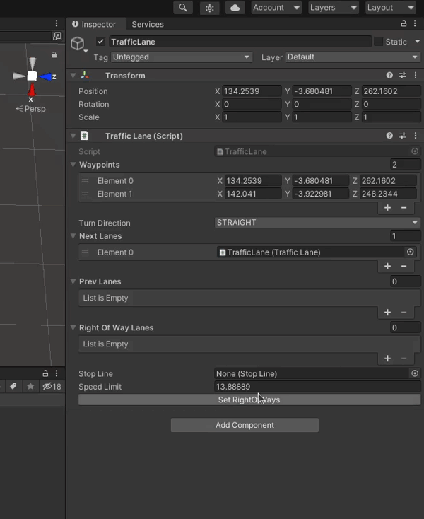

#Load items from lanelet2

To add `RandomTraffic` to the `Environment`, it is necessary to load elements from the *lanelet2*.
As a result of loading, `TrafficLanes` and `StopLines` will be added to the scene. Details of these components can be found [here](../../../../../Components/Traffic/TrafficComponents/).

!!! warning
    Before following this tutorial make sure you have added an [Environment Script](../../../../../Components/Environment/AddNewEnvironment/AddEnvironment/#2-add-an-environment-script) and set a proper `MGRS` offset position. This position is used when loading elements from the *lanelet2*!

1. Click on the `AWSIM` button in the top menu of the Unity editor and navigate to `AWSIM -> Random Traffic -> Load Lanelet`.

    

2. In the window that pops-up select your osm file, change some Waypoint Settings to suit your needs and click `Load`.

    

    !!! info "Waypoint Settings explanation"
        - *Resolution* - resolution of resampling. Lower values provide better accuracy at the cost of processing time
        - *Min Delta Length* - minimum length(m) between adjacent points
        - *Min Delta Angle* - minimum angle(deg) between adjacent edges. Lowering this value produces a smoother curve

3. Traffic Lanes and Stop Lanes should occur in the Hierarchy view.
If they appear somewhere else in your Hierarchy tree, then move them into the `Environment` object.

## Complete loaded TrafficLanes
The Traffic Lanes that were loaded should be configures accordingly to the road situation.
The aspects you can configure

- Right of way

    The right of way has to be configured so that Vehicles know how ot behave in the traffic.
    To configure this please visit a [dedicated section in Add a Traffic Lane](#7-configure-right-of-way).
    After you have set right of way to all traffic lanes please follow [this final step](#10-set-the-right-of-ways).

- Stop Line

    Assuming you have all Stop Lines loaded from the lanelet you have to add them to the Traffic Lanes.
    For detailed instruction please visit a [dedicated section in Add a Traffic Lane](#8-add-stop-line).

    If - for any reason - you don't have all the Stop Lines added, please follow [this dedicated section](#add-a-stopline-manually).

## How to test
If you want to test your Traffic Lanes you have to try running a [Random Traffic](../../../../../Components/Environment/AddNewEnvironment/AddRandomTraffic/AddRandomTraffic/).
To verify one particular Traffic Lane or Traffic Lane connection you can [make a new spawnable lane](../../../../../Components/Environment/AddNewEnvironment/AddRandomTraffic/AddRandomTraffic/#add-spawnable-lanes) next to the Traffic Lane you want to test.
This way you can be sure NPCVehicles will start driving on the Traffic Lane you are interested in at the beginning.

## Add a StopLine manually
When something goes wrong when loading data from *lanelet2* or you just want to add another StopLine manually please do the following

### 1. Add a GameObject
Add a new GameObject *StopLine* in the *StopLines* parent object.

### 2. Add a StopLine Script
Add a StopLine Script by clicking 'Add Component' and searching for `Stop Line`.

!!! example
    So far your Stop Line should look like the following

    

### 3. Set points
Set the position of points `Element 0` and `Element 1`.
These Elements are the two end points of a Stop Line.
The Stop Line will span between these points.

You don't need to set any data in the 'Transform' section as it is not used anyway.

!!! warning "StopLine coordinate system"
    Please note that the Stop Line Script operates in the global coordinate system.
    The transformations of StopLine *Object* and its parent *Objects* won't affect the Stop Line.

    ??? example
        In this example you can see that the Position of the *Game Object* does not affect the position and orientation of the Stop Line.

        For a Game Object in the center of the coordinate system.

        

        The stop Line is in the specified position.

        

        However with the *Game Object* shifted in X axis.

        

        The Stop Line stays in the same position as before, not affected by any transformations happening to the *Game Object*.

        

### 4. Has Stop Sign
Select whether there is a Stop Sign.

Select the `Has Stop Sign` tick-box confirming that this Stop Line has a Stop Sign.
The Stop Sign can be either vertical or horizontal.

### 5. Select a Traffic Light
Select from the drop-down menu the Traffic Light that is on the [Traffic Intersection](../../../../../Components/Traffic/TrafficComponents/) and is facing the vehicle that would be driving on the Traffic Lane connected with the Stop Line you are configuring.

In other words select the right Traffic Light for the Lane on which your Stop Line is placed.

!!! tip "Select Traffic Lights visually"
    If you have a lot of Traffic Lights it can be challenging to add them from the list.
    You can select them visually from the Scene the same as you had selected Traffic Lanes in the [Random Traffic Simulator](../../../../../Components/Environment/AddNewEnvironment/AddRandomTraffic/AddRandomTraffic/#add-spawnable-lanes).

### 6. Configure the Traffic Lane
Every Stop Line has to be connected to a Traffic Lane.
This is done in the Traffic Lane configuration.
For this reason please check the [Traffic Lane section](#8-add-stop-line) for more details.

## Add a TrafficLane manually
It is possible that something may go wring when reading a *lanelet2* and you need to add an additional Traffic Lane or you just want to add it.
To add a Traffic Lane manually please follow the steps below.

### 1. Add a GameObject
Add a new *Game Object* called `TrafficLane` into the `TrafficLanes` parent *Object*.

### 2. Add a Traffic Lane Script
Click the 'Add Component' button and search for the `Traffic lane` script and select it.

!!! example
    So far your Traffic Lane should look like the following.

    

### 3. Configure Waypoints
Now we will configure the 'Waypoints' list.
This list is an ordered list of nest points defining the Traffic Lane.
When you want to add a waypoint to a Traffic Lane just click on the `+` button or specify the number of waypoints on the list in the field with number to the right from 'Waypoints' identifier.

The order of elements on this list determines how waypoints are connected.

!!! warning "Traffic Lane coordinate system"
    Please note that the Traffic Lane waypoints are located in the global coordinate system, any transformations set to a *Game Object* or paren *Objects* will be ignored.

    This behavior is the same as with the Stop Line.
    You can see the example provided in the [Stop Line tutorial](#add-a-stopline-manually).

!!! info "General advice"
    - Two waypoints should not be too far away from each other.
    - When creating a turn that is a curvature please keep in mind the angle that is created between two next waypoints connected.
        The angles should be fairly small - this will translate to a smooth motion of vehicles.

### 4. Select the Turn Direction
You also need to select the Turn Direction.
This field describes what are the vehicles traveling on ths Traffic Lane doing in reference to other Traffic Lanes.
You need to select whether the vehicles are

- Driving straight (`STRAIGHT`)
- Turning right (`RIGHT`)
- Turning left (`LEFT`)

### 5. Configure Next Lanes
You need to add all Traffic Lanes that have their beginning in the end of this Traffic Lane into the Next Lanes list.
In other words if the vehicle can choose where he wants to drive (e.g. drive straight or drive left with choice of two different Traffic Lines).

To do this click the `+` sign in the *Next Lanes* list and in the element that appeared select the correct Traffic Lane.

??? example "Next Lane example"
    Lets consider the following Traffic Intersection.

    

    In this example we will consider the Traffic Lane driving from the bottom of the screen and turning right.
    After finishing driving in this Traffic Lane the vehicle has a choice of 4 different Traffic Lanes each turning into different lane on the parallel road.

    All 4 Traffic Lanes are connected to the considered Traffic Lane.
    This situation is reflected in the Traffic Lane configuration shown below.

    

!!! tip "Select Traffic Lanes visually"
    If you have a lot of Traffic Lanes it can be challenging to add them from the list.
    You can select them visually from the Scene the same as you had selected Traffic Lanes in the [Random Traffic Simulator](../../../../../Components/Environment/AddNewEnvironment/AddRandomTraffic/AddRandomTraffic/#add-spawnable-lanes).

### 6. Configure Previous Lanes
Traffic Lane has to have previous Traffic Lanes configured.
This is done in the exact same way as [configuring next lanes which was shown in the previous step](#5-configure-next-lanes).
Please do the same, but add Traffic Lanes that are before the configured one instead of the ones after into the *Prev Lanes* list.

### 7. Configure Right Of Way
Now we will configure the Right Of Way Lanes.
The Right Of Way Lanes is a list of Traffic Lanes that have a priority over the configured one.
The process of adding the Right Of Way Lanes is the same as with adding Next Lanes.
For this reason we ask you to [see the aforementioned step](#5-configure-next-lanes) for detailed description on how to do this (the only difference is that you add Traffic Lanes to the *Right Of Way Lanes* list).

??? example "Right of way example"
    In this example lets consider the Traffic Lane highlighted in blue from the Traffic Intersection below.

    

    This Traffic Lane has to give way to all Traffic Lanes highlighted on yellow.
    This means all of the yellow Traffic Lanes have to be added to the 'Right Of Way Lanes' list which is reflected on the configuration shown below.

    

### 8. Add Stop Line
Adding a Stop Line is necessary only when at the end of the configured Traffic Lane the Stop Line is present.
If so, please select the correct Stop Line from the drop-down list.

!!! tip "Select Stop Line visually"
    If you have a lot of Stop Lines it can be challenging to add them from the list.
    You can select them visually from the Scene the same as you had selected Traffic Lanes in the [Random Traffic Simulator](../../../../../Components/Environment/AddNewEnvironment/AddRandomTraffic/AddRandomTraffic/#add-spawnable-lanes).

### 9. Add Speed Limit.

In the field called `Speed Limit` simply write the speed limit that is in effect on the configured Traffic Lane.

### 10. Set the Right of Ways

To make the Right Of Ways list you configured earlier take effect simply click the 'Set RightOfWays' button.

