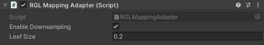
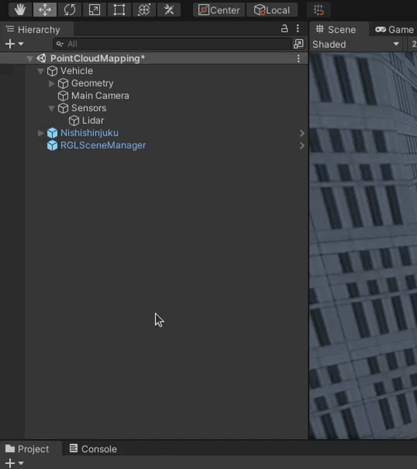
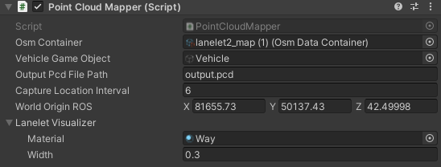

# Create PCD

!!! warning "This section"
    This section is still under development!
<!-- !!! Draft-note
    - Reasons for making pcd from mesh instead of using real world pcd.
    - Usage requirements (osm file, 3d model (prefab))
    - Create a scene with 3D model map of the area (**gif**)
    - Import osm file (**gif**)
    - Add a simple vehicle
        - Add a geometry with collider (**screen**)
        - Add a lidar link (**screen**)
        - Add a Lidar Sensor Script (**screen**)
        - Add a RGL Mapping Adapter Script (explanation, leaf size)
        - Add a Point Cloud Visualization Script
    - Add a Scene Manager (hyperlink)
    - Add a Point Cloud Mapper Script (description, osm container, world origin, vehicle, output, interval)
    - Mapping (description play->stop->result, example - **video**)

    Remember to add pcd downsampling:<br>
    `pcl_voxel_grid output_mgrs_local.pcd output_leaf_0_2_mgrs_local.pcd -leaf 0.2 0.2 0.2`
    `pcl_convert_pcd_ascii_binary output_leaf_0_2_mgrs_local.pcd output_ascii_mgrs_local.pcd 0` -->

## PointCloudMapper


### Description
`PointCloudMapper` is a tool for a vehicle based point cloud mapping in a simulation environment.
It is very useful when you need a point cloud based on some location, but don't have the possibility to physically map the real place.
Instead you can map the simulated environment.

### Required Data
To properly perform the mapping, make sure you have the following files downloaded and configured:

- *Lanelet2* format *OSM* data (`*.osm` file)
- 3D model map of the area

    !!! question "How to obtain a map"
        You can obtain the 3D model of the area by using a `Environment` *prefab* prepared for *AWSIM* or by creating your own.
        You can learn how to create you own `Environment` *prefab* in [this tutorial](../../Environment/AddNewEnvironment/AddEnvironment/).

- Configured in-simulation vehicle object with sensors attached (only the [*LiDAR*](../../../Components/Sensors/LiDARSensor/AddNewLiDAR/) is necessary)

    <!-- !!! info "LiDAR count"
        Please note that mapping with only **one** LiDAR sensor is supported for now.
        If your *Vehicle* has more LiDAR sensors please remove them before moving on with this tutorial. -->

    !!! tip "Vehicle model"
        For the sake of creating a *PCD* the *vehicle* model doesn't have to be accurate.
        It will be just a carrier for *LiDAR*.
        The model can even be a simple box as shown [earlier in this tutorial](#pointcloudmapper).
        Make sure it is not visible to the *LiDAR*, so it does not break the sensor readings.

## Import OSM
1. Drag and drop an *OSM* file into *Unity* project.

    

1. OSM file will be imported as `OsmDataContainer`.

## Setup an Environment
For mapping an `Environment` prefab is needed.
The easiest way is to create a new *Scene* and import the `Environment` *prefab* into it.
Details on how to do this can be found on [this tutorial page](../../Environment/AddNewEnvironment/AddEnvironment/).

## Setup a Vehicle
Create a `Vehicle` *GameObject* in the *Hierarchy* view.


### Add visual elements (optional)
Add vehicle model by adding a `Geometry` *Object* as a child of `Vehicle` and adding all visual elements as children.


!!! info "Visual elements"
    You can learn how to add visual elements and required components like *Mesh Filter* or *Mesh Renderer* in [this tutorial](../../Vehicle/AddNewVehicle/AddVisualElements/).

### Add a Camera (optional)
Add a Camera component for enhanced visuals by adding a `Main Camera` *Object* as a child of `Vehicle` Object and attaching a `Camera` Component to it.

1. Add a `Main Camera` *Object*.

    

2. Add a `Camera` Component by clicking 'Add Component' button, searching for it and selecting it.

    

3. Change the `Transform` for an even better visual experience.

    !!! note "Camera preview"
        Observe how the *Camera* preview changes when adjusting the transformation.

    

### Setup Vehicle Sensors (RGL)
This part of the tutorial shows how to add a *LiDAR* sensor using [RGL](https://github.com/RobotecAI/RobotecGPULidar).

!!! warning "RGL Scene Manager"
    Please make sure that `RGLSceneManager` is added to the scene.
    For more details and instruction how to do it please visit [this tutorial page](../../Sensors/LiDARSensor/RGLUnityPlugin/#scenemanager).

1. Create an empty `Sensors` *GameObject* as a child of the `Vehicle` *Object*.

    

1. Create a `Lidar` *GameObject* as a child of the `Sensors` *Object*.

    

2. Attach *Lidar Sensor* (script) to previously created `Lidar` *Object* by clicking on the 'Add Component' button, searching for the script and selecting it.

    !!! note "Point Cloud Visualization"
        Please note that *Point Cloud Visualization* (script) will be added automatically with the *Lidar Sensor* (script).

    

    

3. Configure *LiDAR* pattern, e.g. by selecting one of the available presets.

    !!! example "Example Lidar Sensor configuration"
        

4. Attach *RGL Mapping Adapter* (script) to previously created `Lidar` *Object* by clicking on the 'Add Component' button, searching for the script and selecting it.

    

    

5. Configure `RGL Mapping Adapter` - e.g. set `Leaf Size` for filtering.

    !!! example "Example RGL Mapping Adapter configuration"
        

#### Effect of `Leaf Size` to Point Cloud Data (PCD) generation
A small `Leaf Size` could result in a noisy PCD, while a large `Leaf Size` could result in excessive filtering such that objects like buildings are not recorded in the PCD.

In the following examples, it can be observed that when a `Leaf Size` is 1.0, point clouds exist on roads in which they shouldn't appear.
When a `Leaf Size` is 100.0, buildings are filtered out and results in an empty PCD.
A `Leaf Size` of 10.0 results in a reasonable PCD in the given example.

| Leaf Size = 1.0                   | Leaf Size = 10.0                  | Leaf Size = 100.0                 |
| --------------------------------- | --------------------------------- | --------------------------------- |
|  |  |  |

## Setup PointCloudMapper
1. Create a `PointCloudMapper` *GameObject* in the *Hierarchy* view.

    

2. Attach `Point Cloud Mapper` script to previously created `Point Cloud Mapper` *Object* by clicking on the 'Add Component' button, searching for the script and selecting it.

    

    

3. Configure the `Point Cloud Mapper` fields:

    - `Osm Container` - the OSM file you [imported earlier](#import-osm)
    - `World Origin` - MGRS position of the origin of the scene

        !!! note "World Origin coordinate system"
            Use [*ROS* coordinate system](../../Vehicle/AddNewVehicle/AddSensors/#coordinate-system-conversion) for *World Origin*, not Unity.

    - `Capture Location Interval` - Distance between consecutive capture points along lanelet centerline
    - `Output Pcd File Path` - Output relative path from `Assets` folder
    - `Target Vehicle` - The vehicle you want to use for point cloud capturing that you [created earlier](#setup-vehicle-sensors-rgl)

    !!! example "Example Point Cloud Mapper configuration"
        

### Effect of `Capture Location Interval` to PCD generation

If the `Capture Location Interval` is too small, it could result in a sparse PCD where some region of the map is captured well but the other regions aren't captured at all.

In the below example, `Leaf Size` of 0.2 was used. Please note that using a different combination of `leaf size` and `Capture Location Interval` may result in a different PCD.


| Capture Location Interval = 6     | Capture Location Interval = 20    | Capture Location Interval = 100   |
| --------------------------------- | --------------------------------- | --------------------------------- |
|  |  |  |

## Capture and Generate PCD
If you play simulation with a scene prepared with the steps above, `PointCloudMapper` will automatically start mapping.
The vehicle will warp along centerlines by intervals of `CaptureLocationInterval` and capture point cloud data.
PCD file will be written when you stop your scene or all locations in the route are captured.

If the Vehicle stops moving for longer and you see the following message in the bottom left corner - you can safely stop the scene.


The Point cloud `*.pcd` file is saved to the location you specified in the [Point Cloud Mapper](#setup-pointcloudmapper).

### Convert the PCD
!!! info "Install required tools"
    The tools required for PCD conversion can be installed on Ubuntu with the following command

    ```bash
    sudo apt install pcl-tools
    ```

The generated PCD file is typically too large.
Therefore you need to down-sample it.

1. Change directory to the one you specified [earlier](#setup-pointcloudmapper).

    ```
    cd <PATH_TO_PCD_FILE>
    ```

1. Down-sample the PCD `output.pcd` generated in simulation.

    ```
    pcl_voxel_grid <PCD_FILE_NAME> downsampled.pcd -leaf 0.2 0.2 0.2
    ```

1. Convert the down-sampled file into an ASCII format.

    ```
    pcl_convert_pcd_ascii_binary downsampled.pcd final.pcd 0
    ```

1. The `final.pcd` is a ready to use point cloud file.

## Verify the PCD
To verify your PCD you can launch the [*Autoware*](https://github.com/autowarefoundation/autoware) with the PCD file specified.

1. Copy your PCD from the *AWSIM* project directory to the *Autoware* map directory.

    ```
    cp <PATH_TO_PCD_FILE> <PATH_TO_AUTOWARE_MAP>/
    ```

1. Source the ROS and Autoware

    ```
    source /opt/ros/humble/setup.bash
    source <PATH_TO_AUTOWARE>/install/setup.bash
    ```

1. Launch the planning simulation with the map directory path (`map_path`) and PCD file (`pointcloud_map_file`) specified.

    !!! note "PCD file location"
        The PCD file needs to be located in the Autoware map directory and as a `pointcloud_map_file` parameter you only supply the file name, not the path.

    !!! warning "Absolute path"
        When launching *Autoware* never use `~/` to specify the home directory.
        Either write the full absolute path ot use `$HOME` environmental variable.

    ```
    ros2 launch autoware_launch planning_simulator.launch.xml vehicle_model:=sample_vehicle sensor_model:=sample_sensor_kit map_path:=<ABSOLUTE_PATH_TO_AUTOWARE_MAP> pointcloud_map_file:=<PCD_FILE_NAME>
    ```

2. Wait for the Autoware to finish loading and inspect the PCD visually given the [Effect of Leaf Size](#effect-of-leaf-size-to-point-cloud-data-pcd-generation) and [Effect of Capture Location Interval](#effect-of-capture-location-interval-to-pcd-generation).

    

## Sample Scene
`PointCloudMapping.unity` is a sample scene for `PointCloudMapper` showcase. It requires setup of OSM data and 3D model map of the area according to the steps above.

!!! example "Sample Mapping Scene"
    In this example you can see a correctly configured Point Cloud Mapping Scene.

    <video width="1920" autoplay muted loop>
        <source src="point_cloud_mapping_scene.mp4" type="video/mp4">
    </video>
