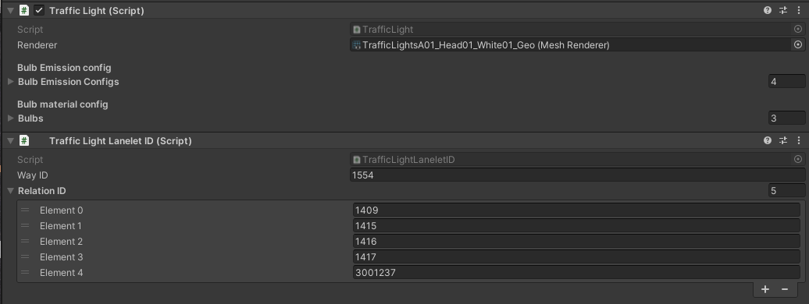
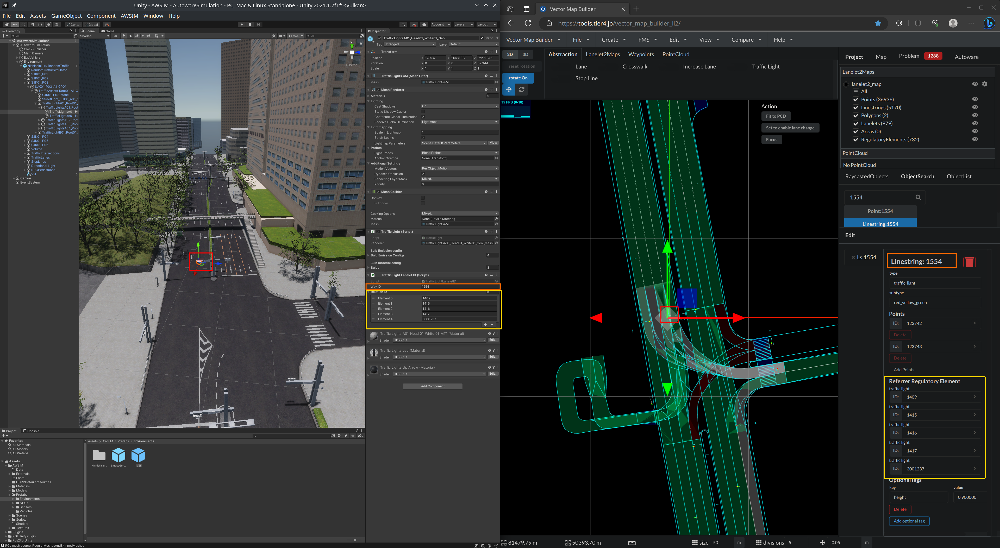
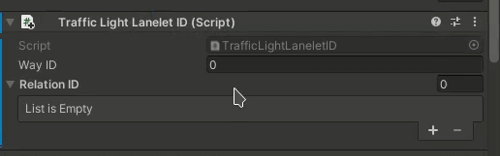
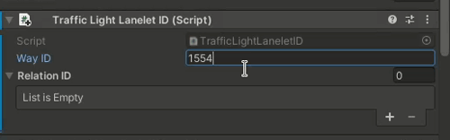
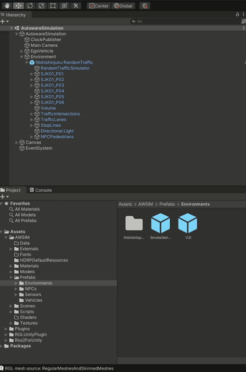
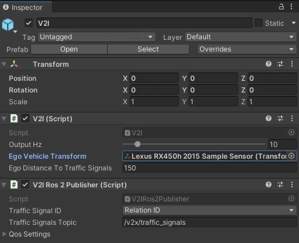

# V2I (Vehicle-to-Infrastructure)
`V2I` is a component that simulates V2I communication protocol which allows to exchange data between vehicles and road infrastructure. In the current version of AWSIM, the `V2I` component publishes information about traffic lights.

## How to add V2I to the environment
### Assign Lanelet2 WayID and RelationID to TrafficLight object

1. Load items from lanelet2 following [the instruction](../AddNewEnvironment/AddRandomTraffic/LoadItemsFromLanelet/index.md)

2. Verify if `Traffic Light Lanelet ID` component has been added to `Traffic Light` game objects.

1. Verify if `WayID` and `RelationID` has been correctly assigned. You can use [Vector Map Builder](https://tools.tier4.jp) as presented below

### Add manually `Traffic Light Lanelet ID` component (alternatively)

If for some reason, `Traffic Light Lanelet ID` component is not added to `Traffic Light` object.

1. Add component manually
   
    

2. Fill Way ID
   
    

3. Fill Relation ID
   
    

### Add V2I prefab

### Select EGO transform
   

## Parameters

Name                            | Type      | Description
------------------------------- | --------- | -----------
Output Hz                       | int       | Topic publication frequency
Ego Vehicle Transform           | transform | Ego Vehicle object transform 
Ego Distance To Traffic Signals | double    | Maximum distance between Traffic Light and Ego
Traffic Signal ID               | enum      | Possibility to select if as `traffic_signal_id` field in msg is `Relation ID` or `Way ID`
Traffic Signals Topic           | string    | Topic name

!!! note 
    V2I feature can be used as Traffic Light ground truth information, and for that usage `Way ID` is supposed to be selected.