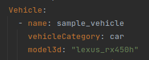

# Preparing the connection between AWSIM and scenario_simulator_v2

This tutorial describes:
- how to modify scenario to work with AWSIM
- how to prepare the AWSIM scene to work with `scenario_simulator_v2`

## Scenario preparation to work with AWSIM

To prepare the scenario to work with AWSIM add `model3d` field to [entity specification](https://www.asam.net/static_downloads/ASAM_OpenSCENARIO_V1.2.0_Model_Documentation/modelDocumentation/content/Vehicle.html#:~:text=model3d,absolute%20file%20path.)

It is utilized as an asset key to identify the proper prefab.

### AWSIM asset catalog

AWSIM currently supports the following asset key values. 

The list can be extended if required. Appropriate values should be added to asst key list in the `ScenarioSimulatorConnector` component

#### Ego Vehicle Entity (with sensor)
|model3d|boundingbox size (m)|wheel base(m)|front tread(m)|rear tread(m)|tier diameter(m)|max steer(deg)|
|:--|:--|:--|:--|:--|:--|:--|
|lexus_rx450h|width : 1.920   height : 1.700   length : 4.890 |2.105|1.640|1.630|0.766|35|

#### NPC Vehicle Entity

|model3d|boundingbox size (m)|wheel base(m)|front tread(m)|rear tread(m)|tier diameter(m)|max steer(deg)|
|:--|:--|:--|:--|:--|:--|:--|
|taxi|width : 1.695   height : 1.515   length : 4.590 | 2.680 | 1.460 | 1.400 | 0.635 | 35 |
|truck_2t|width : 1.695   height : 1.960   length : 4.685 | 2.490 | 1.395 | 1.240 | 0.673 | 40 |
|hatchback|width : 1.695   height 1.515   length : 3.940 | 2.550 | 1.480 | 1.475 | 0.600 | 35 |
|van|width : 1.880   height : 2.285   length : 4.695| 2.570 | 1.655 | 1.650 | 0.600 | 35 |
|small_car|width : 1.475   height 1.800   length : 3.395| 2.520 | 1.305 | 1.305 | 0.557 | 35 |

#### NPC Pedestrian Entity

|model3d|boundingbox size (m)|
|:--|:--|  
|human|width : 0.400   height : 1.800   length : 0.300 |

#### Misc Object Entity

|model3d|boundingbox size (m)|
|:--|:--|  
|sign_board|width : 0.31   height : 0.58   length : 0.21 |

### Scenarios limitations

Within [openSCENARIO/TIER IV Scenario Format version 2.0](https://tier4.github.io/scenario_simulator_v2-docs/developer_guide/OpenSCENARIOSupport/) features, several features are not supported when working with AWSIM

1. Conventional traffic light publishing
2. Controller properties used by `attach_*_sensor`
    - `pointcloudPublishingDelay`
    - `isClairvoyant`
    - `detectedObjectPublishingDelay`
    - `detectedObjectPositionStandardDeviation`
    - `detectedObjectMissingProbability`
    - `randomSeed`

## AWSIM scene preparation to work with `scenario_simulator_v2`

1. Disable random traffic and any pre-spawned NPCs
2. Disable V2I traffic lights publishing
3. Add `ScenarioSimulatorConnector` prefab to the scene (located in `Assets/ScenarioSimulatorConnector`)

   

4. Configure the prefab instance
- Add Ego Follow Camera object - most likely Main Camera
  

- If necessary update the asset_id to prefab mapping

