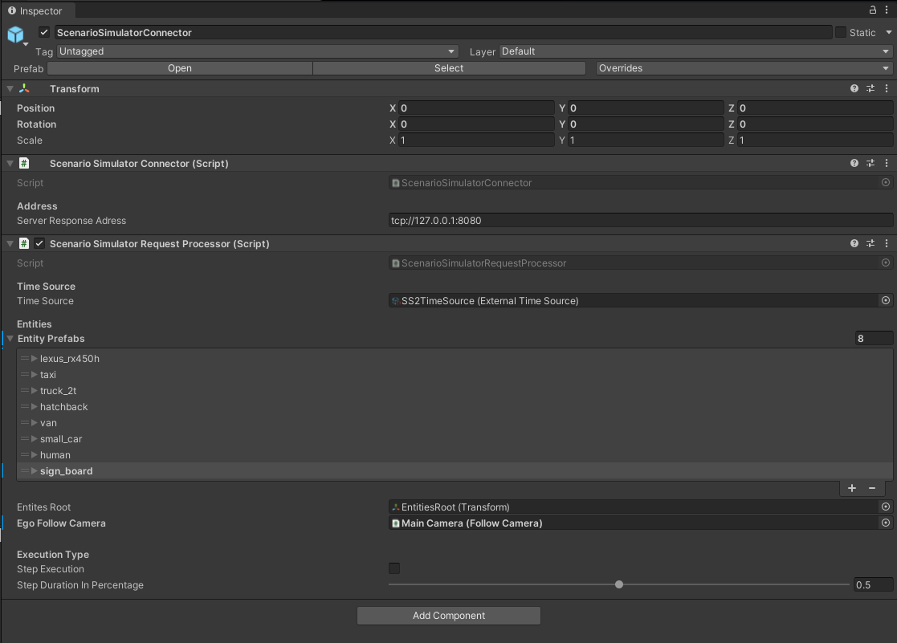
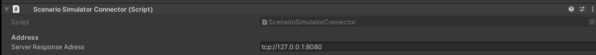
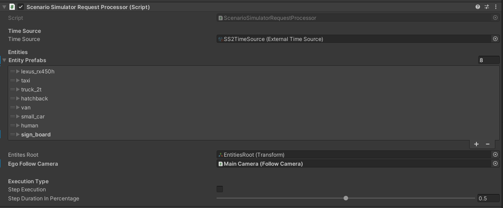

# Scenario Simulator Connector

## Introduction
`ScenarioSimulatorConnector` is a component that allows connecting AWSIM via ZMQ interfaces.

### Prefab
Prefab can be found under the following path:

```
AWSIM/Assets/ScenarioSimulatorConnector/ScenarioSimulatorConnector.prefab
```

### ScenarioSimulatorConnector Components

It contains two scripts:
- ScenarioSimulatorConnector script
- ScenarioSimulatorRequestProcessor script



## ScenarioSimulatorConnector (script)

*ScenarioSimulatorConnector* (script) initializes and maintains the connection via ZeroMQ interface. It processes received bytes and pass it through to ScenarioSimulatorRequestProcessor script and send the response back to client.



#### Elements configurable from the editor level
- `Server Response Address` - address on which ZeroMQ interface listens for incoming requests; format: `tcp://<ip>:<port>; it should match the port configuration in launched scenario_simulator_v2
 
## ScenarioSimulatorRequestProcessor (script) 



*ScenarioSimulatorRequestProcessor* (script) receives parsed message from ScenarioSimulatorComponent script and executes correct behavior for 

### Step execution

### Elements configurable from the editor level

- `Time Source` - Time source i
- `Entities prefabs` - Dictionary of asset keys mapped to prefabs. It is used to spawn appropriate entities with `model3d` attribute in openSCENARIO
- `Entiteis root` - object under which all entities spawned by scenario execution will be put
- `Ego follow camera` - Camera object which should be set as a follow camera of spawned Ego vehicle
- `Step execution` - if checked, AWSIM will work in the step execution mode - see previous section for more details 
- `Step duration in perctage` - specifies, how much of the step time should be filled by AWSIM step in step execution 

## Clock configuration


*ClockConfiguration* allows the clock source configuration. It is a [ScriptableObject](https://docs.unity3d.com/Manual/class-ScriptableObject.html) and is used by *ROS2SimulatorNode* to initialize the clock.

### Elements configurable from the editor level

- `Clock Source Type` - Selected clock source - can be `SS2` if the clock should be controlled from the `scenario_simulator_v2` or `Unity` if the clock should be controlled from within Unity scripts
- `Sources` - Dictionary which maps clock source type to clock script. In case of `SS2` it is the *ExternalTimeSource* 

