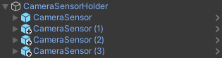
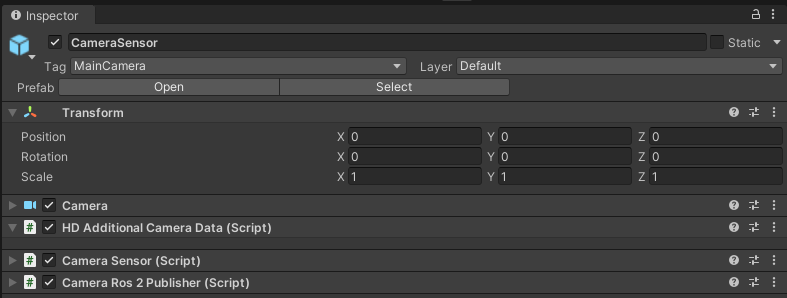
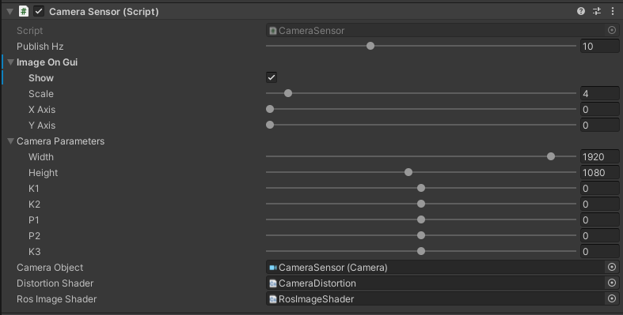
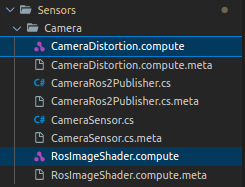

# CameraSensor

## Introduction
`CameraSensor` is a component that simulates an *RGB* camera.
Autonomous vehicles can be equipped with many cameras used for various purposes.
In the current version of *AWSIM*, the camera is used primarily to provide the image to the traffic light recognition module in *Autoware*.

### Prefab
Prefab can be found under the following path:

```
Assets/AWSIM/Prefabs/Sensors/CameraSensor.prefab
```

### Link in the default Scene
The mentioned single `CameraSensor` has its own frame `traffic_light_left_camera/camera_link` in which its data is published.
The sensor prefab is added to this frame.
The `traffic_light_left_camera/camera_link` link is added to the `base_link` object located in the `URDF`.


A detailed description of the `URDF` structure and sensors added to prefab `Lexus RX450h 2015` is available in this [section](../../../Components/Vehicle/URDFAndSensors/).


## CameraSensorHolder (script) 


*CameraSensorHolder* (script) allows the sequential rendering of multiple camera sensors. 
To utilize it, each `CameraSensor` object should be attached as a child object of the `CameraSensorHolder`.


#### Elements configurable from the editor level
- `Camere Sensors` - a collection of camera sensors used for rendering
- `Publish Hz` - the frequency at which camera rendering, image processing and callbacks are executed
- `Render In Queue` - camera sensors rendering sequence type: *in queue (one after another)* or *all at the same frame*


### CameraSensor Components


For the `CameraSensor` to work properly, the *GameObject* to which the scripts are added must also have:

- [*Camera component*](https://docs.unity3d.com/Manual/class-Camera.html) - the basic component that ensures the functionality of the camera as a device in *Unity* that capture and display the world to the player.
- [*HD Additional Camera Data* (script)](https://docs.unity3d.com/Packages/com.unity.render-pipelines.high-definition@13.1/api/UnityEngine.Rendering.HighDefinition.HDAdditionalCameraData.html) - additional component that holds [*HDRP*](https://docs.unity3d.com/Packages/com.unity.render-pipelines.high-definition@16.0/manual/index.html) specific parameters for camera.
This Component should be added automatically together with [*Camera component*](https://docs.unity3d.com/Manual/class-Camera.html).

!!! tip "TrafficLights recognition"
    In case of problems with the recognition of traffic lights in *Autoware*, it may help to increase the image resolution and focal length of the camera in *AWSIM*.

!!! tip "Camera settings"
    If you would like to adjust the image captured by the camera, we encourage you to read [this manual](https://docs.unity3d.com/Packages/com.unity.render-pipelines.high-definition@11.0/manual/HDRP-Camera.html).

The `CameraSensor` functionality is split into two scripts:

- *Camera Sensor* (script) - acquires the image from the *Unity* [camera](https://docs.unity3d.com/ScriptReference/Camera.html), transforms it and saves to the  *BGR8* format, this format along with the camera parameters is its script output - script also calls the callback for it.
- *Camera Ros2 Publisher* (script) - provides the ability to publish `CameraSensor` output as [Image][image_msg] and [CameraInfo][camera_info_msg] messages type published on a specific *ROS2* topics.

Scripts can be found under the following path:

```
Assets/AWSIM/Scripts/Sensors/CameraSensor/*
```

In the same location there are also `*.compute` files containing used [`ComputeShaders`](https://docs.unity3d.com/ScriptReference/ComputeShader.html).

## CameraSensor (script)


*Camera Sensor* (script) is a core camera sensor component.
It is responsible for applying *OpenCV* distortion and encoding to *BGR8* format.
The distortion model is assumed to be *Plumb Bob*.
The script renders the image from the [camera](https://docs.unity3d.com/ScriptReference/Camera.html) to [`Texture2D`](https://docs.unity3d.com/ScriptReference/Texture2D.html) and transforms it using the distortion parameters.
This image is displayed in the *GUI* and further processed to obtain the list of bytes in *BGR8* format on the script output.

The script uses two [`ComputeShaders`](https://docs.unity3d.com/ScriptReference/ComputeShader.html), they are located in the same location as the scripts:

- `CameraDistortion` - to correct the image using the camera distortion parameters,
- `RosImageShader` - to encode two pixels color (*bgr8* - 3 bytes) into one (*uint32* - 4 bytes) in order to produce *ROS Image* *BGR8* buffer.

    

| API      | type | feature                                                                                       |
| :------- | :--- | :-------------------------------------------------------------------------------------------- |
| DoRender | void | Renders the Unity camera, applies OpenCV distortion to rendered image and update output data. |


#### Elements configurable from the editor level
- `Output Hz` - frequency of output calculation and callback (default: `10Hz`)
- *Image On GUI*:
    - `Show` - if camera image should be show on *GUI* (default: `true`)
    - `Scale` - scale of reducing the image from the camera, `1` - will give an image of real size, `2` - twice smaller, etc. (default: `4`)
    - `X Axis` - position of the upper left corner of the displayed image in the X axis, `0 `is the left edge (default: `0`)
    - `Y Axis` - position of the upper left corner of the  displayed image in the Y axis, `0` is the upper edge (default: `0`)
- *Camera parameters*
    - `Width` - image width (default: `1920`)
    - `Height` - image height (default: `1080`)
    - `K1, K2, P1, P2, K3` - camera distortion coefficients for *Plum Bob* model<br>(default: `0, 0, 0, 0, 0`)
- `Camera Object` -  reference to the basic [*Camera component*](https://docs.unity3d.com/Manual/class-Camera.html) (default: `None`)
- `Distortion Shader` - reference to [*ComputeShader*](https://docs.unity3d.com/ScriptReference/ComputeShader.html) asset about *Distortion Shader* functionality (default: `None`)
- `Ros Image Shader` - reference to [*ComputeShader*](https://docs.unity3d.com/ScriptReference/ComputeShader.html) asset about *Ros Image Shader* functionality
(default: `None`)

#### Output Data
The sensor computation output format is presented below:

|      Category      |       Type       | Description                   |
| :----------------: | :--------------: | :---------------------------- |
| *ImageDataBuffer*  |     byte[ ]      | Buffer with image data.       |
| *CameraParameters* | CameraParameters | Set of the camera parameters. |

## CameraRos2Publisher (script) 


Converts the data output from `CameraSensor` to *ROS2* [Image][image_msg] 
and [CameraInfo][camera_info_msg] type messages and publishes them.
The conversion and publication is performed using the `Publish(CameraSensor.OutputData outputData)` method,
which is the `callback` triggered by *Camera Sensor* (script) for the current output.

 Due to the fact that the entire image is always published, the [`ROI`](https://docs.ros2.org/latest/api/sensor_msgs/msg/RegionOfInterest.html) field of the message is always filled with zeros.
The script also ensures that `binning` is assumed to be zero and the rectification matrix is the identity matrix.

!!! warning
    The script uses the camera parameters set in the *CameraSensor script* - remember to configure them depending on the camera you are using.


#### Elements configurable from the editor level
- `Image Topic` - the *ROS2* topic on which the [`Image`][image_msg] message is published<br>(default: `"/sensing/camera/traffic_light/image_raw"`)
- `Camera Info Topic` - the *ROS2* topic on which the [`CameraInfo`][camera_info_msg] message is published<br>(default: `"/sensing/camera/traffic_light/camera_info"`)
- `Frame id` - frame in which data is published, used in [`Header`](https://docs.ros2.org/latest/api/std_msgs/msg/Header.html)<br>(default: `"traffic_light_left_camera/camera_link"`)
- `Qos Settings` - Quality of service profile used in the publication<br>(default: `Best effort`, `Volatile`, `Keep last`, `1`)

#### Published Topics
- Frequency: `10Hz`
- QoS: `Best effort`, `Volatile`, `Keep last/1`

|    Category    | Topic                                       | Message type                                |               `frame_id`                |
| :------------: | :------------------------------------------ | :------------------------------------------ | :-------------------------------------: |
| *Camera info*  | `/sensing/camera/traffic_light/camera_info` | [`sensor_msgs/CameraInfo`][camera_info_msg] | `traffic_light_left_camera/camera_link` |
| *Camera image* | `/sensing/camera/traffic_light/image_raw`   | [`sensor_msgs/Image`][image_msg]            | `traffic_light_left_camera/camera_link` |

[image_msg]: https://docs.ros2.org/latest/api/sensor_msgs/msg/Image.html
[camera_info_msg]: https://docs.ros2.org/latest/api/sensor_msgs/msg/CameraInfo.html
