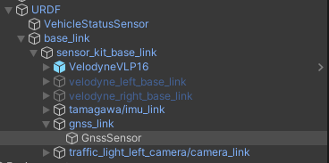
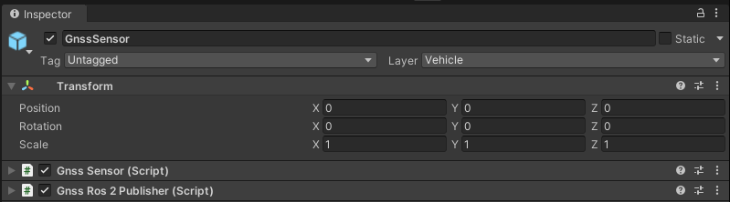

# GnssSensor

## Introduction
`GnssSensor` is a component which simulates the position of vehicle computed by the *Global Navigation Satellite System* based on the transformation of the *GameObject* to which this component is attached.
The `GnssSensor` outputs the position in the [*MGRS*](https://www.maptools.com/tutorials/mgrs/quick_guide) coordinate system.

### Prefab
Prefab can be found under the following path:

```
Assets/AWSIM/Prefabs/Sensors/GnssSensor.prefab
```


### Link
`GnssSensor` has its own frame `gnss_link` in which its data is published.
The sensor prefab is added to this frame.
The `gnss_link` frame is added to the `sensor_kit_base_link` in the `base_link` object located in the `URDF`.



A detailed description of the `URDF` structure and sensors added to prefab `Lexus RX450h 2015` is available in this [section](../../../Components/Vehicle/URDFAndSensors/).

### Components


The `GnssSensor` functionality is split into two components:

- *Gnss Sensor* (script) - it calculates the position as its *output* and calls the callback for it.
- *Gnss Ros2 Publisher* (script) - provides the ability to publish `GnssSensor` output as [`PoseStamped`](https://docs.ros2.org/latest/api/geometry_msgs/msg/PoseStamped.html) and [PoseWithCovarianceStamped](https://docs.ros2.org/latest/api/geometry_msgs/msg/PoseWithCovarianceStamped.html) published on a specific *ROS2* topics.

Scripts can be found under the following path:

```
Assets/AWSIM/Prefabs/Sensors/Gnss/*
```

## Gnss Sensor (script)


This is the main script in which all calculations are performed:

1. the position of the *Object* in *Unity* is read,
2. this position is transformed to the *ROS2* coordinate system (*MGRS* offset is added here),
3. the result of the transformation is saved as the output of the component,
4. for the current output a `callback` is called (which can be assigned externally).


### Elements configurable from the editor level
- `Output Hz` - frequency of output calculation and callback (default: `100Hz`)
                                                                       
### Output Data

|  Category  |  Type   | Description                               |
| :--------: | :-----: | :---------------------------------------- |
| *Position* | Vector3 | Position in the *MGRS* coordinate system. |


## Gnss Ros2 Publisher (script)


Converts the data output from `GnssSensor` to *ROS2* [`PoseStamped`](https://docs.ros2.org/latest/api/geometry_msgs/msg/PoseStamped.html) and [PoseWithCovarianceStamped](https://docs.ros2.org/latest/api/geometry_msgs/msg/PoseWithCovarianceStamped.html) messages.
These messages are published on two separate topics for each type.
The conversion and publication is performed using the `Publish(GnssSensor.OutputData outputData)` method, which is the `callback` triggered by *Gnss Sensor* (script) for the current output update.

!!! warning "Covariance matrix"
    The row-major representation of the 6x6 covariance matrix is filled with `0` and does not change during the script run.

#### Elements configurable from the editor level
- `Pose Topic` - the *ROS2* topic on which the message [`PoseStamped`](https://docs.ros2.org/latest/api/geometry_msgs/msg/PoseStamped.html) type is published<br>(default: `"/sensing/gnss/pose"`)
- `Pose With Covariance Stamped Topic` - the *ROS2* topic on which the message [PoseWithCovarianceStamped](https://docs.ros2.org/latest/api/geometry_msgs/msg/PoseWithCovarianceStamped.html) type is published<br>(default: `"/sensing/gnss/pose_with_covariance"`)
- `Frame id` - frame in which data are published, used in [`Header`](https://docs.ros2.org/latest/api/std_msgs/msg/Header.html)<br>(default: `"gnss_link"`)
- `Qos Settings` - Quality of service profile used in the publication<br>(default is assumed as [`"system_default"`](https://docs.ros.org/en/humble/Concepts/About-Quality-of-Service-Settings.html): `Reliable`, `Volatile`, `Keep last`, `1`)


#### Published Topics
- Frequency: `1Hz`
- QoS: `Reliable`, `Volatile`, `Keep last/1`

|        Category        | Topic                                | Message type                                                                                                            | `frame_id`  |
| :--------------------: | :----------------------------------- | :---------------------------------------------------------------------------------------------------------------------- | :---------: |
|         *Pose*         | `/sensing/gnss/pose`                 | [`geometry_msgs/Pose`](https://docs.ros2.org/latest/api/geometry_msgs/msg/Pose.html)                                    | `gnss_link` |
| *Pose with Covariance* | `/sensing/gnss/pose_with_covariance` | [`geometry_msgs/PoseWithCovarianceStamped`](https://docs.ros2.org/latest/api/geometry_msgs/msg/PoseWithCovariance.html) | `gnss_link` |

