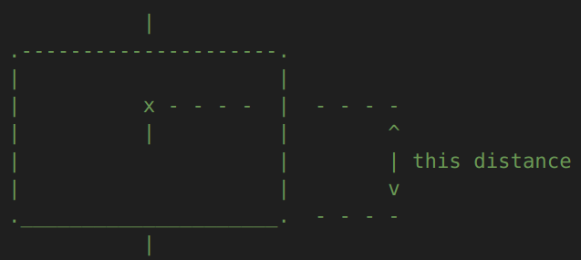
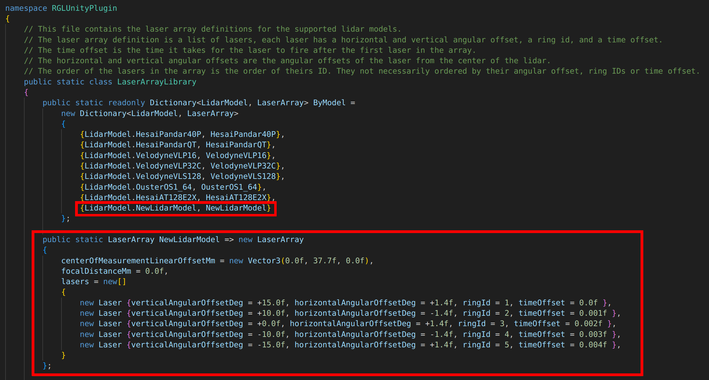
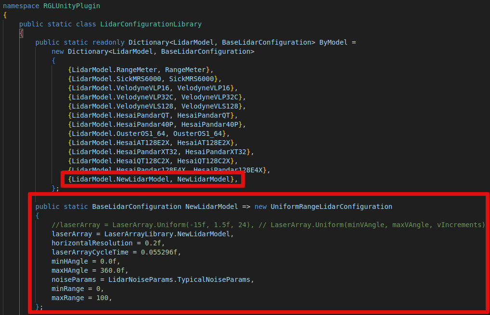
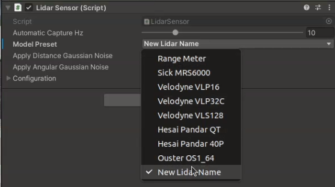
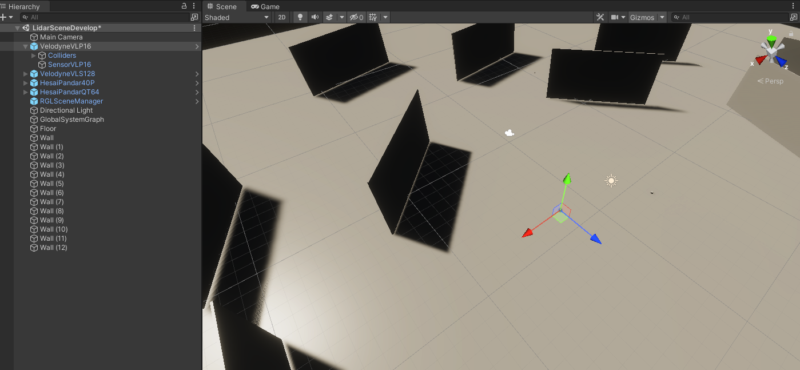

# Add a new LiDAR
`RGLUnityPlugin` (`RGL`) comes with a number of the most popular *LiDARs* model definitions and [ready-to-use prefabs](../../../../Components/Sensors/LiDARSensor/LiDARSensor/#prefabs). However, there is a way to create your custom *LiDAR*. This section describes how to add a new *LiDAR* model that works with `RGL`, then create a prefab for it and add it to the scene.

!!! warning "Supported LiDARs"
    Not all lidar types are supported by `RGL`. Unfortunately, in the case of `MEMs` *LiDARs*, there is a non-repetitive phenomenon - for this reason, the current implementation is not able to reproduce their work.

## 1. Add a new LiDAR model
The example shows the addition of a *LiDAR* named `NewLidarModel`.

To add a new *LiDAR* model, perform the following steps:

1. Navigate to `Assets/RGLUnityPlugin/Scripts/LidarModels`.

1. Add its name to the `LidarModels.cs` at the end of the enumeration. The order of enums must not be changed to keep existing prefabs working.

    

1. Now, it is time to define the laser (also called a channel) distribution of the *LiDAR*.

    !!! info
        If your *LiDAR*:

            - has a uniform laser distribution
            - has the equal range for all of the lasers
            - fire all of the rays (beams) at the same time

        You can skip this step and use our helper method to generate a simple uniform laser array definition (more information in the next step).

    1. Laser distribution is represented by `LaserArray` consists of:
        - `centerOfMeasurementLinearOffsetMm` - 3D translation from the game object's origin to *LiDAR's* origin. Preview in 2D:
            
            
        
        - `focalDistanceMm` - Distance from the sensor center to the focal point where all laser beams intersect.

            

        - `lasers` - array of lasers (channels) with a number of parameters:

            - `horizontalAngularOffsetDeg` - horizontal angle offset of the laser (Azimuth)
            - `verticalAngularOffsetDeg` - vertical angle offset of the laser (Elevation)
            - `verticalLinearOffsetMm` - vertical offset of the laser (translation from origin)
            - `ringId` - Id of the ring (in most cases laser Id)
            - `timeOffset` - time offset of the laser firing in milliseconds (with reference to the first laser in the array)
            - `minRange` - minimum range of the laser (set if lasers have different ranges)
            - `maxRange` - maximum range of the laser (set if lasers have different ranges)

    1. To define a new laser distribution create a new entry to the `LaserArrayLibrary.cs`

        

        1. Add a new public static instance of `LaserArray` with the definition.

        1. Add a new item to the `ByModel` dictionary that collects *LiDAR* model enumerations with their laser array definitions.

        In this example, `NewLidarModel` laser distribution consists of 5 lasers with
        
            - elevations: 15, 10, 0, -10, -15 degrees
            - azimuths: 1.4, -1.4, 1.4, -1.4, 1.4 degrees
            - ring Ids: 1, 2, 3, 4, 5
            - time offsets: 0, 0.01, 0.02, 0.03, 0.04 milliseconds
            - an equal range that will be defined later

        !!! warning "Coordinate system"
            Keep in mind that *Unity* has a left-handed coordinate system, while most of the *LiDAR's* manuals use a right-handed coordinate system. In that case, reverse sign of the values of the angles.

1. The last step is to create a *LiDAR* configuration by adding an entry to `LidarConfigurationLibrary.cs`

    

    1. Add a new public static instance of `LidarConfiguration` with the definition:

        - `laserArray` - laser distribution array created in the previous step (it could be also generated uniformly with `LaserArray.Uniform()`)
        - `horizontalResolution` - horizontal resolution of laser array firings in degrees (laser array will be rotated according to this resolution)
        - `laserArrayCycleTime` - time between two consecutive firings of the whole laser array in milliseconds. Usually, it consists of firing time for all the lasers and recharge time. Skip this parameter if all of the rays are fired at the same time.
        - `minHAngle` - minimum horizontal angle of the *LiDAR*
        - `maxHAngle` - maximum horizontal angle of the *LiDAR*
        - `noiseParams` - *LiDAR* noise parameters (see `LidarNoiseParams.cs` for more details)
        - `rayGenerateMethod` - if *LiDAR* has equal range for all of the lasers choose `RotatingLidarEqualRange` and configure `minRange` and `maxRange` in the `LidarConfiguration`. Otherwise, choose `RotatingLidarDifferentLaserRanges` and define ranges in `LaserArray`.
        - `minRange` - minimum range of the sensor (applied when `Ray Generate Method` is `Rotating Lidar Equal Range`)
        - `maxRange` - maximum range of the sensor (applied when `Ray Generate Method` is `Rotating Lidar Equal Range`)

    1. Add a new item to the `ByModel` dictionary that collects *LiDAR* model enumerations with their *LiDAR* configurations.

1. Done. New *LiDAR* preset should be available via *Unity Inspector*.

    

    Frame rate of the *LiDAR* can be set in the `Automatic Capture Hz` parameter.

    *Note: In the real-world LiDARs, frame rate affects horizontal resolution. Current implementation separates these two parameters. Keep in mind to change it manually.*

## 2. Create new LiDAR prefab

1. Create an empty object and name it appropriately according to the *LiDAR* model.
1. Attach script `LidarSensor.cs` to created object.
1. Set the new added *LiDAR* model in `Model Preset` field, check if the configuration loads correctly. You can now customize it however you like.
1. (Optional) Attach script `PointCloudVisualization.cs` for visualization purposes.
1. For publishing point cloud via *ROS2* attach script `RglLidarPublisher.cs` script to created object.
1. Set the topics on which you want the data to be published and their frame.
2. Save the prefab in the project.

## 3. Test your prefab

1. Create a new scene (remember to add the [`SceneManager`](../../../../Components/Sensors/LiDARSensor/RGLUnityPlugin/#scenemanager)) or use one of [the existing sample scenes](../../../../ProjectGuide/Scenes/#rgl-test-scenes).
1. Add the prepared *LiDAR* prefab by drag the prefab file and drop it into a scene.

    

1. A *LiDAR* *GameObject* should be instantiated automatically

    

1. Now you can run the scene and check how your *LiDAR* works.

!!! success
    We encourage you to develop a vehicle using the new *LiDAR* you have added - learn how to do this [here](../../../../Components/Vehicle/AddNewVehicle/AddAVehicle/).
