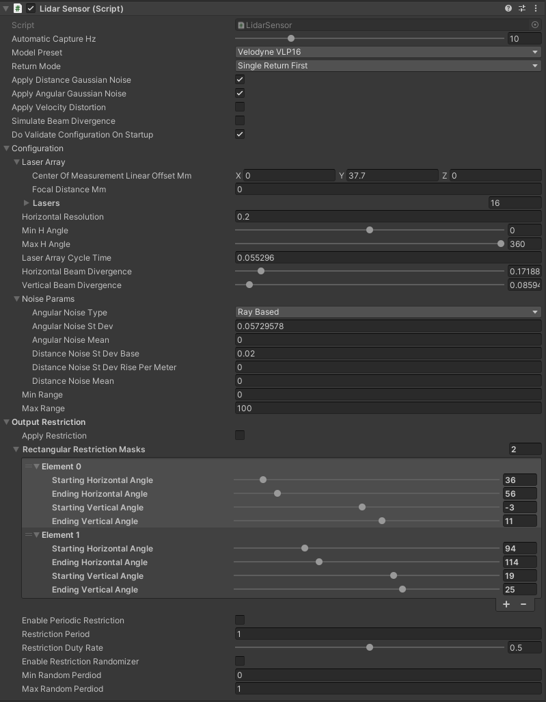

# LidarSensor

## Introduction
`LidarSensor` is the component that simulates the *LiDAR* (*Light Detection and Ranging*) sensor.
*LiDAR* works by emitting laser beams that bounce off objects in the environment, and then measuring the time it takes for the reflected beams to return, allowing the sensor to create a *3D* map of the surroundings.
This data is used for object detection, localization, and mapping.

*LiDAR* in an autonomous vehicle can be used for many purposes.
The ones mounted on the top of autonomous vehicles are primarily used

- to scan the environment for localization in space
- to detect and identify obstacles such as approaching vehicles, pedestrians or other objects in the driving path.

*LiDARs* placed on the left and right sides of the vehicle are mainly used to monitor the traffic lane and detect vehicles moving in adjacent lanes, enabling safe maneuvers such as lane changing or turning.

`LidarSensor` component is a part of [`RGLUnityPlugin`](../RGLUnityPlugin/) that integrates the external [*RobotecGPULidar*](https://github.com/RobotecAI/RobotecGPULidar) (`RGL`) library with *Unity*. `RGL` also allows to provide additional information about objects, more about it [here](#read-material-information).

!!! warning "Use RGL in your scene"
    If you want to use `RGL` in your scene, make sure the scene has an [`SceneManager` component](../RGLUnityPlugin/#scenemanager) added and all objects meet the [usage requirements](../RGLUnityPlugin/#usage-requirements).

!!! note "RGL default scenes"
    If you would like to see how `LidarSensor` works using `RGL` or run some tests, we encourage you to familiarize yourself with the [`RGL` test scenes section](../../../../ProjectGuide/Scenes/#rgl-test-scenes).

!!! note "Supported *LiDARs*"
    The current scripts implementation allows you to configure the prefab for any mechanical *LiDAR*.
    You can read about how to do it [here](../AddNewLiDAR/).
    *MEMS-based LiDARs* due to their different design are not yet fully supported.

### Prefabs
Prefabs can be found under the following path:

```
Assets/AWSIM/Prefabs/RobotecGPULidars/*
```

The table of available prefabs can be found below:

| LiDAR                 | Path                       | Appearance                                          |
| :-------------------- | :-----------------------   | :------------------------------------------------   |
| *HESAI Pandar40P*     | `HesaiPandar40P.prefab`    |     |
| *HESAI PandarQT64*    | `HesaiPandarQT64.prefab`   |      |
| *HESAI PandarXT32*    | `HesaiPandarXT32.prefab`   |    |
| *HESAI QT128C2X*      | `HesaiQT128C2X.prefab`     |     |
| *HESAI Pandar128E4X*  | `HesaiPandar128E4X.prefab` |  |
| *HESAI AT128 E2X*     | `HesaiAT128E2X.prefab`     |      |
| *Ouster OS1-64*       | `OusterOS1-64.prefab`      |        |
| *Velodyne VLP-16*     | `VelodyneVLP16.prefab`     |         |
| *Velodyne VLC-32C*    | `VelodyneVLP32C.prefab`    |         |
| *Velodyne VLS-128-AP* | `VelodyneVLS128.prefab`    |        |

### Link in the default Scene


`LidarSensor` is configured in default vehicle `EgoVehicle` prefab.
It is added to `URDF` object as a child of `sensor_kit_base_link`.
`LidarSensor` placed in this way does not have its own frame, and the data is published relative to `sensor_kit_base_link`.
More details about the location of the sensors in the vehicle can be found [here](../../../../Components/Vehicle/URDFAndSensors/).

A detailed description of the `URDF` structure and sensors added to prefab `Lexus RX450h 2015` is available in this [section](../../../../Components/Vehicle/URDFAndSensors/).

!!! warning "Additional LiDARs"
    For a *LiDAR* placed on the left side, right side or rear, an additional link should be defined.

### Components and Resources


The *LiDAR* sensor simulation functionality is split into three components:

- *Lidar Sensor* (script) - provides lidar configuration, creates *RGL* pipeline to simulate lidar, and performs native *RGL* raytrace calls,
- *Rgl Lidar Publisher* (script)  - extends *RGL* pipeline with nodes to publish *ROS2* messages.
- *Point Cloud Visualization* (script) - visualizes point cloud collected by sensor.

Moreover, the scripts use `Resources` to provide configuration for prefabs of supported lidar models:

- *LaserModels* - provides a list of supported models,
- *LaserArrayLibrary* - provides data related to laser array construction for supported models,
- *LaserConfigurationLibrary* - provides full configuration, with ranges and noise for supported models.

These are elements of the `RGLUnityPlugin`, you can read more [here](../RGLUnityPlugin/).

## Lidar Sensor (script)


This is the main component that creates the `RGL` node pipeline for the *LiDAR* simulation.
The pipeline consists of:

- setting ray pattern,
- transforming rays to represent pose of the sensor on the scene,
- applying *Gaussian* noise,
- performing raytracing,
- removing non-hits from the result point cloud,
- transforming point cloud to sensor frame coordinate system.

#### Elements configurable from the editor level
- `Automatic Capture Hz` - the rate of sensor processing (default: `10Hz`)
- `Model Preset` - allows selecting one of the built-in *LiDAR* models (default: `RangeMeter`)
- `Apply Distance Gaussian Noise` - enable/disable distance *Gaussian* noise (default: `true`)
- `Apply Angular Gaussian Noise` - enable/disable angular *Gaussian* noise (default: `true`)
- `Apply Velocity Distortion` - enable/disable velocity distortion (default: `false`)
- *Configuration*:
    - `Laser Array` - geometry description of lidar's array of lasers, should be prepared on the basis of the manual for a given model of *LiDAR* (default: loaded from `LaserArrayLibrary`)
    - `Horizontal Resolution` - the horiontal resolution of laser array firings
    - `Min H Angle` - minimum horizontal angle, left (default: `0`)
    - `Max H Angle` - maximum horizontal angle, right (default: `0`)
    - `Laser Array Cycle Time` - time between two consecutive firings of the whole laser array in milliseconds (default: `0`); used for velocity distortion feature.
    - `Beam Divergence` - represents the deviation of photons from a single beam emitted by a LiDAR sensor (in degrees); used for simulating snow only (private feature).
    - *Noise Params*: 
        - `Angular Noise Type` - angular noise type<br>(default: `Ray Based`)
        - `Angular Noise St Dev` - angular noise standard deviation in degree<br>(default: `0.05729578`)
        - `Angular Noise Mean` - angular noise mean in degrees<br>(default: `0`)
        - `Distance Noise St Dev Base` - distance noise standard deviation base in meters<br>(default: `0.02`)
        - `Distance Noise Rise Per Meter` - distance noise standard deviation rise per meter<br>(default: `0`)
        - `Distance Noise Mean` - distance noise mean in meters<br>(default: `0`)
    - *Additional options (available for some Lidar Model Preset)*
        - `Min Range` - minimum range of the sensor (if not avaiable, the range is different for each laser in `Laser Array`)
        - `Max Range` - maximum range of the sensor (if not avaiable, the range is different for each laser in `Laser Array`)
        - `High Resolution Mode Enabled` - whether to activate high resolution mode (available for `Hesai Pandar 128E4X` LiDAR model)

#### Output Data
`LidarSensor` provides public methods to extend this pipeline with additional `RGL` nodes.
In this way, other components can request point cloud processing operations and receive data in the desired format.

Example of how to get XYZ point cloud data:

1. To obtain point cloud data from another component you have to create a new `RGLNodeSequence` with RGL node to yield XYZ field and connect it to `LidarSensor`:
   ```cs
   rglOutSubgraph = new RGLNodeSequence().AddNodePointsYield("OUT_XYZ", RGLField.XYZ_F32);
   lidarSensor = GetComponent<LidarSensor>();
   lidarSensor.ConnectToWorldFrame(rglOutSubgraph); // you can also connect to Lidar frame using ConnectToLidarFrame
   // You can add a callback to receive a notification when new data is ready
   lidarSensor.onNewData += HandleLidarDataMethod;
   ```
1. To get data from `RGLNodeSequence` call `GetResultData`:
   ```cs
   Vector3[] xyz = new Vector3[0];
   rglOutSubgraph.GetResultData<Vector3>(ref xyz);
   ```

## Rgl Lidar Publisher (script)


`RglLidarPublisher` extends the main `RGL` pipeline created in `LidarSensor` with `RGL` nodes that produce point clouds in specific format and publish them to the *ROS2* topic.
Thanks to the *ROS2* integration with `RGL`, point clouds can be published directly from the native library.
`RGL` creates *ROS2* node named `/RobotecGPULidar` with publishers generated by `RGL` nodes.

Currently, `RglLidarPublisher` implements ROS2 publishers for two message types:

- [sensor_msgs/PointCloud2](https://docs.ros2.org/latest/api/sensor_msgs/msg/PointCloud2.html)
- [radar_msgs/RadarScan](http://docs.ros.org/en/noetic/api/radar_msgs/html/msg/RadarScan.html)

`PointCloud2` message allows publishing of the point cloud with different points attributes (described by `fields` parameter). In order to easily select different frequently used field sets `RglLidarPublisher` have several field presets defined:

| Preset     | Description            | Fields                             |
| :--------: | :--------------------- | :---------------------------------- |
| Pcl 24 | 24-byte point cloud format used by *Autoware* | XYZ_VEC3_F32, PADDING_32, INTENSITY_F32, RING_ID_U16, PADDING_16 |
| Pcl 48 | 48-byte extended version point cloud format used by *Autoware* | XYZ_VEC3_F32, PADDING_32, INTENSITY_F32, RING_ID_U16, PADDING_16, AZIMUTH_F32, DISTANCE_F32, RETURN_TYPE_U8, PADDING_8, PADDING_16, PADDING_32, TIME_STAMP_F64 |
| ML Instance Segmentation | Machine learning format for instance/semantic segmentation tasks | XYZ_VEC3_F32, ENTITY_ID_I32, INTENSITY_F32 |
| Radar Smart Micro | Format used in Radar Smart Micro | XYZ_VEC3_F32, RADIAL_SPEED_F32, POWER_F32, RCS_F32, NOISE_F32, SNR_F32 |
| Custom | Empty format that allows the user to define its fieldsets |  |

!!! note "*rosPCL48* format"
    For a better understanding of the *rosPCL48* format, we encourage you to familiarize yourself with the point cloud pre-processing process in *Autoware*, which is described [here](https://autowarefoundation.github.io/autoware-documentation/latest/design/autoware-architecture/sensing/data-types/point-cloud/#channel).

#### Elements configurable from the editor level
- `Frame ID` - frame in which data are published, used in [`Header`](https://docs.ros2.org/latest/api/std_msgs/msg/Header.html) (default: `"world"`)
- `Qos` - Quality of service profile used in the publication
    - `Reliability Policy` - Reliability policy (default: `Best effort`)
    - `Durability Policy` - Durability policy (default: `Volatile`)
    - `History Policy` - History policy (default: `Keep last`)
    - `History Depth` - History depth. If history policy is `Keep all`, depth is ignored. (default: `5`)
- `Point Cloud 2 Publishers` - List of [sensor_msgs/PointCloud2 message](https://docs.ros2.org/latest/api/sensor_msgs/msg/PointCloud2.html) publishers
    - `Topic` - Topic name to publish on
    - `Publish` - If false, publishing will be stopped
    - `Fields Preset` - allows selecting one of the pre-defined fieldsets (choose `Custom` to define your own)
    - `Fields` - List of fields to be present in the message
- `Radar Scan Publishers` - List of [radar_msgs/RadarScan message](http://docs.ros.org/en/noetic/api/radar_msgs/html/msg/RadarScan.html) publishers
    - `Topic` - Topic name to publish on
    - `Publish` - If false, publishing will be stopped

!!! note "Elements configurable in simulation runtime"
    Once the simulation starts, only the `Publish` flag is handled. All of the publishers are initialized on the simulation startup and updates of their parameters are not supported in runtime.

#### Default Publishing Topics
- Frequency: `10Hz`
- QoS:  `Best effort`, `Volatile`, `Keep last/5`

|         Category          | Topic                  | Message type                             | `frame_id` |
| :-----------------------: | :--------------------- | :--------------------------------------- | :--------: |
| PointCloud 24-byte format | `/lidar/pointcloud`    | [`sensor_msgs/PointCloud2`][pointcloud2] |  `world`   |
| PointCloud 48-byte format | `/lidar/pointcloud_ex` | [`sensor_msgs/PointCloud2`][pointcloud2] |  `world`   |

## Point Cloud Visualization (script)


A component visualizing a point cloud obtained from `RGL` in the form of a [`Vector3`](https://docs.unity3d.com/ScriptReference/Vector3.html) list as colored points in the *Unity* scene.
Based on the defined color table, it colors the points depending on the height at which they are located.

The obtained points are displayed as the vertices of mesh, and their coloring is possible thanks to the use of `PointCloudMaterial` material which can be found in the following path:

```
Assets/RGLUnityPlugin/Resources/PointCloudMaterial.mat
```

`Point Cloud Visualization` preview:


### Elements configurable from the editor level
- `Point Shape` - the shape of the displayed points (default: `Box`)
- `Point Size` - the size of the displayed points (default: `0.05`)
- `Colors` - color list used depending on height<br>(default: `6` colors: `red, orange, yellow, green, blue, violet`)
- `Auto Compute Coloring Heights` - automatic calculation of heights limits for a list of colors (default: `false`)
- `Min Coloring Height` - minimum height value from which color matching is performed, below this value all points have the first color from the list (default: `0`)
- `Max Coloring Height` - maximum height value from which color matching is performed, above this value all points have the last color from the list (default: `20`)

[pointcloud2]: https://docs.ros2.org/latest/api/sensor_msgs/msg/PointCloud2.html

## Read material information

To ensure the publication of the information described in this section, *GameObjects* must be adjusted accordingly. [This](../ReadMaterialInformation/) tutorial describes how to do it.

### Intensity Texture

`RGL Unity Plugin` allows assigning an `Intensity Texture` to the *GameObjects* to produce a point cloud containing information about the lidar ray intensity of hit. It can be used to distinguish different levels of an object's reflectivity. 

### Output data

Point cloud containing intensity is published on the *ROS2* topic via `RglLidarPublisher` component. The intensity value is stored in the `intensity` field of the `sensor_msgs/PointCloud2` message.

## Instance segmentation
`RGL Unity Plugin` allows assigning an ID to *GameObjects* to produce a point cloud containing information about hit objects. It can be used for instance/semantic segmentation tasks. [This](../ReadMaterialInformation/#add-id-assignment) tutorial describes how to do it.

!!! note "LidarInstanceSegmentationDemo"
    If you would like to see how `LidarInstanceSegmentationDemo` works using `RGL` or run some tests, we encourage you to familiarize yourself with this [section](../../../../ProjectGuide/Scenes/#rgl-test-scenes).

### Output data

Point cloud containing hit objects *IDs* is published on the *ROS2* topic via `RglLidarPublisher` component. The publisher for such point cloud format is not added by default. Add a new `PointCloud2` publisher with `ML Instance Segmentation` fields preset or create your format by selecting `Custom` preset (remember to add `ENTITY_ID_I32` field which holds objects *IDs*).


### Dictionary mapping

The resulting simulation data contains only the id of objects without their human-readable names. To facilitate the interpretation of such data, a function has been implemented to save a file with a dictionary mapping instance ID to *GameObject* names. It writes pairs of values in the `yaml` format:

- The name of the *GameObject*
- Category ID of `SemanticCategory` component

To enable saving dictionary mapping set output file path to the `Semantic Category Dictionary File` property in the `Scene Manager` component:


The dictionary mapping file will be saved at the end of the simulation.

