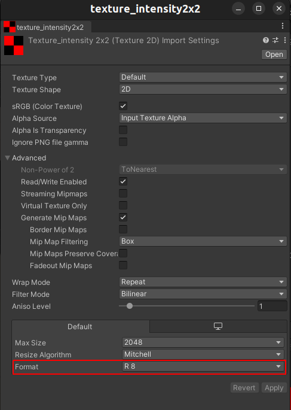

`RGL Unity Plugin` allows to:

- assigning an `Intensity Texture` to the *GameObjects* to produce a point cloud containing information about the lidar ray intensity of hit. It can be used to distinguish different levels of an object's reflectivity. 
- assigning an ID to *GameObjects* to produce a point cloud containing information about hit objects. It can be used for instance/semantic segmentation tasks.
Below describes how to ensure the publication of this information.

## Add Intensity Texture assignment

To enable reading material information, add `IntensityTexture` component to every `GameObject` that is expected to have non-default intensity values.

After that desired texture has to be inserted into the `Intensity Texture` slot.

The texture has to be in `R8` format. That means `8bit` in the red channel (`255` possible values).

When the texture is assigned, the intensity values will be read from the texture and added to the point cloud if and only if the mesh component in the `GameObject` has a set of properly created texture coordinates. 

The expected number of texture coordinates is equal to the number of vertices in the mesh. The quantity of indices is not relevant. In other cases, the texture will be no read properly.

## Add ID assignment

To enable segmentation, add `SemanticCategory` component to every *GameObject* that is expected to have a distinct ID. All meshes that belong to a given object will inherit its ID.
ID inheritance mechanism allows IDs to be overwritten for individual meshes/objects.
This solution also enables the creation of coarse categories (e.g., `Pedestrians`, `Vehicles`)

!!! example
    `SemanticCategory` component is assigned to the `Taxi` *GameObject*. All meshes in the `Taxi` *GameObject* will have the same instance ID as `Taxi`:*
    

!!! example
    The driver has its own `SemanticCategory` component, so his instance ID will differ from the rest of the meshes:
    

!!! example
    `SemanticCategory` component is assigned to the `Vehicles` *GameObject* that contains all of the cars on the scene:
    

### Dictionary mapping

The resulting simulation data contains only the id of objects without their human-readable names. To facilitate the interpretation of such data, a function has been implemented to save a file with a dictionary mapping instance ID to *GameObject* names. It writes pairs of values in the `yaml` format:

- The name of the *GameObject*
- Category ID of `SemanticCategory` component

To enable saving dictionary mapping set output file path to the `Semantic Category Dictionary File` property in the `Scene Manager` component:

The dictionary mapping file will be saved at the end of the simulation.
