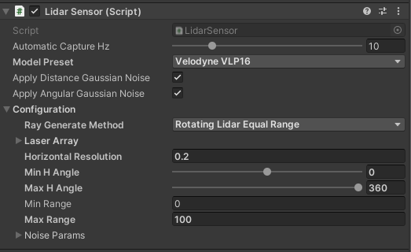
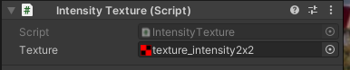
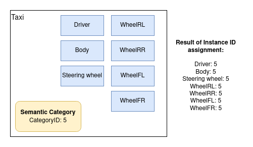

# Lidar Sensor
AWSIM uses Robotec GPU Lidar, which is a cross-platform (Windows and Linux), RTX-accelerated, CUDA/C++ library developed by [Robotec.AI](https://robotec.ai/). For more information about RGL library, visit [its repository](https://github.com/RobotecAI/RobotecGPULidar).

AWSIM is integrated with RGL out-of-the-box - using RGLUnityPlugin Asset.


## ROS2 configuration

The following sections describe RGL configuration in AWSIM.
### Published Topics
The table below shows topics published by `RglLidarPublisher` script.

|topic|msg|frame_id|hz|QoS|
|:--|:--|:--|:--|:--|
|`/lidar/pointcloud`|`sensor_msgs/PointCloud2`|`world`|`10`|`Best effort`, `Volatile`, `Keep last/5`|
|`/lidar/pointcloud_ex`|`sensor_msgs/PointCloud2 `|`world`|`10`|`Best effort`, `Volatile`, `Keep last/5`|
|`/lidar/instance_id`|`sensor_msgs/PointCloud2 `|`world`|`10`|`Best effort`, `Volatile`, `Keep last/5`|

### Output Data


The following table describes `LidarSensor.OutputData` struct used in Unity:

|field|type|feature|
|:--|:--|:--|
|hitCount|int|Number of rays that hit any object|
|hits|Vector3 [ ]|Vertices for visualization in Unity's coordinate system|
|rosPCL24|byte [ ]|Vertices for publishing Autoware format pointcloud in ROS coordinate system|
|rosPCL48|byte [ ]|Vertices for publishing extended Autoware format pointcloud in ROS coordinate system|

## Minimal scene example

The scene `Assets/AWSIM/Scenes/Samples/LidarSceneDevelop.unity` can be used as a complete, minimalistic example of how to set up RGL. It contains `RGLSceneManager` component, four lidars, and an environment composed of floor and walls.


## RGLSceneManager

Each scene needs `RGLSceneManager` component to synchronize models between Unity and RGL. On every frame, it detects changes in Unity's scene and propagates the changes to native RGL code. Three different strategies to interact with in-simulation 3D models are implemented. `RGLSceneManager` uses executes one of the following policies to obtain raycast hit:

- `Only Colliders` - active colliders only,
- `Regular Meshes And Colliders Instead Of Skinned` - mesh for non-skinned MeshRenderers or set of colliders (if provided) attached to the rootBone and below for SkinnedMeshRenderers,
- `RegularMeshesAndSkinnedMeshes` - mesh for both MeshRenderer and SkinnedMeshRenderer.

Mesh source can be changed in the Scene Manager (Script) properties:


*Note: RGLSceneManager performance depends on the mesh source option selected.*

### Setup instruction

To configure RGL for new scenes, please:

1. Create an empty object (name it RGLSceneManager).
2. Attach script `SceneManager.cs` to the RGLSceneManager object.

## Lidar models

Lidar prefabs typically consist of three scripts:

- `LidarSensor` - provides lidar configuration and performs native RGL raytrace calls
- `PointCloudVisualization` - visualizes point cloud collected by the sensor
- `RglLidarPublisher` - converts the data output from LidarSensor to ROS2 msg and publishes it

To use one of the prepared prefab lidars, drag the prefab file and drop it into a scene:


A lidar GameObject should be instantiated automatically:


Next, you can modify scripts parameters in Unity Inspector:

In `LidarSensor` script, the following configuration can be changed:

- `Automatic Capture Hz` - the rate of sensor processing
- `Model Preset` - allows selecting one of the built-in LiDAR models
- `Apply Gaussian Noise` - enable/disable Gaussian noise
- `Configuration` - advanced lidar configuration (in most cases no need to change)
    - `Laser Array` - geometry description of lidar array
    - `Horizontal Steps` - the number of laser array firings between `Min H Angle` and `Max H Angle`
    - `Min H Angle` - minimum horizontal angle (left)
    - `Max H Angle` - maximum horizontal angle (right)
    - `Max Range` - maximum range of the sensor
    - `Noise Params` - lidar noise paramteres



In the script `Point Cloud Visualization` the material of points can be changed. If material is `None` then `PointCloudMaterial` from `Assets/RGLUnityPlugin/Resources` will be automatically loaded. You can disable visualization by deactivating the component.


`Point `Cloud Visualization` Preview:


In the last script - `RglLidarPublisher` - ROS properties such as topics names, frame IDs, publish activation or QoS settings can be modified:


### Adding new lidar models

To add a new lidar model, perform the following steps:

1. Add its name to the `LidarModels.cs`
2. If the Lidar has a non-uniform laser array construction (e.g. different linear/angular spacing between lasers), add an entry to the `LaserArrayLibrary`. Keep in mind that Unity has a left-handed coordinate system, while most of the lidar's manuals use a right-handed coordinate system. In that case, reverse sign of the values of the angles.
3. Add an entry to `LidarConfigurationLibrary`. Use the provided laser array or generate a uniform one using static method `LaserArray.Uniform()`.
4. Done. New lidar preset should be available via Unity Inspector.

### Creating Lidar GameObject

To create GameObject (or prefab) containing a lidar sensor, please perform the following steps:

1. Create an empty object
2. Attach script `LidarSensor.cs`.
3. `PointCloudVisualization.cs` will be added automatically, however, you can disable it.
4. Now you can add a callback from another script to receive a notification when data is ready:
   ```cs
   lidarSensor = GetComponent<LidarSensor>();
   lidarSensor.OnOutputData += HandleLidarDataMethod;
   ```
5. For publishing point cloud via ROS2 attach script `RglLidarPublisher.cs`

#### Prefabs

The list of available prefabs can be found below.

|LiDAR|Path|
|:--|:--|
|HESAI Pandar40P|`Assets/AWSIM/Prefabs/Sensors/RobotecGPULidars/HesaiPandar40P.prefab`|
|HESAI PandarQT64|`Assets/AWSIM/Prefabs/Sensors/RobotecGPULidars/HesaiPandarQT64.prefab`|
|Ouster OS1-64|`Assets/AWSIM/Prefabs/Sensors/RobotecGPULidars/OusterOS1-64.prefab`|
|Velodyne VLP-16|`Assets/AWSIM/Prefabs/Sensors/RobotecGPULidars/VelodyneVLP16.prefab`|
|Velodyne VLC-32C|`Assets/AWSIM/Prefabs/Sensors/RobotecGPULidars/VelodyneVLP32C.prefab`|
|Velodyne VLS-128-AP|`Assets/AWSIM/Prefabs/Sensors/RobotecGPULidars/VelodyneVLS128.prefab`|

## Usage requirements
Objects, to be detectable by Robotec GPU lidar, must fulfill the following requirements:

1. Contain one of the components: `Collider`, `Mesh Renderer`, or `Skinned Mesh Renderer`. It depends on RGLSceneManager mesh source parameter.
2. Be readable from CPU-accessible memory. It can be achieved using the “Read/Write Enabled” checkbox in mesh settings. *Note: Primitive Objects are readable by default.*


## RGL Unity side scripts

The following table describes the most essential lidar simulation scripts:

|script|feature|path|
|:--|:--|:--|
|SceneManager.cs|Synchronize the scene between Unity and RGL.|`Assets/RGLUnityPlugin/Scripts/SceneManager.cs`|
|LidarSensor.cs|Lidar Sensor. Provide lidar configuration and collect point cloud.|`Assets/RGLUnityPlugin/Scripts/LidarSensor.cs`|
|PointCloudVisualization.cs|Visualize point cloud collected by lidar.|`Assets/RGLUnityPlugin/Scripts/PointCloudVisualization.cs`|
|SemanticCategory.cs|Adds category ID to the game object|`Assets/RGLUnityPlugin/Scripts/SemanticCategory.cs`|
|RglLidarPublisher.cs|Convert the data output from LidarSensor to ROS2 msg and publish.|`Assets/AWSIM/Scripts/Sensors/LiDAR/RglLidarPublisher.cs`|
|IntensityTexture.cs|Adds slot for Intensity Texture ID to the game object|`Assets/RGLUnityPlugin/Scripts/IntensityTexture.cs`|


## Read material information

RGL Unity Plugin allows assigning an Intensity Texture to the game objects to produce a point cloud containing information about the lidar ray intensity of hit. It can be used to distinguish different levels of an object's reflectivity. 

### Intensity Texture assignment

To enable reading material information, add IntenityTexture component to every game object that is expected to have non-default intensity values.

<center></center>

After that desired texture has to be inserted into the Intensity Texture slot.

The texture has to be in R8 format. That means 8bit in the red channel (255 possible values).

<center></center>

When the texture is assigned, the intensity values will be read from the texture and added to the point cloud if and only if the mesh component in the game object has a set of properly created texture coordinates. 

The expected number of texture coordinates is equal to the number of vertices in the mesh. The quantity of indices is not relevant. In other cases, the texture will be no read properly.

### Output

Point cloud containing intensity is published on the ROS2 topic via `RglLidarPublisher` component. The intensity value is stored in the `intensity` field of the `sensor_msgs/PointCloud2` message.

## Instance segmentation

RGL Unity Plugin allows assigning an ID to game objects to produce a point cloud containing information about hit objects. It can be used for instance/semantic segmentation tasks.

### ID assignment

To enable segmentation, add `SemanticCategory` component to every game object that is expected to have a distinct ID. All meshes that belong to a given object will inherit its ID.

*Example: SemanticCategory component is assigned to the Taxi game object. All meshes in the Taxi game object will have the same instance ID as Taxi:*

<center></center>

ID inheritance mechanism allows IDs to be overwritten for individual meshes/objects.

*Example: The driver has its own SemanticCategory component, so his instance ID will differ from the rest of the meshes:*

<center></center>

This solution also enables the creation of coarse categories (e.g., Pedestrians, Vehicles)

*Example: SemanticCategory component is assigned to the Vehicles game object that contains all of the cars on the scene:*

<center></center>

### Output

Point cloud containing hit objects IDs is published on the ROS2 topic via `RglLidarPublisher` component. It is disabled by default. Properties related to this feature are marked below:

<center></center>

### Dictionary mapping

The resulting simulation data contains only the id of objects without their human-readable names. To facilitate the interpretation of such data, a function has been implemented to save a file with a dictionary mapping instance ID to game object names. It writes pairs of values in the `yaml` format:

- The name of the game object
- Category ID of `SemanticCategory` component

To enable saving dictionary mapping set output file path to the `Semantic Category Dictionary File` property in the `Scene Manager` component:

<center></center>

The dictionary mapping file will be saved at the end of the simulation.

### Demo scene

In the AWSIM project, you can find a demo scene for instance segmentation feature. It contains a set of game objects with ID assigned and sample lidar that publishes output to the ROS2 topic. The game objects are grouped to present different methods to assign IDs.

To run demo scene:

1. Open scene: `Assets/AWSIM/Scenes/Samples/LidarInstanceSegmentationDemo.unity`
2. Run simulation
3. Open rviz2
4. Setup rviz2 as follows:
    - Fixed frame: world
    - PointCloud2 topic: lidar/instance_id
    - Topic QoS as in the sceen below
    - Channel name: enitity_id
    - To better visualization disable Autocompute intensity and set min to 0 and max to 50

<center></center>
