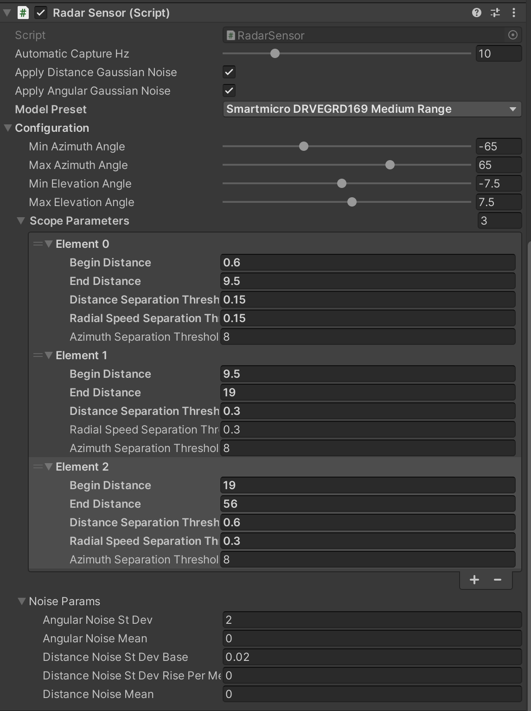
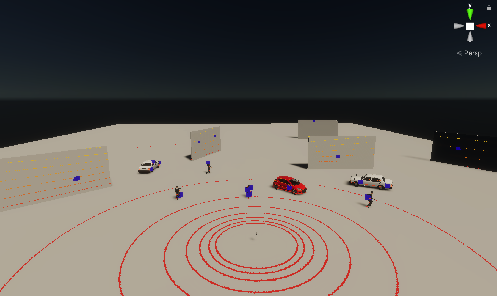

# RadarSensor

## Introduction

The `RadarSensor` component simulates a radar sensor that detect objects in the environment.
Real-world radar sensors work by emitting radio waves and detecting the waves that are reflected back from objects in
the environment.

`RadarSensor` implements simplified a model of wave propagation and reflection using GPU-accelerated ray casting and
post-processing
to obtain radar-specific information such as radial (aka doppler)
speed, [RCS](https://en.wikipedia.org/wiki/Radar_cross_section),
power level, noise level and signal-to-noise ratio.

`RadarSensor` component is a part of [`RGLUnityPlugin`](../LiDARSensor/RGLUnityPlugin) that integrates the external [
*RobotecGPULidar*](https://github.com/RobotecAI/RobotecGPULidar) (`RGL`) library with *Unity*.

!!! warning "Use RGL in your scene"
    If you want to use `RGL` in your scene, make sure the scene has
    an [`SceneManager` component](../LiDARSensor/RGLUnityPlugin/#scenemanager) added and all objects meet
    the [usage requirements](../LiDARSensor/RGLUnityPlugin/#usage-requirements).

### Prefabs

Prefabs can be found under the following path:

Assets/AWSIM/Prefabs/Sensors/RobotecGPULidars/*

| Radar                  | Path                          | Appearance                                            |
|:-----------------------|:------------------------------|:------------------------------------------------------|
| *SmartmicroDRVEGRD169* | `SmartmicroDRVEGRD169.prefab` |  |

### Components


The Radar sensor simulation functionality is split into three components:

- *Radar Sensor* (script) - provides radar configuration and creates *RGL* pipeline to simulate radar.
- *Rgl Lidar Publisher* (script)  - extends *RGL* pipeline with nodes to publish *ROS2* messages ([see](../LiDARSensor/LiDARSensor/#rgl-lidar-publisher-script)).
- *Point Cloud Visualization* (script) - visualizes point cloud collected by sensor ([see](../LiDARSensor/LiDARSensor/#point-cloud-visualization-script)).

## Radar Sensor (script)


This is the component that creates the `RGL` node pipeline for the radar simulation.
The pipeline consists of:

- setting ray pattern,
- transforming rays to represent pose of the sensor on the scene,
- applying noise,
- performing raytracing,
- performs point cloud post-processing to achieve radar-like output 

#### Elements configurable from the editor level

- `Automatic Capture Hz` - the rate of sensor processing
- `Model Preset` - allows selecting one of the built-in radar models
- *Configuration*:
    - `Min Azimuth Angle` - minimum azimuth angle (in degrees)
    - `Max Azimuth Angle` - maximum azimuth angle (in degrees)
    - `Min Elevation Angle` - minimum elevation angle (in degrees)
    - `Max Elevation Angle` - maximum elevation angle (in degrees)
    - `Frequency` - frequency of the wave propagation by the radar (in GHz)
    - `Power Transmitted` - power transmitted by the radar (in dBm)
    - `Cumulative Device Gain` - gain of the radar's antennas and any other gains of the device (in dBi)
    - `Received Noise Mean` - mean of the received noise (in dB)
    - `Received Noise St Dev` - standard deviation of the received noise (in dB)
    - *Scope Parameters* - radar ability to separate (distinguish) different detections varies with the distance (e.g. by employing multiple frequency bands). Scope parameters allow to configure separation thresholds for different distance ranges (scopes):
        - `Begin Distance` - begin of the distance interval where the following parameters are used (in meters)
        - `End Distance` - end of the distance interval where the following parameters are used (in meters)
        - `Distance Separation Threshold` - minimum distance between two points to be considered as separate detections (in meters)
        - `Radial Speed Seperation Threshold` - minimum radial speed difference between two points to be considered as separate detections (in meters per seconds)
        - `Azimuth Separation Threshold` - minimum azimuth difference between two points to be considered as separate detections (in degrees)

#### Output Data

`RadarSensor` provides public methods to extend this pipeline with additional `RGL` nodes.
In this way, other components can request point cloud processing operations and receive data in the desired format.

Example of how to get XYZ point cloud data:

1. To obtain point cloud data from another component you have to create a new `RGLNodeSequence` with RGL node to yield XYZ field and connect it to `RadarSensor`:
   ```cs
   rglOutSubgraph = new RGLNodeSequence().AddNodePointsYield("OUT_XYZ", RGLField.XYZ_F32);
   radarSensor = GetComponent<RadarSensor>();
   radarSensor.ConnectToWorldFrame(rglOutSubgraph); // you can also connect to radar frame using ConnectToRadarFrame
   // You can add a callback to receive a notification when new data is ready
   radarSensor.onNewData += HandleRadarDataMethod;
   ```
1. To get data from `RGLNodeSequence` call `GetResultData`:
   ```cs
   Vector3[] xyz = new Vector3[0];
   rglOutSubgraph.GetResultData<Vector3>(ref xyz);
   ```

## Example

On the screenshot below (scene `RadarSceneDevelopSample`) radar detections are shown as blue boxes.


