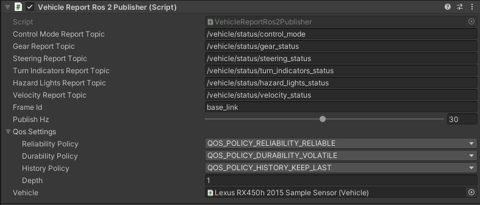

# VehicleStatusSensor

## Introduction
`VehicleStatusSensor` is a component that is designed to aggregate information about the current state of the vehicle.
It aggregates information about:

- *Control mode* - currently active control mode, e.g. `AUTONOMOUS` or `MANUAL`.
- *Gear status* - currently engaged gearbox gear, e.g. `DRIVE` or `REVERSE`.
- *Steering status* - current angle of the steering tire in radians left, e.g. `0.1745` (10&deg;).
- *Turn indicators status* - current status of the direction indicators, e.g. `DISABLE` or `ENABLE_LEFT`.
- *Hazard lights status* - current status of the hazard lights, e.g. `DISABLE` or `ENABLE`.
- *Velocity status* - current lateral, longitudinal and heading velocities values, e.g `{0.2, 0.0, 0.0}`.

### Prefab
Prefab can be found under the following path:

```
Assets/AWSIM/Prefabs/Sensors/VehicleStatusSensor.prefab
```


### Link in the default Scene

This sensor is added directly to the [*URDF*](https://docs.ros.org/en/humble/Tutorials/Intermediate/URDF/URDF-Main.html) link in the `EgoVehicle` prefab.


A detailed description of the `URDF` structure and sensors added to prefab `Lexus RX450h 2015` is available in this [section](../../../Components/Vehicle/URDFAndSensors/).

### Components 


All features are implemented within the *Vehicle Report Ros2 Publisher* (script) which can be found under the following path: 

```
Assets/AWSIM/Prefabs/Sensors/*
```

## Vehicle Report Ros2 Publisher (script)


The script is responsible for updating and publishing each of the aggregated data on a separate topic.
Therefore, it has 6 publishers publishing the appropriate type of message with a constant frequency - one common for all data.

#### Elements configurable from the editor level
- `* Report Topic` - topic on which suitable type of information is published<br>(default: listed in the [table below](#published-topics))
- `Publish Hz` - frequency of publications on each topic<br>(default: `30Hz`)
- `Frame ID` - frame in which data is published, used in [`Header`](https://docs.ros2.org/latest/api/std_msgs/msg/Header.html)<br>(default: `base_link`)
- `QoS`- Quality of service profile used in the publication<br>(default assumed as [`"system_default"`](https://docs.ros.org/en/humble/Concepts/About-Quality-of-Service-Settings.html): `Reliable`, `Volatile`, `Keep last/1`)
- `Vehicle` - the object from which all published data are read<br>(default: `None`)

!!! warning "Vehicle configuration"
    An important element of the script configuration that **must** be set is the scene *Object* (`Vehicle`).
    It will be used for reading all the data needed.
    The appropriate `EgoVehicle` object should be selected.

    If you can't select the right object, make sure it's set up correctly - it has got added all the scripts needed for `EgoVehicle`.

#### Published topics
- Frequency: `30Hz`
- QoS: `Reliable`, `Volatile`, `Keep last/1`

|         Category         | Topic                                    | Message type                                                                                                                                                             | `frame_id`  |
| :----------------------: | :--------------------------------------- | :----------------------------------------------------------------------------------------------------------------------------------------------------------------------- | :---------: |
|      *Control mode*      | `/vehicle/status/control_mode`           | [`autoware_auto_vehicle_msgs/ControlModeReport`](https://github.com/tier4/autoware_auto_msgs/blob/tier4/main/autoware_auto_vehicle_msgs/msg/ControlModeReport.idl)       |      -      |
|      *Gear status*       | `/vehicle/status/gear_status`            | [`autoware_auto_vehicle_msgs/GearReport` ](https://github.com/tier4/autoware_auto_msgs/blob/tier4/main/autoware_auto_vehicle_msgs/msg/GearReport.idl)                    |      -      |
|    *Steering status*     | `/vehicle/status/steering_status`        | [`autoware_auto_vehicle_msgs/SteeringReport`](https://github.com/tier4/autoware_auto_msgs/blob/tier4/main/autoware_auto_vehicle_msgs/msg/SteeringReport.idl)             |      -      |
| *Turn indicators status* | `/vehicle/status/turn_indicators_status` | [`autoware_auto_vehicle_msgs/TurnIndicatorsReport`](https://github.com/tier4/autoware_auto_msgs/blob/tier4/main/autoware_auto_vehicle_msgs/msg/TurnIndicatorsReport.idl) |      -      |
|  *Hazard lights status*  | `/vehicle/status/hazard_lights_status`   | [`autoware_auto_vehicle_msgs/HazardLightsReport`](https://github.com/tier4/autoware_auto_msgs/blob/tier4/main/autoware_auto_vehicle_msgs/msg/HazardLightsReport.idl)     |      -      |
|    *Velocity status*     | `/vehicle/status/velocity_status`        | [`autoware_auto_vehicle_msgs/VelocityReport`](https://github.com/tier4/autoware_auto_msgs/blob/tier4/main/autoware_auto_vehicle_msgs/msg/VelocityReport.idl)             | `base_line` |

