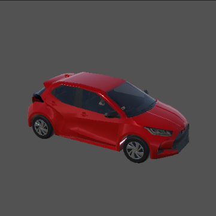
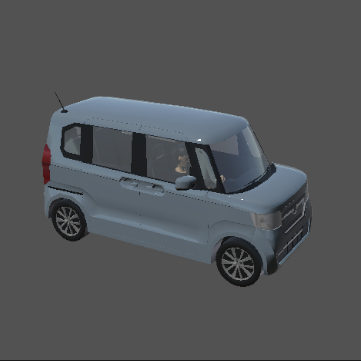
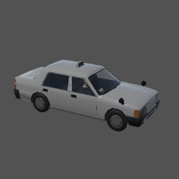
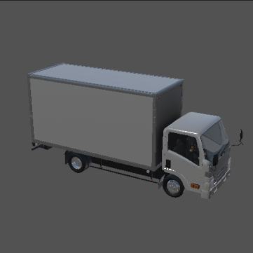
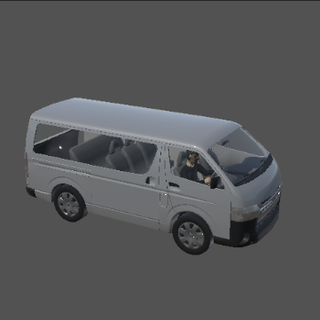

# NPC Vehicle

The `NPC Vehicle` is a non-playable vehicle object and used for simulation traffic flows. 

The following prefab files are placed under `AWSIM\Assets\AWSIM\Prefabs\NPCs\Vehicles` directory.

   

Supported features:

- Move inverse kinematically based on `Vector3 position`.
- Rotate inverse kinematically based on `Vector3 rotation`.

## Sample scene

The sample scene that simulates the behavior of NPC Vehicle is placed under `AWSIM\Assets\AWSIM\Scenes\Samples` directory.

## NPC Vehicle control scripts

`NPCVehicle.cs` script that controls the vehicle's behavior are placed under `AWSIM\Assets\AWSIM\Scripts\NPCs\Vehicles` directory.

## NPC Vehicle API

The following section describes the API of `NPCVehicle.cs` script.

|API|type|feature|
|:--|:--|:--|
|SetPosition|Vector3|Move the NPC Vehicle so that its x, z coodinates are same as the specified coordinates.|
|SetRotation|Vector3|Rotate the NPC Vehicle so that its yaw becomes equal to the specified one.|
