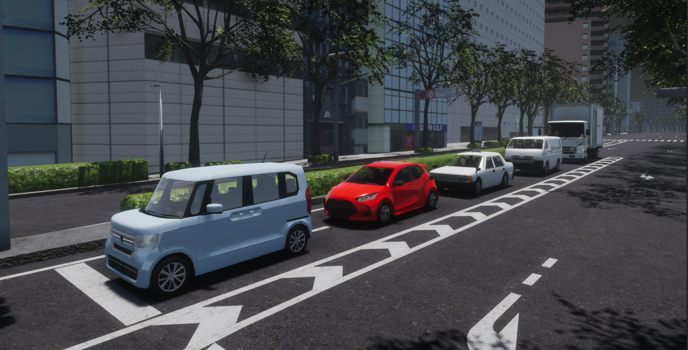
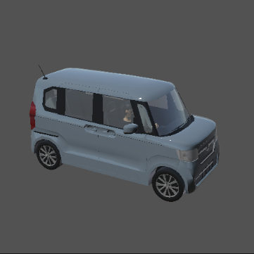
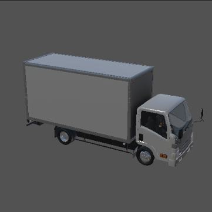
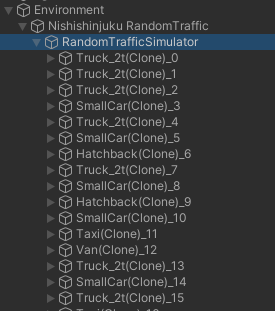
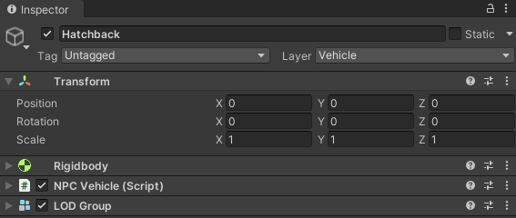
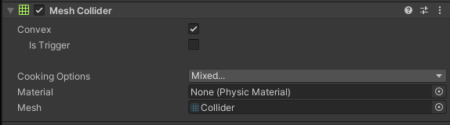
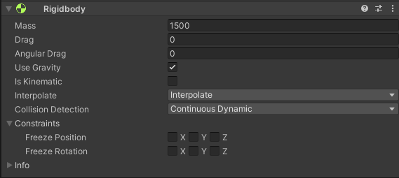
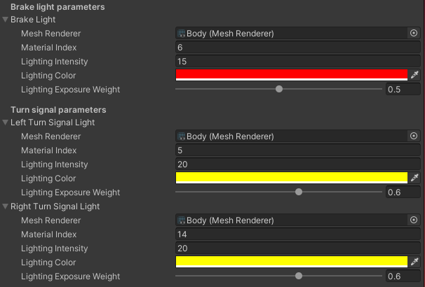

#　NPCVehicle

## Introduction
`NPCVehicle` is a non-playable object that simulates a vehicle that is stationary or moving around the scene.
It can move on roads, more specifically `TrafficLanes`, thanks to the use of `TrafficSimulator` - which you can read more about [here](../../../../Components/Traffic/TrafficComponents/).
Vehicles moving on the scene take into account each other - avoiding collisions, follow traffic lights and have an implemented mechanism of yielding the right of way.



!!! note "Sample scene"
    If you would like to see how `NPCVehicle` works or run some tests, we encourage you to familiarize yourself with the `NPCVehicleSample` default scene described in this [section](../../../../ProjectGuide/Scenes/#npcvehiclesample).

!!! tip "Ego Vehicle"
    If you are interested in the most important vehicle on the scene - `Ego Vehicle`, we encourage you to read this [section](../../../../Components/Vehicle/EgoVehicle/).

### Prefabs and Fbxs
Prefabs can be found under the following path:

```
Assets/AWSIM/Prefabs/NPCs/Vehicles/*
```

The table shows the available prefabs of the vehicles:

|              |        Hatchback         |         SmallCar         |           Taxi           |          Truck           |           Van            |
| :----------: | :----------------------: | :----------------------: | :----------------------: | :----------------------: | :----------------------: |
| *Appearance* |  |  |  |  |  |
|   *Prefab*   |    `Hatchback.prefab`    |    `SmallCar.prefab`     |     `Taxi-64.prefab`     |    `Truck_2t.prefab`     |       `Van.prefab`       |

`NPCVehicle` prefab has the following content:


As you can see, it consists of 2 parents for *GameObjects*: `Visuals` - aggregating visual elements, `Colliders` - aggregating colliders and single object `CoM`.
 All objects are described in the sections below.

### Visual elements
Prefabs are developed using models available in the form of `*.fbx` files.
For each vehicle, the visuals elements and `LOD` were loaded from the appropriate `*.fbx` file.
The `LOD` is always added as components of the main-parent *GameObject* in prefab, while the visual elements of the model are aggregated and added in object `Visuals`.

`*.fbx` file for each vehicle is located in the appropriate `Models` directory for the vehicle under the following path:

```
Assets/AWSIM/Models/NPCs/Vehicles/<vehicle_name>/Models/<vehicle_name>.fbx
```

As you can see, the additional visual element is `Driver`.


It was also loaded from the `*.fbx` file which can be found under the following path:

```
Assets/AWSIM/Models/NPCs/Vehicles/Driver/Model/Driver.fbx
```

!!! example "Vehicle fbx"
    The content of a sample `*.fbx` file is presented below, all elements except `Collider` have been added to the prefab as visual elements of the vehicle.
    `Collider` is used as the *Mesh* source for the `Mesh Collider` in the `BodyCollider` object.

    .

### Link
The default scene does not have vehicles implemented in fixed places, but they are spawned by `RandomTrafficSimulator` which is located in the `Environment` prefab.
Therefore, before starting the simulation, no `NPCVehicle` object is on the scene.

When you run the simulation, you can see objects appearing as children of `RandomTrafficSimulator`:



In each `NPCVehicle` prefab, the local coordinate system of the vehicle (main prefab link) should be defined in the axis of the rear wheels projected onto the ground - in the middle of the distance between them.
This aspect holds significance when characterizing the dynamics of the object, as it provides convenience in terms of describing its motion and control.

 

### Components


There are several components responsible for the full functionality of `NPCVehicle`:

- *[LOD Group](https://docs.unity3d.com/Manual/class-LODGroup.html)* - provides level of detail configuration for shaders - affects *GPU* usage.
- *[Rigidbody](https://docs.unity3d.com/ScriptReference/Rigidbody.html)* - ensures that the object is controlled by the physics engine in *Unity* - e.g. pulled downward by gravity.
- *NPC Vehicle* (script) - provides the ability to change the position and orientation of the vehicle, as well as to control the turn signals and brake light.

Script can be found under the following path:

```
Assets/AWSIM/Scripts/NPCs/Vehicles
```

## CoM
`CoM` (*Center of Mass*) is an additional link that is defined to set the center of mass in the `Rigidbody`.
The *NPC Vehicle* (script) is responsible for its assignment.
This measure should be defined in accordance with reality.
Most often, the center of mass of the vehicle is located in its center, at the height of its wheel axis - as shown below.

 

## Colliders
*Colliders* are used to ensure collision between objects.
In `NPCVehicle`, the main `BodyCollider` collider and `Wheels Colliders` colliders for each wheel were added.

### Body Collider


`BodyCollider` is a vehicle *Object* responsible for ensuring collision with other objects.
Additionally it can be used to detect these collisions.
The `MeshCollider` uses a *Mesh* of an *Object* to build its `Collider`.
The *Mesh* for the `BodyCollider` was also loaded from the `*.fbx` file similarly to the visual elements.


### Wheels Colliders


`WheelsColliders` are an essential element from the point of view of driving vehicles on the road.
They are the only ones that have contact with the roads and it is important that they are properly configured.
Each vehicle, apart from the visual elements related to the wheels, should also have 4 colliders - one for each wheel.

To prevent inspector entry for `WheelCollider` the `WheelColliderConfig` has been developed.
It ensures that friction is set to 0 and only wheel suspension and collisions are enabled.

<!-- TODO: Radius, Suspension, Suspension Spring -->


!!! tip "Wheel Collider Config"
    For a better understanding of the meaning of `WheelCollider` we encourage you to read [this manual](https://docs.unity3d.com/Manual/class-WheelCollider.html).

## LOD


`LOD` provides dependence of the level of detail of the object depending on the ratio of the *GameObject’s* screen space height to the total screen height.
Vehicle models have only one `LOD0` group, therefore there is no reduction in model complexity when it does not occupy a large part of the screen.
It is only culled when it occupies less than 2% of the height.

## Rigidbody


`Rigidbody` ensures that the object is controlled by the physics engine.
The `Mass` of the vehicle should approximate its actual weight.
In order for the vehicle to physically interact with other objects - react to collisions, `Is Kinematic` must be turned off.
The `Use Gravity` should be turned on - to ensure the correct behavior of the body during movement.
In addition, `Interpolate` should be turned on to ensure the physics engine's effects are smoothed out.

## NPC Vehicle (script)


The script takes the `Rigidbody` and provides an inputs that allows the `NPCVehicle` to move.
Script inputs give the ability to set the position and orientation of the vehicle, taking into account the effects of suspension and gravity.
In addition, the script uses the [`CoM`](#com) link reference to assign the center of mass of the vehicle to the `Rigidbody`.

Script inputs are used by `RandomTrafficSimulator`, which controls the vehicles on the scene - it is described [here](../../../../Components/Traffic/TrafficComponents/).

#### Input Data
| Category      | Type    | Description                                                                                                                                                                                              |
| :------------ | :------ | :------------------------------------------------------------------------------------------------------------------------------------------------------------------------------------------------------- |
| *SetPosition* | Vector3 | Move the `NPCVehicle` so that its x, z coordinates are same as the specified coordinates. Pitch and roll are determined by physical operations that take effects of suspension and gravity into account. |
| *SetRotation* | Vector3 | Rotate the `NPCVehicle` so that its yaw becomes equal to the specified one. Vertical movement is determined by physical operations that take effects of suspension and gravity into account.             |

`Visual Object Root` is a reference to the parent aggregating visuals, it can be used to disable the appearance of visual elements of the `NPCVehicle` in the scene.

Whereas `Bounds` Represents an axis aligned bounding box of the `NPCVehicle`.
It is used primarily to detect collisions between vehicles in the event of spawning, yielding and others.
Moreover, vehicle bounds are displayed by [*Gizmos*](https://docs.unity3d.com/ScriptReference/Gizmos.html).


The settings of the remaining elements, i.e. the `Axle` and the `Lights`, are described [here](#axle-settings) and [here](#lights-settings).

!!! question "No Gizmo visualization"
    If you don't see *Gizmo's* visual elements, remember to turn them on.

    


### Axle Settings


This part of the settings is responsible for the proper connection of visual elements with the collider for each wheel - described [earlier](#wheels-colliders).
The objects configured in this section are used to control the vehicle - its wheel speed and steering angle, which are calculated based on the input values.
Correct configuration is very important from the point of view of the `NPCVehicle` movement on the road.

### Lights Settings


This part of the settings is related to the configuration of materials emission - used when a specific lighting is activated.
There are 3 types of lights: `Brake`, `Left Turn Signal` and `Right Turn Signal`.
Each of the lights has its visual equivalent in the form of a *Mesh*.
In the case of `NPCVehicle` all of the lights are included in the `Body` object *Mesh*, which has many materials - including those related to lights.

For each type of light, the appropriate `Material Index` (equivalent of element index in mesh) and `Lighting Color` are assigned - yellow for `Turn Signals`, red for `Break`.

`Lighting Intensity` values are also configured - the greater the value, the more light will be emitted.
This value is related to `Lighting Exposure Weight` parameter that is an exposure weight - the lower the value, the more light is emitted.

The brake light is switched on depending on the speed of the `NPCVehicle`, while `RandomTrafficSimulator` is responsible for switching the turn signals on and off.


