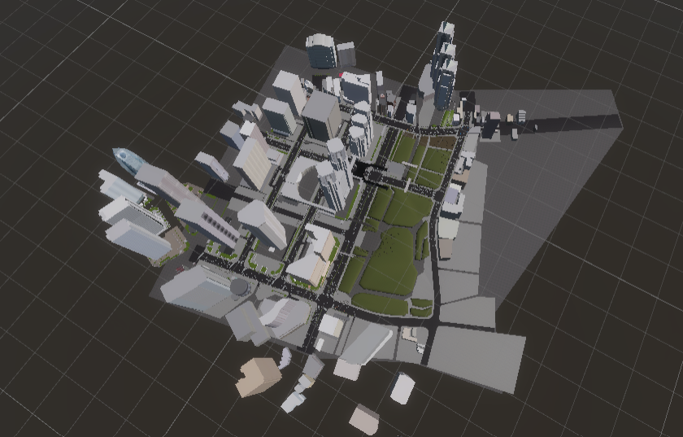
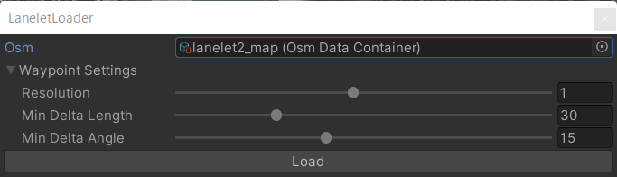
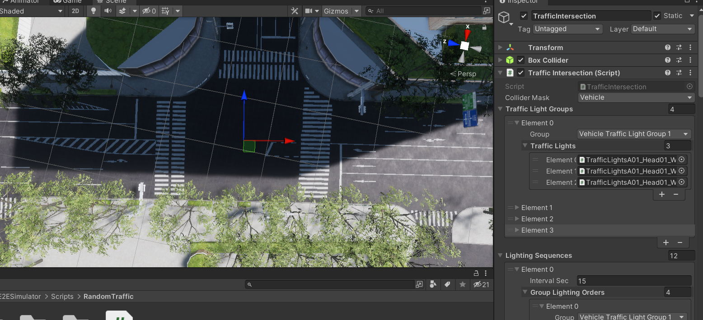
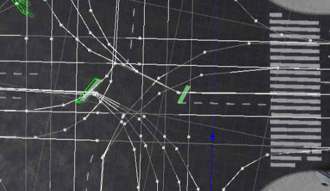
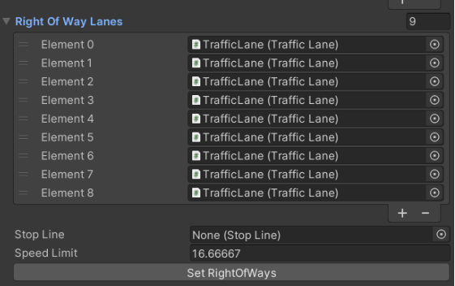

# Add Environment for Random Traffic

This document describes the steps to properly configuer `RandomTrafficSimulator` in your environment.

## Map preparation

The 3D map model should be added to the scene. Please make sure that the `Environment` component with appropriate `mgrsOffsetPosition` is attached to the root GameObject.

## Annotate Traffic Lights

Please attach `TrafficLight` component to all traffic light GameObjects placed on scene.
  

## Load Lanelet

The lanelet load process can be performed by opening `AWSIM -> Random Traffic -> Load Lanelet` at the top toolbar of Unity Editor.

You should be prompted with a similar window to the one presented below. Please adjust the parameters for the loading process if needed.

Waypoint settings affect the density and accuracy of the generated waypoints. The parameters are described below:

- Resolution: resolution of resampling. Lower values provide better accuracy at the cost of processing time.
- Min Delta Length: minimum length(m) between adjacent points.
- Min Delta Angle: minimum angle(deg) between adjacent edges. Lowering this value produces a smoother curve.

To generate the Lanelet2 map representation in your simulation, please click the `Load` button. Environment components should be generated and placed as child objects of the `Environment` GameObject. You can check their visual representation by clicking consecutive elements in the scene hierarchy.

## Annotate Traffic Intersections

To annotate intersection please, add an empty GameObject named `TrafficIntersections` at the same level as the `TrafficLanes` GameObject.

For each intersection repeat the following steps:

1. Add an GameObject named `TrafficIntersection` as a child object of the `TrafficIntersections` object.
2. Attach a `TrafficIntersection` component to it.
3. Add a  `BoxCollider` as a component of GameObject. It's size and position should cover the whole intersection. This is used for detecting vehicles in the intersection.
4. Set `TrafficLightGroups`. Each group is controlled to have different signals, so facing traffic lights should be added to the same group. These groupings are used in traffic signal control.
5. Specify the signal control pattern.

## Annotate right of ways on uncontrolled intersections

For the vehicles to operate properly it is needed to annotate the right of way of `TrafficLane` manually on intersections without traffic lights.

To set the right of way, please:

- Select a straight lane that is not right of way in the intersection. The selected lane should be highlighted as presented below.
- Click the `Set RightOfWays` button to give the lane priority over other lanes.

- Please check if all lanes that intersect with the selected lane are highlighted yellow. This means that the right of way was applied correctly.

## Annotate stop lines

For each right turn lane that yields to the opposite straight or left turn lane, a stop line needs to be defined near the center of the intersection.

If there is no visible stop line, a `StopLine` component should be added to the scene, near the center of the intersection and associated with `TrafficLane`.

## Check final configuration

Once all the components are ready, the simulation can be run.
Check carefully if the vehicles are moving around the map correctly.
For each intersection, review the settings of the relevant components if vehicles are unable to proceed.
