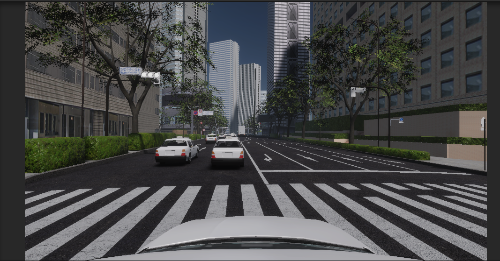

# Random Traffic Simulator
The `RandomTrafficSimulator` simulates random behaviour of NPCs that folows traffic rules. It allows you to add vehicles as obstacles in a driving simulation.
  

## Getting Started
### Overview
The RandomTraffic system consists of the following components:

- `RandomTrafficSimulator` component manages lifecycle of NPCs and simulates NPC behaviours.
- Additional Environment components(`TrafficLane`, `TrafficIntersection` and `StopLine`) helps you to annotate traffic rules.
- `NPCVehicle` components are updated by `RandomTrafficSimulator`
- Ego vehicle can be referenced to be considered in the simulation steps.

### Quick Start
1. Prepare nishishinjuku environment assets.
2. Open and play `Scenes/Main/RandomTraffic.unity`. NPCs should be generated in the scene and move along the lanes.
3. You can control ego vehicle with arrow keys
  

For manual setup, please read [Components Settings](#component-settings) and [Add Environment for Random Traffic](AddRandomTrafficEnvironment)

## Components Settings
  

| Parameter | Description |
|---|---|
| Seed | Seed value for random generator |
| Ego Vehicle | Transform of ego vehicle |
| Vehicle Layer Mask | LayerMask that masks only vehicle(NPC and ego) colliders |
| Ground Layer Mask | LayerMask that masks only ground colliders of the map |
| **NPC Vehicle Settings** | |
| Max Vehicle Count | Maximum number of NPC vehicles |
| NPC Prefabs | Prefabs of NPC vehicles which should have `NPCVehicle` component |
| Spawnable Lanes | `TrafficLane` components where NPC vehicles can spawn|
| Vehicle Config | Parameters for NPC vehicle control `Sudden Deceleration` is a deceleration during emergency braking |
| **Debug** | |
| Show Gizmos | Enable the checkbox to show editor gizmos that visualize behaviours of NPCs |

## Gizmos
Gizmos are useful for checking current behavior of NPCs and its causes. Gizmos have a high display load so please disable it if the editor is laggy.
  
