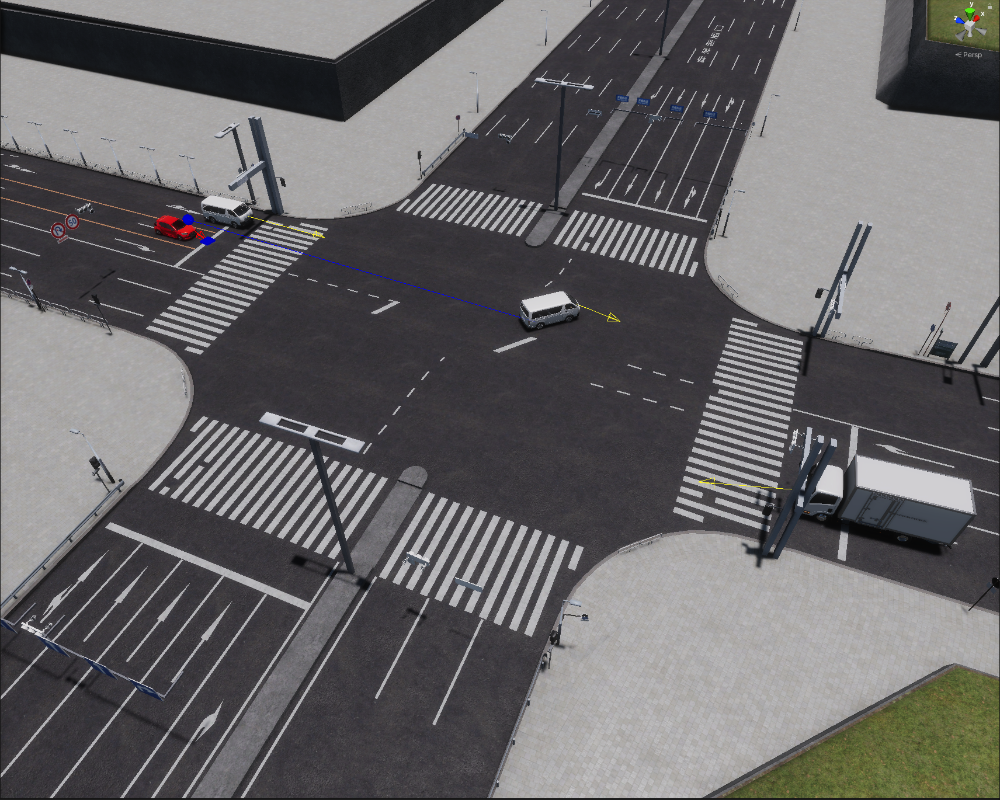
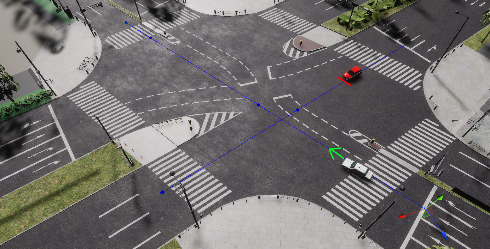

# Yielding rules
The `RandomTrafficSimulator` assumes that there are 10 phases of yielding priority:

!!! note "RandomTrafficYielding scene"
    If you would like to see how `RandomTrafficSimulator` with yielding rules works or run some tests, we encourage you to familiarize yourself with the `RandomTrafficYielding` scene described in this [section](../../../ProjectGuide/Scenes/#randomtrafficyielding).

1. `NONE` - state in which it is only checked if a vehicle is approaching the intersection. If yes, a transition to state `ENTERING_INTERSECTION` is made.

1. `ENTERING_INTERSECTION` - state in which it is checked if any of the situations `LANES_RULES_ENTERING_INTERSECTION`, `LEFT_HAND_RULE_ENTERING_INTERSECTION`,  `INTERSECTION_BLOCKED`  occur, if yes the state of the vehicle is changed to one matching the situation - to determine if the vehicle must yield priority. If none of these situations occur only the entry into the intersection will result in a transition to `AT_INTERSECTION`.

1. `AT_INTERSECTION` - state in which it is checked if any of the situations `LANES_RULES_AT_INTERSECTION`, `LEFT_HAND_RULE_AT_INTERSECTION`,  `FORCING_PRIORITY`  occur, if yes the state of the vehicle is changed to one matching the situation - to determine if the vehicle must yield priority. If none of these situations occur only leaving the intersection will result in a transition to `NONE`.

1.  `INTERSECTION_BLOCKED` -  when vehicle A is approaching the intersection, it yields priority to vehicle B, which should yield priority, but is forcing it - this refers to a situation in which vehicle B has entered the intersection and has already passed its stop point vehicle B isn’t going to stop but has to leave the intersection. Until now, vehicle A has continued to pass through the intersection without taking vehicle B into account, now it is checking if any vehicle is forcing priority (vehicle A has `INTERSECTION_BLOCKED` state).
 **(vehicle A is red car with blue sphere, B is the white car to which it points)**

1. `LEFT_HAND_RULE_ENTERING_INTERSECTION` -  vehicle A, before entering the intersection where the traffic lights are off, yields priority to vehicles (ex. B) that are approaching to the intersection and are on the left side of vehicle A. 
Until now, situations in which the lights are off were not handled. If a vehicle didn't have a red light and was going straight - it just entered the intersection. Now vehicle A checks if the vehicles on the left (ex. B) have a red light, if not it yields them priority.
 **(vehicle A is truck car with gray sphere, B is the white car to which it points)**

1. `LEFT_HAND_RULE_AT_INTERSECTION` -  when vehicle A is already at the intersection, yields priority to vehicles (ex. B) that are also at the intersection and are on its left side - in cases where no other yielding rules are resolved between them (i.e. there are no `RightOfWayLanes` between them).
 **(vehicle A is red, B is white)**

1. `LANES_RULES_ENTERING_INTERSECTION` - when vehicle B intends to turn left and is approaching at the intersection where it needs to yield to vehicle A which is going straight ahead, then it goes to state `LANES_RULES_ENTERING_INTERSECTION`. The introduced changes take into account that a vehicle approaching the intersection considers not only the vehicles at the intersection but also those which are approaching it (at a distance of less than `minimumDistanceToIntersection` to the intersection).
 **(vehicle B is truck with yellow sphere, A the white car to which it points)**

1. `LANES_RULES_AT_INTERSECTION` - when vehicle B intends to turn right and is already at the intersection where it needs to yield to vehicle A which is approaching the intersection, then it goes to state `LANES_RULES_AT_INTERSECTION`. The introduced changes take into account that a vehicle approaching the intersection considers not only the vehicles at the intersection but also those which are approaching it (at a distance of less than `minimumDistanceToIntersection` to the intersection).
**(vehicle B is car with red sphere, A the white car to which it points)**

1. `FORCING_PRIORITY` -  state in which some vehicle B should yield priority to a vehicle A but doesn't - for some reason, most likely it could be some unusual situation in which all other rules have failed. Then vehicle A which is at intersection yields priority to a vehicle that is forcing priority. In such a situation, vehicle A transitions to state `FORCING_PRIORITY`. It is very rare to achieve this state, but it does happen. 

## Gizmos Markings
- **No sphere** means the vehicle is in one of the following states - `NONE`, `ENTERING_INTERSECTION` or `AT_INTERSECTION`.
- The **gray** sphere means that the vehicle is approaching the intersection and yields priority to the vehicle on the left side - `LEFT_HAND_RULE_ENTERING_INTERSECTION`.
- The **black** sphere means that the vehicle is at the intersection and yields priority to a vehicle on the left side - `LEFT_HAND_RULE_AT_INTERSECTION`.
- The **yellow** sphere means that the vehicle yields due to lanes rules before entering the intersection - `LANES_RULES_ENTERING_INTERSECTION`. 
- The **red** sphere means that it yields due to lanes rules but is already at the intersection - `LANES_RULES_AT_INTERSECTION`.
- The **blue** sphere means that a vehicle is approaching the intersection and yields priority to a vehicle that is forcing priority - `INTERSECTION_BLOCKED` - when the turning vehicle begins to yield, then the blue sphere disappears. However, if the turning vehicle continues to turn (does not yield because it has passed the stopping point), then the vehicle going straight stops before the intersection and allows the turning vehicle to leave the intersection.
- The **pink** sphere means that a vehicle is at intersection and yields priority to a vehicle that is forcing priority - `FORCING_PRIORITY`.

