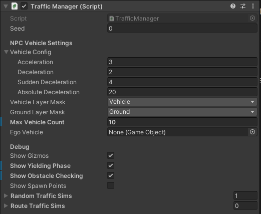
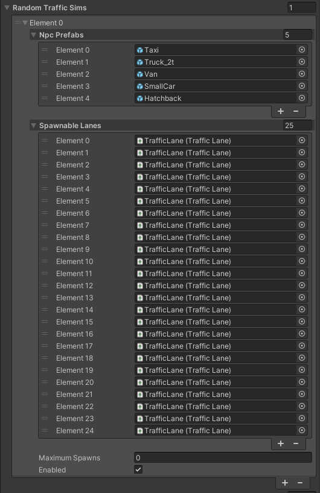
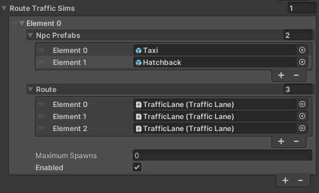
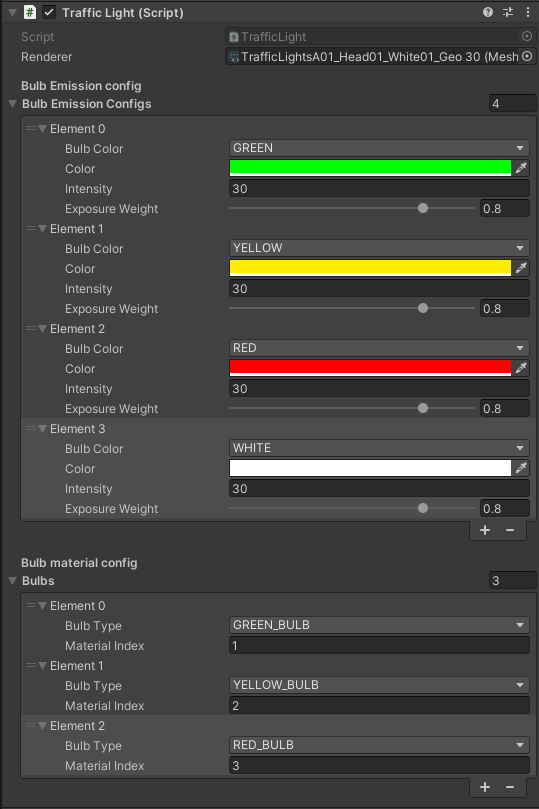
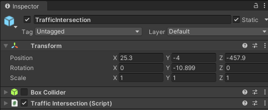
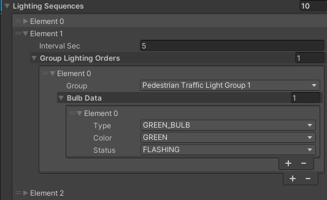
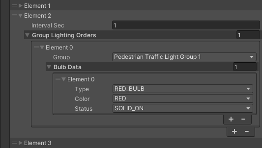
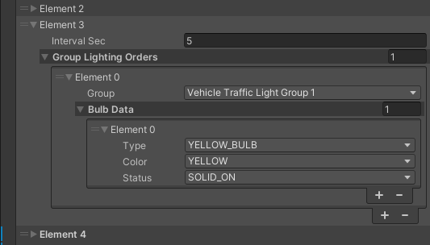
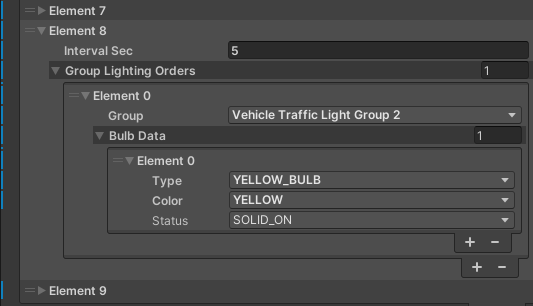

!!! warning "This section"
    This section is still under development!

This is a section that describes in detail all components related to simulated traffic in the `Environment` prefab.

## Architecture

The random traffic system consists of the following components:

- [`TrafficManager`](#trafficmanager-script)

    It is a top level interface meant to be used on the *Unity* scene.
    `TrafficManager` runs all elements needed for a successful traffic simulation.
    This component manages all `TrafficSimulators` so they don't work against each other.
    It gives you the possibility to configure the `TrafficSimulators`.
    
- `TrafficSimulator` 
  
    Technically it is not a component, it is crucial to understand what it is and what it does in order to correctly configure the `TrafficManager`.
    `TrafficSimulator` manages `NPCVehicles` spawning.
    There can be many `TrafficSimulators` on the scene.
    They are added and configured in the `TrafficManager` component.
    Every `TrafficSimulator` manages some part of the traffic it is responsible for - meaning it has spawned the `NPCVehicles` and set their configuration.

    - `RandomTrafficSimulator` - spawns and controls `NPCVehicles` driving randomly
    - `RouteTrafficSimulator` - spawns and controls `NPCVehicles` driving on a defined route

    !!! info "TrafficSimulator inaccessibility"
        It is not possible to get direct access to the `TrafficSimulator`.
        It should be added and configured through the `TrafficManager` component.

- [`TrafficLane`](#trafficlanes), [`TrafficIntersection`](#trafficintersections) and [`StopLine`](#stoplines)

    These components represent traffic entities.
    They are used to control and manage the traffic with respect to traffic rules and current road situation.

- [`NPCVehicle`](../../../Components/Traffic/NPCs/Vehicle/)

    The vehicle models (*NPCs*) spawned by one of the `TrafficSimulators`.
    They are spawned according to the `TrafficSimulator` configuration and either drive around the map randomly (when spawned by a [`RandomTrafficSimulator`](#random-traffic)) or follow the predefined path (when spawned by a [`RouteTrafficSimulator`](#route-traffic)).
    `NPCVehicles` are managed by one central knowledge base.

The process of spawning a `NPCVehicle` and its later behavior control is presented on the following sequence diagram.

<!--  -->

!!! note "Sequence Diagram Composition"
    Please note that the diagram composition has been simplified to the level of *GameObjects* and chosen elements of the *GameObjects* for the purpose of improving readability.

## Lanelet2
*Lanelet2* is a library created for handling a map focused on automated driving.
It also supports *ROS* and *ROS2* natively.
In *AWSIM* *Lanelet2* is used for reading and handling a map of all roads.
Specifically it does contain all [`TrafficLanes`](#trafficlanes) and [`StopLines`](#stoplines).
You may also see us referring to the actual map data file (`*.osm`) as a *Lanelet2*.

!!! info "Lanelet2 official page"
    If you want to learn more we encourage to visit the [official project page](https://github.com/fzi-forschungszentrum-informatik/Lanelet2/tree/master#readme).

## RandomTrafficSimulator
!!! note "Nomenclature"
    Please note that
    
    - a [*GameObject*](#link-in-the-default-scene)
    - an [element spawning `NPCVehicles` randomly](#random-traffic) and
    - the [whole system of traffic control](#randomtrafficsimulator)

    are named `RandomTrafficSimulator`.
    Keep this in mind when reading the following page - so you don't get confused.

`RandomTrafficSimulator` simulates traffic with respect to all traffic rules. The system allows for random selection of car models and the paths they follow. It also allows adding static vehicles in the simulation.

### Link in the default Scene

The `RandomTrafficSimulator` consists of several *GameObjects*.

- `RandomTrafficSimulator` - this is an *Object* consisting of a *Traffic Manager* (script). 
    You can learn more about it [here](#trafficmanager-script).
- `TrafficIntersections` - this is a parent *Object* for all `TrafficIntersections`. 
    You can learn more about it [here](#trafficintersections).
- `TrafficLanes` - this is a parent *Object* for all `TrafficLanes`. 
    You can learn more about it [here](#trafficlanes).
- `StopLines` - this is a parent *Object* for all `StopLines`. 
    You can learn more about it [here](#stoplines).

### Components

`RandomTrafficSimulator` only has one component: *Traffic Manager* (script) which is described below.

### TrafficManager (script)

*Traffic Manager* (script) is responsible for all of top level management of the [`NPCVehicles`](../../../Components/Traffic/NPCs/Vehicle/).
It managed spawning of `NPCVehicles` on `TrafficLanes`.

`TrafficManager` uses the concept of `TrafficSimulators`.
One `TrafficSimulator` is responsible for managing its set of `NPCVehicles`.
Every `TrafficSimulator` spawns its own `NPCVehicles` independently.
The vehicles spawned by one `TrafficSimulator` do respect its configuration.
`TrafficSimulators` can be interpreted as `NPCVehicle` spawners with different configurations each.
Many different `TrafficSimulators` can be added to the `TrafficManager`.

If a random mode is selected ([`RandomTrafficSimulator`](#random-traffic)) then [`NPCVehicles`](../../../Components/Traffic/NPCs/Vehicle/) will spawn in random places (from the selected list) and drive in random directions.
To be able to reproduce the behavior of the `RandomTrafficSimulator` a [`Seed`](https://en.wikipedia.org/wiki/Random_seed) can be specified - which is used for the pseudo-random numbers generation.

`TrafficManager` script also configures all of the spawned `NPCVehicles`, so that they all have common parameters

- `Acceleration` - the acceleration used by the vehicles at all times when accelerating.
- `Deceleration` - the value of deceleration used in ordinary situations.
- `Sudden Deceleration` - deceleration used when standard `Deceleration` is not sufficient to avoid accident.
- `Absolute Deceleration` - value of deceleration used when no other deceleration allows to avoid the accident.

The `Vehicle Layer Mask` and `Ground Layer Mask` are used to make sure all vehicles can correctly interact with the ground to guarantee simulation accuracy.

`Max Vehicle Count` specifies how many `NPCVehicles` can be present on the scene at once.
When the number of `NPCVehicles` on the scene is equal to this value the [`RandomTrafficSimulator`](#randomtrafficsimulator) stops spawning new vehicles until some existing vehicles drive away and disappear.

The `EgoVehicle` field provides the information about Ego vehicle used for correct behavior of`NPCVehicles`when interacting with Ego.

`Show Gizmos` checkbox specifies whether the [Gizmos](#gizmos) visualization should be displayed when running the simulation.

!!! note "Gizmos performance"
    Gizmos have a high computational load.
    Enabling them may cause the simulation to lag.

As mentioned earlier - `TrafficManager` may contain multiple `TrafficSimulators`.
The two available variants of `TrafficSimulator` are described below

- [`RandomTrafficSimulator`](#random-traffic)
- [`RouteTrafficSimulator`](#route-traffic)

`TrafficSimulators` should be interpreted as spawning configurations for some group of `NPCVehicles` on the scene.

#### Random Traffic

When using `RandomTrafficSimulator` the `NPCVehicle` prefabs (*NPC Prefabs*) can be chosen as well as *Spawnable Lanes*.
The later are the only `TrafficLanes` on which the `NPCVehicles` can spawn.
Upon spawning one of the *Spawnabe Lanes* is chosen and - given the vehicle limits are not reached - one random NPCVehicle from the *Npc prefabs* list is spawned on that lane.
After spawning, the NPCVehicle takes a random route until it drives out of the map - then it is destroyed.

The `Maximum Spawns` field specifies how many Vehicles should be spawned before this `TrafficSimulator` stops working.
Set to `0` to disable this restriction.

#### Route Traffic

When using `Route traffic Simulator` the `NPCVehicle` prefabs (*NPC Prefabs*) as well as *Route* can be chosen.
The later is an ordered list of `TrafficLanes` that all spawned vehicles will drive on.
Given the vehicle limit is not reached - the `RouteTrafficSimulator` will spawn one of the *Npc Prefabs* chosen randomly on the first *Route* element (`Element 0`).
After the first vehicle drives off the next one will spawn according to the configuration.
It is **important** for all *Route* elements to be connected and to be arranged in order of appearance on the map.
The NPCVehicle disappears after completing the Route.

The `Maximum Spawns` field specifies how many Vehicles should be spawned before this `TrafficSimulator` stops working.
Set to `0` to disable this restriction.

#### Parameter explanation
| Parameter               | Description                                                                                                 |
| ----------------------- | ----------------------------------------------------------------------------------------------------------- |
| **General Settings**    |                                                                                                             |
| Seed                    | Seed value for random generator                                                                             |
| Ego Vehicle             | Transform of ego vehicle                                                                                    |
| Vehicle Layer Mask      | LayerMask that masks only vehicle(NPC and ego) colliders                                                    |
| Ground Layer Mask       | LayerMask that masks only ground colliders of the map                                                       |
| Culling Distance        | Distance at which NPCs are culled relative to EgoVehicle                                                    |
| Culling Hz              | Culling operation cycle                                                                                     |
| **NPCVehicle Settings** |                                                                                                             |
| Max Vehicle Count       | Maximum number of NPC vehicles to be spawned in simulation                                                  |
| NPC Prefabs             | Prefabs representing controlled vehicles.  They must have `NPCVehicle` component attached.              |
| Spawnable Lanes         | `TrafficLane` components where NPC vehicles can be spawned during traffic simulation                        |
| Vehicle Config          | Parameters for NPC vehicle control `Sudden Deceleration` is a deceleration related to emergency braking |
| **Debug**               |                                                                                                             |
| Show Gizmos             | Enable the checkbox to show editor gizmos that visualize behaviours of NPCs                                 |

## Traffic Light (script)

*Traffic Light* (script) is a component added to every `TrafficLight` on the scene.
It is responsible for configuring the `TrafficLight` behavior - the bulbs and their colors.

The `Renderer` filed points to the renderer that should be configured - in this case it is always a `TrafficLight` renderer.

`Bulbs Emission Config` is a list describing available colors for this Traffic Light.
Every element of this list configures the following

- `Bulb Color` - the name of the configured color that will be used to reference this color
- `Color` - the actual color with which a bulb should light up
- `Intensity` - the intensity of the color
- `Exposure Weight` - how bright should the color be when lighting up

The `Bulb Material Config` is a list of available bulbs in a given Traffic Light.
Every element describes a different bulb.
Every bulb has the following aspects configured

- `Bulb Type` - the name that will be usd to reference the configured bulb
- `Material Index` - The index of a material of the configured bulb.
    This is an index of a sub-mesh of the configured bulb in the Traffic Light mesh.
    The material indices are described in detail [here](../../../Components/Environment/AWSIMEnvironment/#materials) and [here](../../../Components/Environment/AWSIMEnvironment/#materials_1).

## TrafficIntersections

`TrafficIntersection` is a representation of a road intersection.
It consists of several components.
`TrafficIntersection` is used in the `Scene` for managing `TrafficLights`.
All Traffic Lights present on one `Traffic Intersection` must be synchronized - this is why the logic of `TrafficLight` operation is included in the `TrafficIntersection`.

### Link in the default Scene

Every `TrafficIntersection` has its own *GameObject* and is added as a child of the aggregate `TrafficIntersections` *Object*.
`TrafficIntersections` are elements of an `Environment`, so they should be placed as children of an appropriate `Environment` *Object*.

### Components

`TrafficIntersection` has the following components:

- *Box Collider* - marks the area of the Traffic Intersection, it should cover the whole intersection area
- *Traffic Intersection* (script) - controls all Traffic Lights on the given intersection according to the configuration

### Collider

Every `TrafficIntersection` contains a *Box Collider* element.
It needs to accurately cover the whole area of the `TrafficIntersection`.
*Box Collider* - together with the [*Traffic Intersection* (script)](#traffic-intersection-script) - is used for detecting vehicles entering the `TrafficIntersection`.

### Traffic Intersection (script)

*Traffic Intersection* (script) is used for controlling all `TrafficLights` on a given intersection.
The `Collider Mask` field is a mask on which all Vehicle Colliders are present.
It - together with Box Collider - is used for keeping track of how many Vehicles are currently present on the Traffic Intersection.
The [`Traffic Light Groups`](#traffic-light-groups) and [`Lighting Sequences`](#lighting-sequences) are described below.

#### Traffic Light Groups

`Traffic Light Group` is a collection of all `Traffic Lights` that are in the same state at all times.
This includes all redundant `Traffic Lights` shining in one direction as well as the ones in the opposite direction.
In other words - as long as two `Traffic Lights` indicate exactly the same thing they should be added to the same `Traffic Light Group`.
This grouping simplifies the creation of [`Lighting Sequences`](#lighting-sequences).

#### Lighting Sequences

`Lighting Sequences` is the field in which the whole intersection `Traffic Lights` logic is defined.
It consists of many different *Elements*.
Each *Element* is a collection of *Orders* that should take an effect for the period of time specified in the `Interval Sec` field.
`Lighting Sequences` *Elements* are executed sequentially, in order of definition and looped  - after the last element sequence goes back to the first element.

The `Group Lighting Orders` field defines which [`Traffic Light Groups`](#traffic-light-groups) should change their state and how.
For every `Group Lighting Orders` *Element* the [`Traffic Lights Group`](#traffic-light-groups) is specified with the exact description of the goal state for all Traffic Lights in that group - which bulb should light up and with what color.

One `Lighting Sequences` *Element* has many `Group Lighting Orders`, which means that for one period of time many different orders can be given.
E.g. when `Traffic Lights` in one direction change color to green - `Traffic Lights` in the parallel direction change color to red.

!!! info "Traffic Light state persistance"
    If in the given `Lighting Sequences` *Element* no order is given to some [Traffic Light Group](#traffic-light-groups) - this Group will keep its current state.
    When the next `Lighting Sequences` *Element* activates - the given `Traffic Light Group` will remain in an unchanged state.

??? example "Lighting Sequence Sample - details"
    <table>
        <tr>
            <td>Description</td>
            <td>Editor</td>
        </tr>
        <tr>
            <td>
                Traffic Lights in Pedestrian Group 1 change color to flashing green.  
                Other Groups keep their current state.  
                This state lasts for 5 seconds.
            </td>
            <td></td>
        </tr>
        <tr>
            <td>
                Traffic Lights in Pedestrian Group 1 change color to solid red.  
                Other Groups keep their current state.  
                This state lasts for 1 second.
            </td>
            <td></td>
        </tr>
        <tr>
            <td>
                Traffic Lights in Vehicle Group 1 change color to solid yellow.  
                Other Groups keep their current state.  
                This state lasts for 5 seconds.
            </td>
            <td></td>
        </tr>
        <tr>
            <td>
                Traffic Lights in Vehicle Group 1 change color to solid red.  
                Other Groups keep their current state.  
                This state lasts for 3 seconds.
            </td>
            <td></td>
        </tr>
        <tr>
            <td>
                Traffic Lights in Vehicle Group 2 change color to solid green.  
                Traffic Lights in Pedestrian Group 2 change color to solid green.  
                Other Groups keep their current state.  
                This state lasts for 15 seconds.
            </td>
            <td></td>
        </tr>
        <tr>
            <td>
                Traffic Lights in Pedestrian Group 2 change color to flashing green.  
                Other Groups keep their current state.  
                This state lasts for 5 seconds.
            </td>
            <td></td>
        </tr>
        <tr>
            <td>
                Traffic Lights in Pedestrian Group 2 change color to solid red.  
                Other Groups keep their current state.  
                This state lasts for 1 second.
            </td>
            <td></td>
        </tr>
        <tr>
            <td>
                Traffic Lights in Vehicle Group 2 change color to solid yellow.  
                Other Groups keep their current state.  
                This state lasts for 5 seconds.
            </td>
            <td></td>
        </tr>
        <tr>
            <td>
                Traffic Lights in Vehicle Group 2 change color to solid red.  
                Other Groups keep their current state.  
                This state lasts for 3 second.  
                Sequence **loops back** to the first element of the list.
            </td>
            <td></td>
        </tr>
    </table>

## TrafficLanes

`TrafficLane` is a representation of a short road segment.
It consists of several waypoints that are connected by straight lines.
`TrafficLanes` are used as a base for a [RandomTrafficSimulator](#randomtrafficsimulator).
They allow [`NPCVehicles`](../../../Components/Traffic/NPCs/Vehicle/) to drive on the specific lanes on the road and perform different maneuvers with respect to the traffic rules.
TrafficLanes create a network of drivable roads when connected.

### Link in the default Scene

Every `TrafficLane` has its own *GameObject* and is added as a child of the aggregate `TrafficLanes` *Object*.
`TrafficLanes` are an element of an `Environment`, so they should be placed as children of an appropriate `Environment` *Object*.

`TrafficLanes` can be imported from the [*lanelet2*](#lanelet2) `*.osm` file.

### Components

`TrafficLane` consists of an *Object* containing [*Traffic Lane* (script)](#traffic-lane-script).

`TrafficLane` has a transformation property - as every *Object* in Unity - however it is not used in any way.
All details are configured in the [*Traffic Lane* (script)](#traffic-lane-script), the information in *Object* transformation is ignored.

### Traffic Lane (script)

*Traffic Lane* (script) defines the `TrafficLane` structure.
The `Waypoints` field is an ordered list of points that - when connected with straight lines - create a `TrafficLane`.

!!! note "Traffic Lane (script) coordinate system"
    `Waypoints` are defined in the `Environment` coordinate system, the transformation of *GameObject* is ignored.

`Turn Direction` field contains information on what is the direction of this `TrafficLane` - whether it is a right or left turn or straight road.

Traffic lanes are connected using `Next Lanes` and `Prev Lanes` fields.
This way individual `TrafficLanes` can create a connected road network.
One Traffic Lane can have many `Next Lanes` and `Prev Lanes`.
This represents the situation of multiple lanes connecting to one or one lane splitting into many - e.g. the possibility to turn and to drive straight.

[Right Of Way Lanes](#right-of-way-lanes) are described below.

Every `TrafficLane` has to have a `Stop Line` field configured when the [Stop Line](#stoplines) is present on the end of the `TrafficLane`.
Additionally the `Speed Limit` field contains the highest allowed speed on given `TrafficLane`.

#### Right Of Way Lanes

`Right Of Way Lanes` is a collection of `TrafficLanes`.
Vehicle moving on the given `TrafficLane` has to give way to all vehicles moving on every `Right Of Way Lane`.
It is determined based on basic traffic rules.
Setting `Right Of Way Lanes` allows [`RandomTrafficSimulator`](#randomtrafficsimulator) to manage all [`NPCVehicles`](../../../Components/Traffic/NPCs/Vehicle/) so they follow traffic rules and drive safely.

In the *Unity* editor - when a `TrafficLane` is selected - aside from the selected `TrafficLane` highlighted in blue, all `Right Of Way Lanes` are highlighted in yellow.

!!! example "Right Of Way Lanes Sample - details"
    The selected `TrafficLane` (blue) is a right turn on an intersection.
    This means, that before turning right the vehicle must give way to all vehicles driving from ahead - the ones driving straight as well as the ones turning left.
    This can be observed as `TrafficLanes` highlighted in yellow.

    

## StopLines

`StopLine` is a representation of a place on the road where vehicles giving way to other vehicles should stop and wait.
They allow [`RandomTrafficSimulator`](#randomtrafficsimulator) to manage [`NPCVehicles`](../../../Components/Traffic/NPCs/Vehicle/) in safe and correct way - according to the traffic rules.
All possible locations where a vehicle can stop in order to give way to other vehicles - that are enforced by an infrastructure, this does not include regular lane changing - need to be marked with `StopLines`.

###  Link in the default Scene

Every `StopLine` has its own *GameObject* and is added as a child of the aggregate `StopLines` *Object*.
Stop Lines are an element of an `Environment`, so they should be placed as children of an appropriate `Environment` *Object*.

`StopLines` can be imported from the [*lanelet2*](#lanelet2) `*.osm` file.

### Components

`StopLine` consists of an *Object* containing [*Stop Line* (script)](#stop-line-script).

Stop Line has a transformation property - as every *Object* in Unity - however it is not used in any way.
All details are configured in the *Traffic Lane (script)*, the information in *Object* transformation is ignored.

### Stop Line (script)

*Stop Line* (script) defines `StopLine` configuration.
The `Points` field is an ordered list of points that - when connected - create a `StopLine`.
The list of points should always have two elements that create a straight `StopLine`.

!!! note "Stop Line (script) coordinate system"
    `Points` are defined in the Environment coordinate system, the transformation of *GameObject* is ignored.

The `Has Stop Sign` field contains information whether the configured `StopLine` has a corresponding `StopSign` on the scene.

Every Stop Line needs to have a `Traffic Light` field configured with the corresponding [`Traffic Light`](../../../Components/Environment/AWSIMEnvironment/#trafficlights).
This information allows the [`RandomTrafficSimulator`](#randomtrafficsimulator) to manage the [`NPCVehicles`](../../../Components/Traffic/NPCs/Vehicle/) in such a way that they respect the Traffic Lights and behave on the [`Traffic Intersections`](#trafficintersections) correctly.

## Gizmos

*Gizmos* are a in-simulation visualization showing current and future moves of the [`NPCVehicles`](../../../Components/Traffic/NPCs/Vehicle/).
They are useful for checking current behavior of NPCs and its causes.
On the Scene they are visible as cuboid contours indicating which TrafficLanes will be taken by each vehicle in the near future.

!!! warning "Gizmos computing"
    *Gizmos* have a high computational load.
    Please disable them if the simulation is laggy.

<!-- 
!!! node "Draft note"
    (description of what it is and how spawned NPCs behave in the environment)

    - Architecture description [30% current] (**graph**)
    - Seed, Spawnable Lanes, Max Vehicle Count, Spawning process (description, **gif**: example of spawning on a specific line)
    - Vehicle Prefabs (**screens** - examples of vehicles and the impact of boundaries)
    - Vehicle and Ground Layer masks (impact on spawning and behavior)
    - Vehicle Config (an explanation of each and a reference to SpeedMode)
    - Simulator steps (cognition, decision, control -> SpeedMode and Yielding states, **graph**)
    - Yielding process (stop lines, **gifs**)
    - Visualization description (**screens**: yielding, SpeedMode)

    **TrafficIntersection**

    (description of what it is and where it occurs in the environment, **screen**)

    - Traffic Lights (description, bulbs, dependence of the location on the lanelet, impact on the recognition of traffic lights in Autoware, **screens**)
    - `Traffic Intersection` (script)
        - Collider Mask (probably out of date)
        - Traffic Light Groups (what they are and the result of adding traffic lights to them)
        - Lighting Sequences (description, how it works - **gifs**)

    **StopLine**

    (description of what it is and where it occurs in the environment **screen**, impact on Random Traffic)

    - Stop Line (script)
        - Points
        - Stop sign (why this association occurs)
        - Traffic light (why this association occurs)

    **TrafficLane**

    (description of what it is and where it occurs in the environment **screen**, impact on Random Traffic)

    - Traffic Lane (script)
        - Waypoints (**screen**)
        - Turn Direction (**screens**)
        - Next and Prev Lanes (**screens**)
        - Right of Way Lanes (**gifs**: a few examples with explanations regarding to Random Traffic)
        - Stop Line (**screen**)
        - Speed Limit -->

