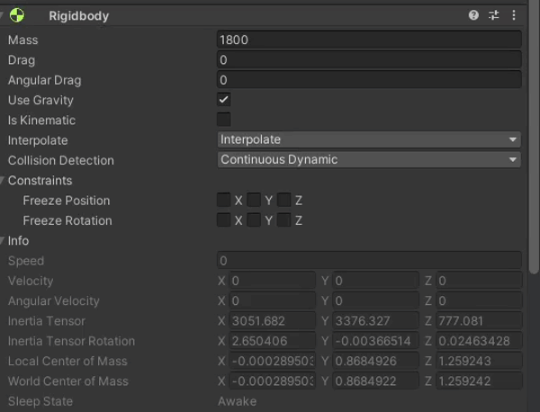
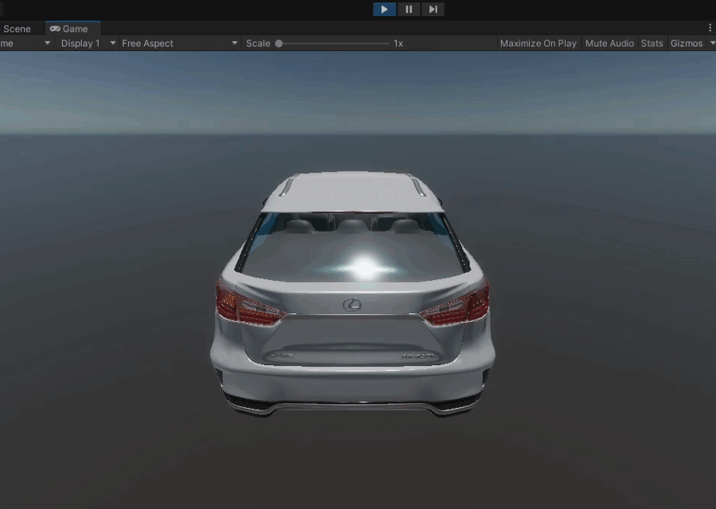

!!! info "Ego Vehicle Component"
    In this tutorial we will create a new `EgoVehicle`.
    To learn more about what an `EgoVehicle` is in *AWSIM* please visit [Ego Vehicle description page](../../../../Components/Vehicle/EgoVehicle/).

## Cerate an Object
Add a child *Object* to the *Simulation* called `EgoVehicle`.

## Add a Rigidbody
1. While having a newly created `EgoVehicle` *Object* selected, in the *Inspector* view click on the 'Add Component' button, search for `Rigidbody` and select it.

    

    

1. Configure Mass and Drag with the correct values for your Vehicle.

    

1. Configure Interpolation and Collision Detection.

    

## Add visual elements
For a detailed explanation hwo to add visual elements of your Vehicle check out this [dedicated tutorial](../AddVisualElements/).

## Add a Canter of Mass
To add a center of mass to your vehicle you have to add a `CoM` child *Object* to the `EgoVehicle` *Object* (the same as in steps before).

Then just set the *position* of the `CoM` *Object* in the *Inspector* view to represent real-world center of mass of the Vehicle.

??? question "How do I know what is the Center of Mass of my Vehicle"
    The best way is to obtain a Center of Mass information from your Vehicle documentation.

    However, if this is not possible, you can try to estimate the Center of Mass of your vehicle.
    Best practice is to set the estimated Center of Mass as the following

    - Evenly between the axles of the Vehicle
    - Right in the middle of the Vehicles width
    - Somewhere in the neighborhood of a quarter of the Vehicle height

    **Note**: This will vary very much depending on your Vehicle construction.
    For the best possible result please follow the Vehicle specifications.

## Add a Reflection Probe
1. Add a new *Object* called `Reflection Probe` as a child to the `EgoVehicle` *Object*.

    

2. Click on the 'Add Component' button, in the windows that pops-up search for `Reflection Probe` and select it.

    

    !!!note
        Please note that with `Reflection Probe` there should also be automatically added a ``HD Additional Reflection Data` Script.

        

3. Configure the `Reflection Probe` as you wish.

    !!! example "Example Configuration"
        Below you can see an example configuration of the `Reflection Probe`.

        

## Add Colliders
For a detailed explanation how to add colliders to your Vehicle check out this [dedicated tutorial](../AddColliders/).

## Add a base for sensors (URDF)
You will most certainly want to add some sensors to your `EgoVehicle`.
First you need to create a parent *Object* for all those sensors called `URDF`.
To do this we will add a child *Object* `URDF` to the `EgoVehicle` *Object*.

This *Object* will be used as a base for all sensors we will add later.

## Add a Vehicle Script
To be able to control your `EgoVehicle` you need a `Vehicle` Script.

1. Add the `Vehicle` Script to the `EgoVehicle` *Object*.

    

    

1. Configure the `Vehicle` Script *Axle Settings* and *Center Of Mass Transform*.

    

!!! note "Testing"
    It is not possible to test this Script alone, but you can test the following
    
    - [Vehicle Keyboard Input Script](#add-a-vehicle-keyboard-input-script)
    - [Vehicle Visual Effects Script](#add-a-vehicle-visual-effect-script)
    - [Vehicle Ros Input Script](#add-a-vehicle-ros-input-script)
    
    If components listed above work correctly this means the `Vehicle` Script works correctly too.

## Add a Vehicle Keyboard Input Script
You can control your `EgoVehicle` in the simulation manually with just one Script called `Vehicle Keyboard Input`.

If you want to add it just click the 'Add Component' button on the `EgoVehicle` *Object* and search for `Vehicle Keyboard Input` Script and select it.

## Add a Vehicle Visual Effect Script
For a visual indication of a Vehicle status you will need a `Vehicle Visual Effect` Script.
To add and configure it follow the steps below.

1. Add a `Vehicle Visual Effect` Script by clicking 'Add Component' button, searching for it and selecting it.

    

1. Configure the lights.

    !!!note
        In this step we will configure only `Brake Lights`, but should repeat this for every Light.
        The process is almost the same for all Lights - just change the mesh renderer and lighting settings according to your preference.

    

### How to test
After configuring `Vehicle Visual Effect` Script it is advised to test whether everything works as expected.

1. Make sure you have a [`Vehicle Keyboard Input` Script](#add-a-vehicle-keyboard-input-script) added and that it is enabled.

1. If your scene does not have any models yet please turn the gravity off in `Rigidbody` configuration so that the Vehicle does not fall down into infinity.

    

1. Start the simulation.

    

1. Test the Turn Signals.

    You can control the Turn Signals with a `Vehicle Keyboard Input` Script.
    Activate the Turn Signals with one of the following keys

    - `1` - Left Turn Signal
    - `2` - Right Turn Signal
    - `3` - Hazard Lights
    - `4` - Turn Off all Signals

    

1. Test the Lights.

    You can control the lights by "driving" the Vehicle using `Vehicle Keyboard Input` Script.
    Although if you have an empty Environment like in this tutorial the Vehicle won't actually drive.

    To test Brake Lights change the gear to Drive by pressing `D` on the keyboard and activate braking by holding `arrow down`.

    To test the Reverse Light change the gear to Reverse by pressing `R` on the keyboard.
    The Reverse Light should turn on right away.

    

!!! tip "Camera tip"
    If you have not configured a camera or configured it in such a way that you can't see the Vehicle well you can still test most of the lights by changing views.

    - Turn the Light (or Signal) on by pressing the appropriate key
    - Move to the Scene View by pressing `ctrl + 1` - now you can move the camera freely
    - To change the Lights you need to go back to Game View by pressing `ctrl + 2`

    Pleas note that this method **won't** work for testing Brake Lights, as for them to work you need to keep the `arrow down` button pressed all the time.

## Add a Vehicle Ros Input Script
For controlling your Vehicle with autonomous driving software (e.g. [Autoware](../../../../Introduction/Autoware/)) you need a `Vehicle Ros Input` Script.

!!! warning "Disable `Vehicle Keyboard Input` Script"
    If you have added a `Vehicle Keyboard Input` Script in your Vehicle please disable it when using the `Vehicle Ros Input` Script.

    Not doing so will lead to the vehicle receiving two different inputs which will cause many problems.

    

Add it to the `EgoVehicle` *Object* by clicking on the 'Add Component' button, searching for it and selecting it.

The Script is configured to work with [Autoware](../../../../Introduction/Autoware/) by default, but you can change the topics and Quality of Service settings as you wish.

!!!note
    The `Vehicle` should be configured correctly, but if you have many Vehicles or something goes wrong, please select the right Vehicle in the `Vehicle` field by clicking on the small arrow icon and choosing the right item from the list.

### How to test
The best way to test the Vehicle Ros Input Script is to run *Autoware*.

1. Run the *Scene* same as on [this page](../../../../GettingStarted/SetupUnityProject/#run-the-demo-in-editor).
2. Launch **only** the *Autoware* like on [this page](../../../../GettingStarted/QuickStartDemo/#launching-autoware)
3. Plan a path in *Autoware* like [here](../../../../GettingStarted/QuickStartDemo/#5-lets-run-the-self-driving-simulation), if the Vehicle moves in *AWSIM* correctly then the Script is configured well.

## Add Sensors
For a detailed explanation how to add sensors to your Vehicle check out this [dedicated tutorial](../AddSensors/).

## Add a Vehicle to Scene
First you will have to save the Vehicle you created as a *prefab*, to easily add it later to different Scenes.

1. Open the Vehicles directory in the *Project* view (`Assets/AWSIM/Prefabs/Vehicles`)
2. Drag the Vehicle *Object* from the *Hierarchy* view to the Vehicles directory

After that, you can add the Vehicle you created to different Scenes by dragging it from Vehicles directory to the *Hierarchy* of different Scenes.

