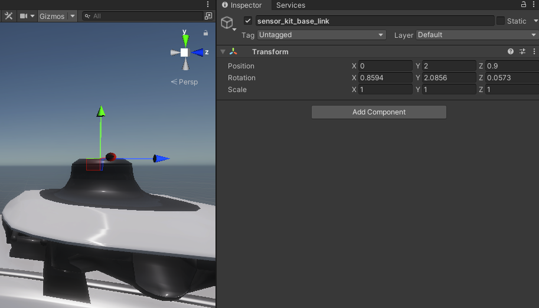
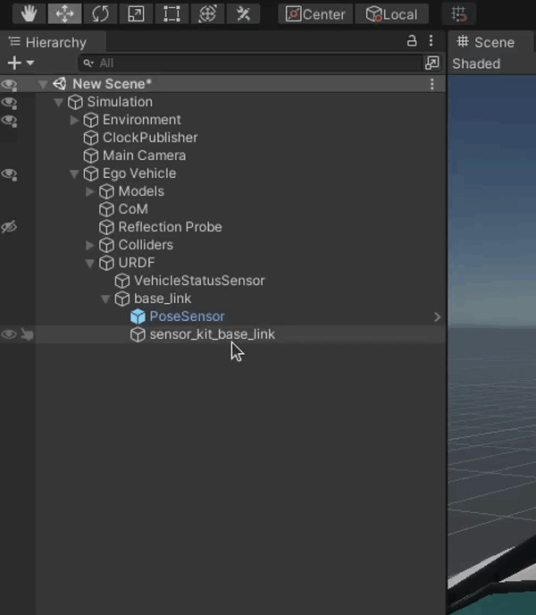
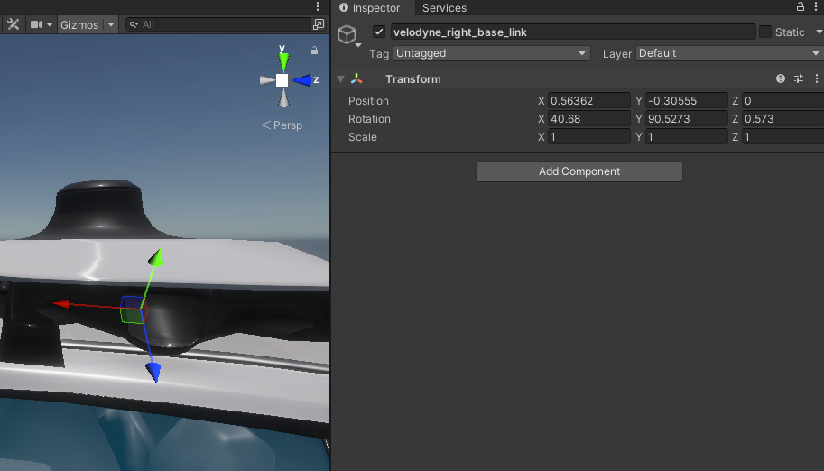
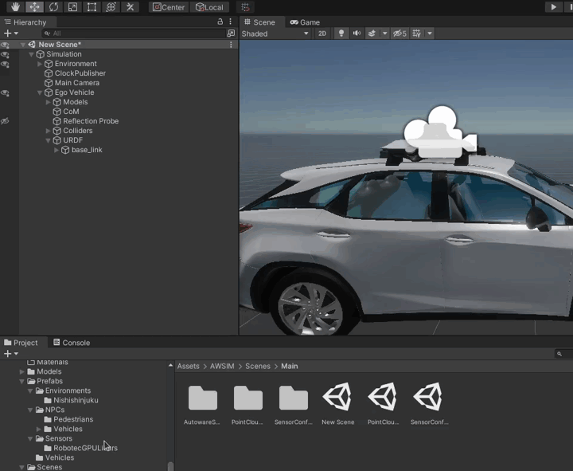
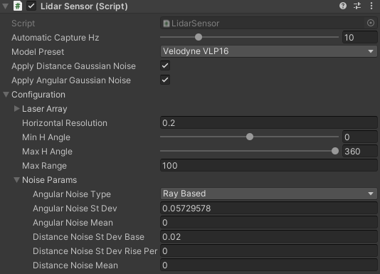
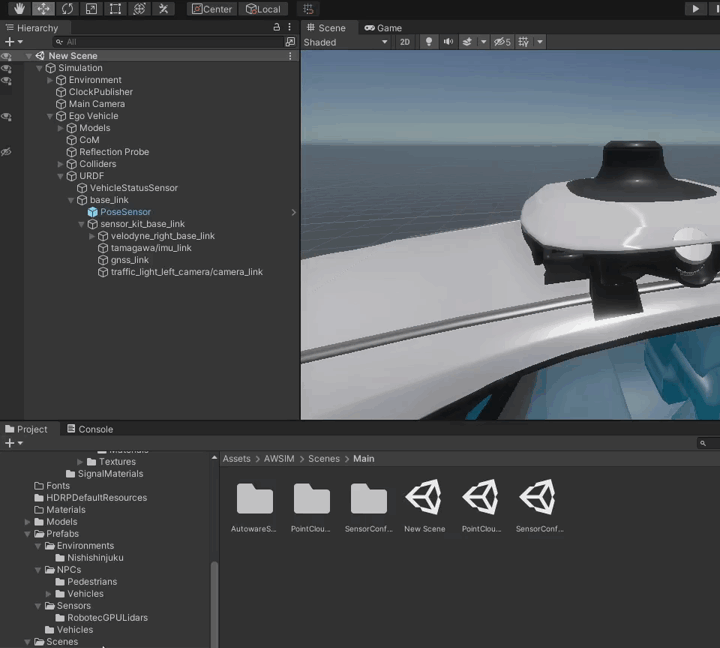
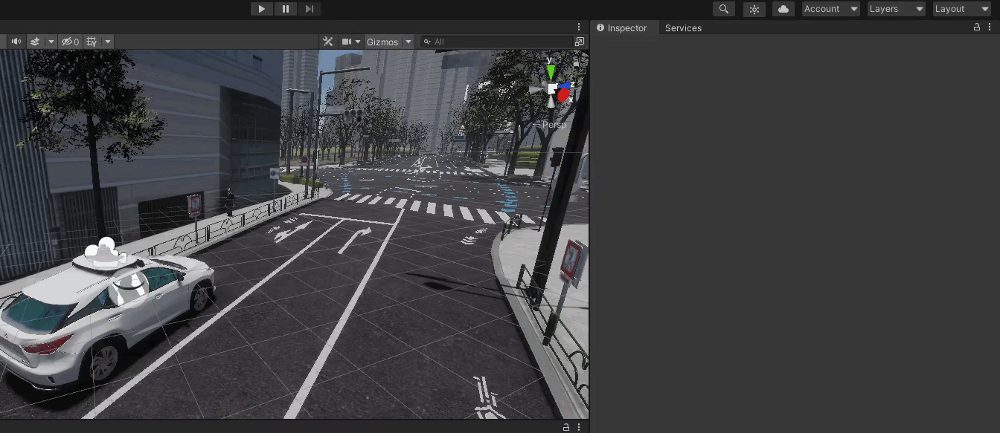

## AWSIM Sensors
There is a number of different sensors available in *AWSIM*.
Below we present a list of sensors with links to their individual pages.

- [Vehicle Status Sensor](../../../../Components/Sensors/VehicleStatusSensor/)
- [GNSS](../../../../Components/Sensors/GNSSSensor/)
- [LiDAR](../../../../Components/Sensors/LiDARSensor/LiDARSensor/)
- [IMU](../../../../Components/Sensors/IMUSensor/)
- [Camera](../../../../Components/Sensors/CameraSensor/)

## Add links for sensors
Best practice is to replicate a *ROS* sensors transformations tree in Unity using *Objects*.

### Coordinate system conversion
Please note that Unity uses less common *left-handed* coordinate system.
Please keep this in mind while defining transformations.
More details about right-handed and left-handed systems can be found [here](https://en.wikipedia.org/wiki/Right-hand_rule).

To simplify the conversion process always remember that any point in ROS coordinate system `(x, y, z)` has an equivalent in the Unity coordinate system being `(-y, z, x)`.

The same can be done with the rotation.
ROS orientation described with roll, pitch and yaw `(r, p, y)` can be translated to Unity Rotation as follows `(p, -y, -r)`.

!!! danger "Unit conversion"
    Please remember to convert the rotation units.
    *ROS* uses radians and *Unity* uses degrees.
    The conversion from radians (`rad`) to degrees (`deg`) is as follows.
    
    ```
    deg = rad * 180 / PI
    ```

### Add transformations tree
!!! warning "URDF"
    Before following this tutorial please make sure you have an `URDF` *Object* like it is shown shown in [this section](../AddAVehicle/#add-a-base-for-sensors-urdf).

First we will have to add a `base_link` which is the root of all transformations.

Add a `base_link` *Object* as a child to the `URDF` *Object*.


!!!info "`base_link` transformation"
    Please remember to set an appropriate transformation of the `base_link` *Object* so that it is identical as the `base_link` used in *ROS* in reference to the Vehicle.
    
    This is very important, as a mistake here will result in all subsequent sensors being misplaced.

Inside the `base_link` we will represent all transformations contained in the *ROS* transformations tree.

You will have to check your Vehicle specific configuration.
You can do this in many ways, for example:

- Check the ROS specific `.yaml` parameter files containing information about each transformation.

    
    !!! example
        Here we see an example `.yaml` file containing transformation from the `base_link` to the `sensor_kit_base_link`:

        ```yaml
        base_link:
            sensor_kit_base_link:
                x: 0.9
                y: 0.0
                z: 2.0
                roll: -0.001
                pitch: 0.015
                yaw: -0.0364
        ```

- Check the values with *ROS* command line tools (for more information on these please visit [official ROS 2 documentation](https://docs.ros.org/en/foxy/Tutorials/Intermediate/Tf2/Introduction-To-Tf2.html)).

    You can run a command like the following to check a transformation between two frames.

    ```bash
    ros2 run tf2_ros tf2_echo [source_frame] [target_frame]
    ```

    !!! example
        Here we see an example command with the output containing transformation from the `base_link` to the `sensor_kit_base_link` (note that the line after `$` sign is the executed command):

        ```log
        $ ros2 run tf2_ros tf2_echo base_link sensor_kit_base_link
        [INFO] [1686654712.339110702] [tf2_echo]: Waiting for transform base_link ->  sensor_kit_base_link: Invalid frame ID "base_link" passed to canTransform argument target_frame - frame does not exist
        At time 0.0
        - Translation: [0.900, 0.000, 2.000]
        - Rotation: in Quaternion [-0.000, 0.008, -0.018, 1.000]
        - Rotation: in RPY (radian) [-0.001, 0.015, -0.036]
        - Rotation: in RPY (degree) [-0.057, 0.859, -2.086]
        - Matrix:
        0.999  0.036  0.015  0.900
        -0.036  0.999  0.000  0.000
        -0.015 -0.001  1.000  2.000
        0.000  0.000  0.000  1.000
        ```

#### Add one sensor link
!!!note
    In this step we will only add one sensor link.
    You will have to repeat this step for every sensor you want to add to your Vehicle.

Let's say we want to add a LiDAR that is facing right.

We have the following configuration files.

```yaml
base_link:
    sensor_kit_base_link:
        x: 0.9
        y: 0.0
        z: 2.0
        roll: -0.001
        pitch: 0.015
        yaw: -0.0364
```

```yaml
sensor_kit_base_link:
    velodyne_right_base_link:
        x: 0.0
        y: -0.56362
        z: -0.30555
        roll: -0.01
        pitch: 0.71
        yaw: -1.580
```

We can clearly see the structure of transformation tree.
The transformations are as follows.

```
base_link -> sensor_kit_base_link -> velodyne_right_base_link
```

We need to start adding these transformation from the root of the tree.
We will start with the `sensor_kit_base_link`, as the `base_link` already exists in our tree.

1. The first step is to add an *Object* named the same as the transformation frame (`sensor_kit_base_link`).

    

1. Next we have to convert the transformation from *ROS* standard to the *Unity* standard.
    This is done with the formulas show in [this section](#coordinate-system-conversion).

    The result of conversion of the coordinate systems and units is shown below.

    ```
    Position:
    (0.9, 0.0, 2.0)             ->  (0.0, 2.0, 0.9)
    Rotation:
    (-0.001, 0.015, -0.0364)    ->  (0.8594, 2.0856, 0.0573)
    ```

    The resulting `sensor_kit_base_link` *Object* transformation is shown below.

    

Now the same has to be done with the `velodyne_right_base_link`.

1. Add transformation *Object* (`velodyne_right_base_link`).

    !!!info
        Remember to correctly set the child *Object*, in this case we use `sensor_kit_base_link` as a child, because this is what the `.yaml` file says.

    

2. Convert the transformation into *Unity* coordinate system.

    The correct transformation is shown below.

    ```
    Position:
    (0, -0.56362, -0.30555)     ->  (0.56362, -0.30555, 0)
    Rotation:
    (-0.01, 0.71, -1.580)       ->  (40.68, 90.5273, 0.573)
    ```

    The final `velodyne_right_base_link` *Object* transformation is shown below.

    

!!!success
    If you have done everything right, after adding all of the sensor links your `URDF` *Object* tree should look something like the one following.

    

## Add sensors
After [adding links for all sensors](#add-links-for-sensors) you need to add the actual sensors into your Vehicle.

!!! info "Sensor position"
    Please keep in mind, that we have created the [sensor links](#add-links-for-sensors) in order to have an accurate transformations for all of the sensors.
    This implies that the Sensor *Object* itself can not have any transformation.

    If one of your Sensors, after adding it to the scene, is mispositioned, check whether the transformation is set to identity (position and rotation are zeros).

When adding sensors almost all of them will have some common fields.

- Frame Id
    
    Frame Id is the name of frame of reference against which the received data will be interpreted by the autonomous driving software stack.

    **Remember** that the Frame Id must exist internally in the ROS transformations tree.

- Topics

    Topics are names of broadcasting channels.
    You can set the names of topics as you like and the data from sensors will be broadcasted on these topics.
    
    **Remember** to configure your receiving end to listen on the same topics as broadcasting ones.

- Quality Of Service settings (QOS settings)

    Quality of service settings allow you to configure the behavior of the source node while broadcasting the sensor data.
    You can adjust these settings to suit your needs.

### Add a Vehicle Status Sensor
To add a Vehicle Status Sensor to your Vehicle simply locate the following directory in the *Project* view and drag a prefab of this Sensor into the `URDF` *Object*.

```
Assets/AWSIM/Prefabs/Sensors
```



Next in the *Inspector* View select your *Vehicle*.


??? example "ROS message example"
    In this example you can see what a valid message from the Vehicle Status Sensor can look like.

    ```log
    $ ros2 topic echo --once /vehicle/status/velocity_status 
    header:
      stamp:
        sec: 17
        nanosec: 709999604
      frame_id: base_link
    longitudinal_velocity: 0.004912620410323143
    lateral_velocity: -0.005416259169578552
    heading_rate: 0.006338323466479778
    ---
    ```

### Add a LiDAR
!!! info "Scene Manager"
    Before continuing with this tutorial please check out a [dedicated one focused on Scene Manager](../../../../Components/Sensors/LiDARSensor/RGLUnityPlugin/#scenemanager).

To add a LiDAR to your Vehicle you will have to drag a model of the LiDAR to the link tree you have created in the [earlier step](#add-links-for-sensors).

You can use the predefined RGL LiDAR models or any other LiDAR models.
In this tutorial we will be using RGL `VelodyneVLP16` LiDAR model.

Simply locate the following directory in the *Project* view and drag the prefab into the designated sensor link.

```
Assets/AWSIM/Prefabs/Sensors/RobotecGPULidars
```


!!! note "LiDAR noise configuration"
    LiDAR Sensor in simulation is returning a **perfect** result data.
    This is not an accurate representation of the real-world.

    LiDAR Sensor addresses this issue by applying a simulated noise to the output data.
    You can configure the noise parameters in the *Inspector* View under `Configuration -> Noise Params` fields.

    You can optionally remove the noise simulation by unchecking the `Apply Distance/Angular Gaussian Noise`.
    
    You can also change the ranges of the LiDAR detection.

    

    There is also a possibility to configure the visualization of the Point Cloud generated by the LiDAR.
    E.g. change the hit-point shape and size.

    

??? example "ROS message example"
    In this example you can see what a valid message from the LiDAR Sensor can look like.

    ```log
    $ ros2 topic echo --once /lidar/pointcloud
    header:
      stamp:
        sec: 20
        nanosec: 589999539
      frame_id: world
    height: 1
    width: 14603
    fields:
    - name: x
      offset: 0
      datatype: 7
      count: 1
    - name: y
      offset: 4
      datatype: 7
      count: 1
    - name: z
      offset: 8
      datatype: 7
      count: 1
    - name: intensity
      offset: 16
      datatype: 7
      count: 1
    - name: ring
      offset: 20
      datatype: 4
      count: 1
    is_bigendian: false
    point_step: 24
    row_step: 350472
    data:
    - 156
    - 218
    - 183
    - 62
    - 0
    - 189
    - 167
    - 187
    - 32
    - 58
    - 173
    - 189
    - 0
    - 0
    - 0
    - 0
    - 0
    - 0
    - 200
    - 66
    - 1
    - 0
    - 0
    - 0
    - 198
    - 129
    - 28
    - 63
    - 0
    - 6
    - 230
    - 58
    - 128
    - 184
    - 93
    - 61
    - 0
    - 0
    - 0
    - 0
    - 0
    - 0
    - 200
    - 66
    - 9
    - 0
    - 0
    - 0
    - 92
    - 2
    - 194
    - 62
    - 0
    - 141
    - 42
    - 187
    - 128
    - 89
    - 139
    - 189
    - 0
    - 0
    - 0
    - 0
    - 0
    - 0
    - 200
    - 66
    - 2
    - 0
    - 0
    - 0
    - 187
    - 168
    - 42
    - 63
    - 0
    - 159
    - 175
    - 59
    - 160
    - 243
    - 185
    - 61
    - 0
    - 0
    - 0
    - 0
    - 0
    - 0
    - 200
    - 66
    - 10
    - 0
    - 0
    - 0
    - 119
    - 186
    - 204
    - 62
    - 0
    - 254
    - 23
    - 59
    - 128
    - 143
    - 41
    - 189
    - 0
    - 0
    - 0
    - 0
    - 0
    - 0
    - 200
    - 66
    - 3
    - 0
    - 0
    - 0
    - 65
    - 241
    - 59
    - 63
    - 128
    - 0
    - 252
    - 187
    - '...'
    is_dense: true
    ---
    ```

### Add an IMU
To add an IMU to your Vehicle you will have to drag a model of the IMU to the link tree you have created in the [earlier step](#add-links-for-sensors).

You can use the provided or your own IMU Sensor.
In this tutorial we will be using IMU Sensor provided with *AWSIM*.

Simply locate the following directory in the *Project* view and drag the prefab into the designated sensor link.

```
Assets/AWSIM/Prefabs/Sensors
```



??? example "ROS message example"
    In this example you can see what a valid message from the IMU Sensor can look like.

    ```log
    $ ros2 topic echo --once /sensing/imu/tamagawa/imu_raw 
    header:
      stamp:
        sec: 20
        nanosec: 589999539
      frame_id: tamagawa/imu_link
    orientation:
      x: 0.0
      y: 0.0
      z: 0.0
      w: 1.0
    orientation_covariance:
    - 0.0
    - 0.0
    - 0.0
    - 0.0
    - 0.0
    - 0.0
    - 0.0
    - 0.0
    - 0.0
    angular_velocity:
      x: 0.014335081912577152
      y: 0.008947336114943027
      z: -0.008393825963139534
    angular_velocity_covariance:
    - 0.0
    - 0.0
    - 0.0
    - 0.0
    - 0.0
    - 0.0
    - 0.0
    - 0.0
    - 0.0
    linear_acceleration:
      x: 0.006333829835057259
      y: -0.005533283110707998
      z: -0.0018753920448943973
    linear_acceleration_covariance:
    - 0.0
    - 0.0
    - 0.0
    - 0.0
    - 0.0
    - 0.0
    - 0.0
    - 0.0
    - 0.0
    ---
    ```

### Add a GNSS
To add a GNSS Sensor to your Vehicle you will have to drag a model of the GNSS to the link tree you have created in the [earlier step](#add-links-for-sensors).

You can use the provided or your own GNSS Sensor.
In this tutorial we will be using GNSS Sensor provided with *AWSIM*.

Simply locate the following directory in the *Project* view and drag the prefab into the designated sensor link.

```
Assets/AWSIM/Prefabs/Sensors
```


??? example "ROS message example"
    In this example you can see what a valid message from the GNSS Sensor can look like.

    ```log
    $ ros2 topic echo --once /sensing/gnss/pose
    header:
      stamp:
        sec: 8
        nanosec: 989999799
      frame_id: gnss_link
    pose:
      position:
        x: 81656.765625
        y: 50137.5859375
        z: 44.60169219970703
      orientation:
        x: 0.0
        y: 0.0
        z: 0.0
        w: 0.0
    ---
    ```

### Add a Camera
To add a Camera Sensor to your Vehicle you will have to drag a model of the Camera to the link tree you have created in the [earlier step](#add-links-for-sensors).

Simply locate the following directory in the *Project* view and drag the prefab into the designated sensor link.

```
Assets/AWSIM/Prefabs/Sensors
```


You can configure some aspects of the Camera to your liking.

E.g. you can set the field of view (fov) of the camera by changing the `Field of View` field or manipulating the physical camera parameters like `Focal Length`.


The **important** thing is to configure the `Camera Sensor` Script correctly.

**Always** check whether the correct `Camera Object` is selected and make sure that `Distortion Shader` and `Ros Image Shader` are selected.

!!! example "Example Camera Sensor Script configuration"
    

You can add the live Camera preview onto the Scene.
To do this select the `Show` checkbox.
Additionally you can change how the preview is displayed.
Change the `Scale` value to control the size of the preview (how many times smaller the preview will be compared to the actual screen size).

Move the preview on the screen by changing the `X Axis` and `Y Axis` values on the `Image On Gui` section.

!!! example "Camera preview example"
    

!!! tip "Testing camera with traffic light recognition"
    You can test the Camera Sensor traffic light recognition by positioning the vehicle on the *Unity* Scene in such a way that on the *Camera preview* you can see the traffic lights.
    
    Remember to lock the *Inspector* view on Camera *Object* before dragging the whole Vehicle - this way you can see the preview while moving the vehicle.

    <!--  -->

    
    
    Run the *Scene* the same as [on this page](../../../../GettingStarted/SetupUnityProject/#run-the-demo-in-editor).

    Launch **only** the *Autoware* like [on this page](../../../../GettingStarted/QuickStartDemo/#launching-autoware).

    By default you should see the preview of traffic light recognition visualization in the bottom left corner of *Autoware*.

    !!! example "Traffic lights recognition example in *Autoware*"
        

??? example "ROS message example"
    In this example you can see what a valid message from the Camera Sensor can look like.

    ```log
    $ ros2 topic echo --once /sensing/camera/traffic_light/image_raw 
    header:
      stamp:
        sec: 14
        nanosec: 619999673
      frame_id: traffic_light_left_camera/camera_optical_link
    height: 1080
    width: 1920
    encoding: bgr8
    is_bigendian: 0
    step: 5760
    data:
    - 145
    - 126
    - 106
    - 145
    - 126
    - 106
    - 145
    - 126
    - 106
    - 145
    - 126
    - 105
    - 145
    - 126
    - 105
    - 145
    - 126
    - 105
    - 145
    - 126
    - 105
    - 145
    - 126
    - 105
    - 145
    - 126
    - 105
    - 145
    - 126
    - 105
    - 145
    - 126
    - 104
    - 145
    - 126
    - 104
    - 145
    - 126
    - 104
    - 145
    - 126
    - 104
    - 145
    - 126
    - 104
    - 145
    - 126
    - 104
    - 145
    - 126
    - 104
    - 145
    - 126
    - 104
    - 145
    - 126
    - 103
    - 145
    - 126
    - 103
    - 145
    - 126
    - 103
    - 145
    - 126
    - 103
    - 145
    - 126
    - 103
    - 145
    - 126
    - 103
    - 145
    - 126
    - 103
    - 145
    - 126
    - 103
    - 145
    - 126
    - 103
    - 145
    - 126
    - 103
    - 145
    - 124
    - 103
    - 145
    - 124
    - 103
    - 145
    - 124
    - 103
    - 145
    - 124
    - 103
    - 145
    - 124
    - 103
    - 145
    - 124
    - 103
    - 145
    - 124
    - 103
    - 145
    - 124
    - 101
    - 145
    - 124
    - 101
    - 145
    - 124
    - 101
    - 145
    - 124
    - 101
    - 145
    - 123
    - 101
    - 145
    - 123
    - 101
    - 145
    - 123
    - 101
    - 145
    - 123
    - '...'
    ---
    ```

### Add a Pose Sensor
To add a Pose Sensor to your Vehicle simply locate the following directory in the *Project* view and drag a prefab of this Sensor into the `base_link` *Object*.

```
Assets/AWSIM/Prefabs/Sensors
```


??? example "ROS message example"
    In this example you can see what a valid message from the Pose Sensor can look like.

    ```log
    $ ros2 topic echo --once /awsim/ground_truth/vehicle/pose 
    header:
      stamp:
        sec: 5
        nanosec: 389999879
      frame_id: base_link
    pose:
      position:
        x: 81655.7578125
        y: 50137.3515625
        z: 42.8094367980957
      orientation:
        x: -0.03631274029612541
        y: 0.0392342209815979
        z: 0.02319677732884884
        w: 0.9983005523681641
    ---
    ```

## Test a Sensor

You can test whether the Sensor works correctly in several ways.

1. Check whether the configuration is correct.

    In terminal source ROS with the following line (only if you haven't done so already).

    ```
    source /opt/ros/humble/setup.bash
    ```

    Check the details about the topic that your Sensor is broadcasting to with the following command.

    ```
    ros2 topic info -v <topic_name>
    ```

    !!!example
        In this example we can see that the message is broadcasted by *AWSIM* and nobody is listening.
        We can also examine the Quality of Service settings.

        ```log
        $ ros2 topic info -v /awsim/ground_truth/vehicle/pose
        Type: geometry_msgs/msg/PoseStamped

        Publisher count: 1

        Node name: AWSIM
        Node namespace: /
        Topic type: geometry_msgs/msg/PoseStamped
        Endpoint type: PUBLISHER
        GID: 01.10.13.11.98.7a.b1.2a.ee.a3.5a.11.00.00.07.03.00.00.00.00.00.00.00.00
        QoS profile:
          Reliability: RELIABLE
          History (Depth): KEEP_LAST (1)
          Durability: VOLATILE
          Lifespan: Infinite
          Deadline: Infinite
          Liveliness: AUTOMATIC
          Liveliness lease duration: Infinite

        Subscription count: 0

        ```

2. Check whether correct information is broadcasted.

    In terminal source ROS with the following line (only if you haven't done so already).

    ```
    source /opt/ros/humble/setup.bash
    ```

    View one transmitted message.

    ```
    ros2 topic echo --once <topic_name>
    ```

    !!!example
        In this example we can see the Vehicles location at the moment of executing the command.

        **NOTE:** The position and orientation are relative to the frame in the `header/frame_id` field (`base_link` in this example).

        ```log
        $ ros2 topic echo --once /awsim/ground_truth/vehicle/pose
        header:
          stamp:
            sec: 46
            nanosec: 959998950
          frame_id: base_link
        pose:
          position:
            x: 81655.7265625
            y: 50137.4296875
            z: 42.53997802734375
          orientation:
            x: 0.0
            y: -9.313260163068549e-10
            z: -6.36646204504876e-12
            w: 1.0
        ---
        ```
