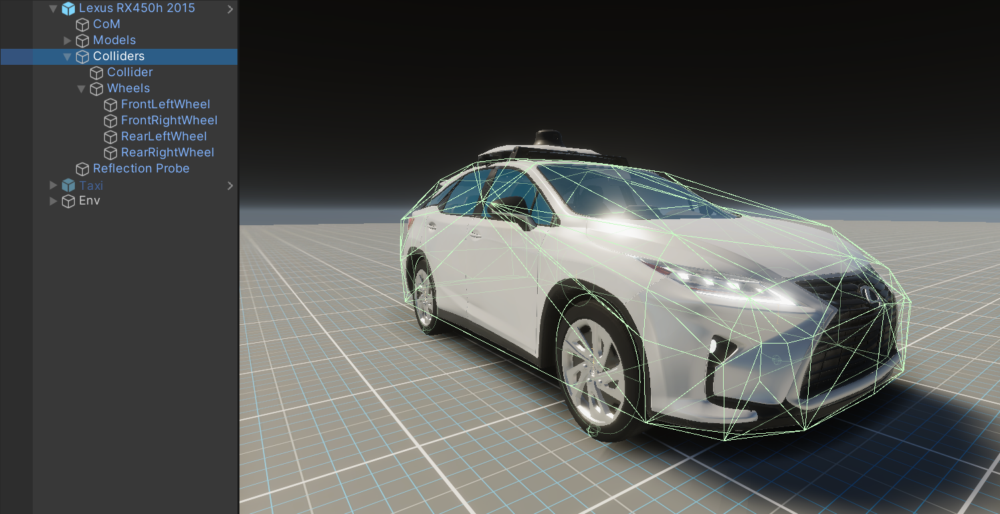

# Add New Vehicle

## 1. Prepare Vehicle 3D models

You can check the fbx of Lexus rx450h in the sample.   
Path : `Assets\AWSIM\Models\Vehicles\Lexus RX450h 2015`

These meshes need to be divided.

- Body
- Each wheel
- Steering

These materials need to be divided.

- HeadLight
- BrakeLight
- TurnSignal
- ReverseLight

## 2. Setup Physics & Collider

1. Attach and configure `Rigidbody`
2. Create `MeshCollider` for Body
3. Set up `WheelCollider` on each wheel. Also attach the editor extension script for `WheelColliderConfig.cs`, which automatically sets unnecessary parameters of `WheelCollider`. Set up parameters through the `WheelColliderConfig` inspector.
## 3. Attach Script & Configuration

1. Wheel.cs

    Attach `Wheel.cs` script to each `WheelCollider`

    |property|feature|
    |:--|:--|
    |WheelCollider|See WheelCollider. (automatically referenced)|
    |WheelVisualTransform|Reference to WheelVisual Object|

2. Vehicle.cs

    Attach `Vehicle.cs` script to vehicle root game object

    |property|feature|
    |:--|:--|
    |CenterOfMass|Center of Mass position set by transform|
    |UseInertia|Define moment of inertia?|
    |Inertia|Moment of inertia when `UseInertia` is true. (kgm^2)|
    |Front, Rear Axle|Reference to each `Wheel` component|

3. VehicleVisualEffect.cs

    Attach `VehicleVisualEffect.cs` script to the object to which `Vehicle.cs` is attached

    |property|feature|
    |:--|:--|
    |Vehicle|Reference to `Vehicle` component|
    |Brake Lights|Brake light materials|
    |Left, Right Turn Signal Lights|Turn signal light materials|
    |Turn Signal Timer Interval Sec|Blink time of turn signal light|
    |Reverse Lights|Reverse light materials|

4. VehicleROSInput.cs

    Attach `VehicleROSInput.cs` script to the object ot which `Vehicle.cs` is attached. You can configure the Topic of each msg to subscribe in ROS2. When this script is attached, default values are set.

    (Attach `VehicleKeyboardInput.cs` depending on the application. It can be operated with a keyboard.)
