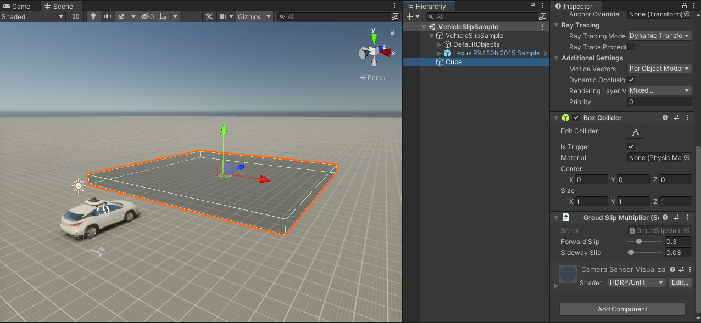

# Customize slip

By attaching a `GroundSlipMutiplier.cs` script to a collider (trigger), you can change the slip of the vehicle within the range of that collider.

## Sample scene

`Assets\AWSIM\Scenes\Samples\VehicleSlipSample.unity`

## How to setup

1. Create collider
2. Check IsTrigger
3. Change properties of FowardSlip and SidewaySlip.

