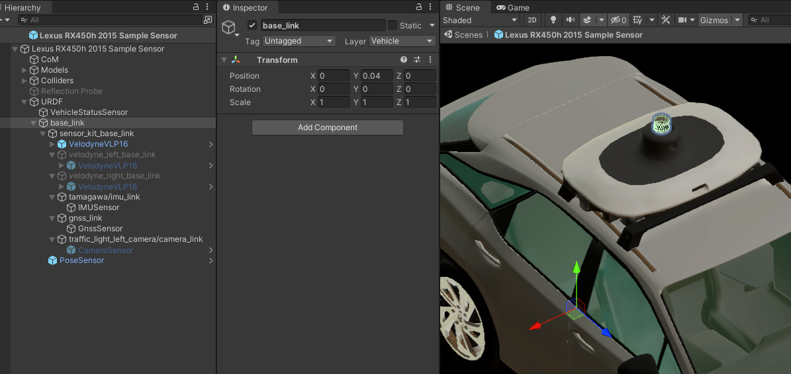
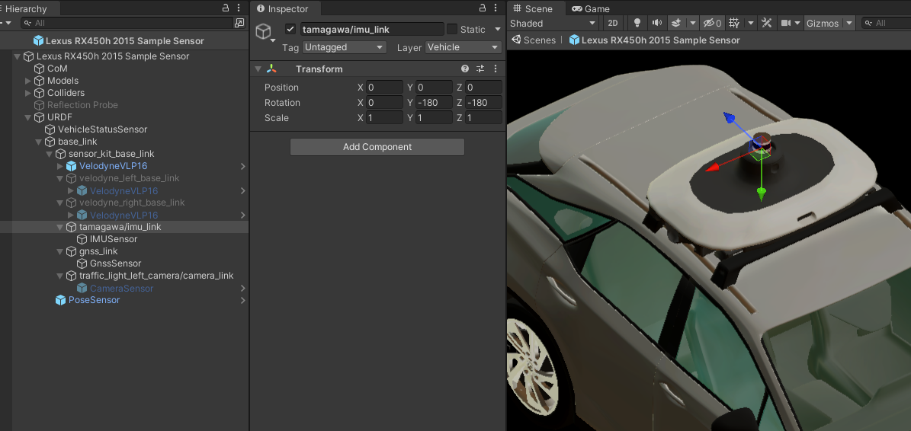

# URDF and Sensors
This section describes the placement of sensors in `EgoVehicle` on the example of a `Lexus RX450h 2015 Sample Sensor` prefab.

`URDF` (*Unified Robot Description Format*) is equivalent to the simplified [*URDF*](https://docs.ros.org/en/humble/Tutorials/Intermediate/URDF/URDF-Main.html) format used in *ROS2*.
This format allows to define the positions of all sensors of the vehicle in relation to its main parent prefab coordinate system.

`URDF` is added directly to the main parent of the prefab and there are no transforms between these objects.
It is built using multiple *GameObjects* as children appropriately transformed with relation to its parent.

The transforms in the `URDF` object are defined using the data from the *sensor kit* documentation used in the vehicle.
Such data can be obtained from *sensor kit* packages for *Autoware*, for example: [`awsim_sensor_kit_launch`](https://github.com/RobotecAI/awsim_sensor_kit_launch) - it is used in the *AWSIM* compatible version of *Autoware*.
This package contains a description of transforms between coordinate systems (frames) in the form of `*.yaml` files: [sensors_calibration](https://github.com/RobotecAI/awsim_sensor_kit_launch/blob/main/awsim_sensor_kit_description/config/sensors_calibration.yaml) and [sensor_kit_calibration](https://github.com/RobotecAI/awsim_sensor_kit_launch/blob/main/awsim_sensor_kit_description/config/sensor_kit_calibration.yaml).

In the first file, the transform of the *sensor kit* frame (`sensor_kit_base_link`) relative to the local vehicle frame (`base_link`) is defined.
In *Unity*, this transform is defined in the object [`Sensor Kit`](#sensor-kit).
While the second file contains a definition of the transformations of all sensors with respect to the *sensor kit* - they are described in the [`Sensor Kit`](#sensor-kit) subsections.

!!! note "Transformations"
    Please note that the transformation *Objects* are intended to be a direct reflection of frames existing in *ROS2*.
    All *frame* *Objects* are defined as children of `base_link` and consist of nothing but a transformation - analogical to the one present in *ROS2* (keep in mind the coordinate system conversion).
    The sensor *Objects* are added to the transformation *Object* with **no transformation of their own**.

!!! warning "Coordinate system conventions"
    *Unity* uses a left-handed convention for its coordinate system, while the *ROS2* uses a right-handed convention.
    For this reason, you should remember to perform conversions to get the correct transforms.

## Base Link
`Base Link` (frame named `base_link`) is the formalized local coordinate system in `URDF`.
All sensors that publish data specified in some frame present in *Autoware* are defined in relation to `base_link`.
It is a standard practice in ROS, that `base_link` is a parent transformation of the whole robot and all robot parts are defined in some relation to the `base_link`.

If any device publishes data in the `base_link` frame - it is added as a direct child, with no additional transformation intermediate *Object* (`PoseSensor` is an example).
However, if this device has its own frame, it is added as a child to its frame *Object* - which provides an additional transformation.
The final transformation can consist of many intermediate transformation *Objects*.
The frame *Objects* are added to the `base_link` (`GnssSensor` and its parent `gnss_link` are an example).

### Sensor Kit
`Sensor Kit` (frame named `sensor_kit_base_link`) is a set of objects that consists of all simulated sensors that are physically present in an autonomous vehicle and have their own coordinate system (frame).
This set of sensors has its own frame `sensor_kit_base_link` that is relative to the `base_link`.

In the `Lexus RX450h 2015 Sample Sensor` prefab, it is added to the `base_link` *GameObject* with an appropriately defined transformation.
It acts as an intermediate frame *GameObject*.
`Sensor Kit` is located on the top of the vehicle, so it is significantly shifted about the `Oy` and `Oz` axes.
Sensors can be defined directly in this *Object* (`VelodyneVLP16` is an example), or have their own transformation *Object* added on top of the `sensor_kit_base_link` (like `GnssSensor` mentioned in the [`base_link` section](#base-link)).

The sensors described in this subsection are defined in relation to the `sensor_kit_base_link` *frame*.

#### LiDARs
`LidarSensor` is the component that simulates the *LiDAR* (*Light Detection and Ranging*) sensor.
The *LiDARs* mounted on the top of autonomous vehicles are primarily used to scan the environment for localization in space and for detection and identification of obstacles.
*LiDARs* placed on the left and right sides of the vehicle are mainly used to monitor the traffic lane and detect vehicles moving in adjacent lanes.
A detailed description of this sensor is available in this [section](../../../Components/Sensors/LiDARSensor/LiDARSensor/).

`Lexus RX450h 2015 Sample Sensor` prefab has one `VelodyneVLP16` prefab sensor configured on the top of the vehicle, mainly used for location in space, but also for object recognition.
Since the top *LiDAR* publishes data directly in the `sensor_kit_base_link` frame, the prefab is added directly to it - there is no transform.
The other two remaining *LiDARs* are defined, but disabled - they do **not** provide data from space (but you can enable them!).

##### Top

##### Left - *disabled*

##### Right - *disabled*

#### IMU
`IMUSensor` is a component that simulates an *IMU* (*Inertial Measurement Unit*) sensor.
It measures acceleration and angular velocity of the `EgoVehicle`.
A detailed description of this sensor is available in this [section](../../../Components/Sensors/IMUSensor/).

`Lexus RX450h 2015 Sample Sensor` has one such sensor located on the top of the vehicle.
It is added to an *Object* `tamagawa/imu_link` that matches its `frame_id` and contains its transform with respect to `sensor_kit_base_link`.
This transformation has no transition, but only rotation around the `Oy` and `Oz` axes.
The transform is defined in such a way that its axis `Oy` points downwards - in accordance with the gravity vector.

#### GNSS
`GnssSensor` is a component which simulates the position of vehicle computed by the *Global Navigation Satellite*.
A detailed description of this sensor is available in this [section](../../../Components/Sensors/GNSSSensor/).

`Lexus RX450h 2015 Sample Sensor` prefab has one such sensor located on top of the vehicle.
It is added to an *Object* `gnss_link` that matches its `frame_id` and contains its transform with respect to `sensor_kit_base_link`.
The frame is slightly moved back along the `Oy` and `Oz` axes.

#### Camera
`CameraSensor` is a component that simulates an *RGB* camera.
Autonomous vehicles can be equipped with many cameras used for various purposes.
A detailed description of this sensor is available in this [section](../../../Components/Sensors/CameraSensor/).

`Lexus RX450h 2015 Sample Sensor` prefab has one camera, positioned on top of the vehicle in such a way that the cameras field of view provides an image including traffic lights - the status of which must be recognized by *Autoware*.
It is added to an *Object* `traffic_light_left_camera/camera_link` that matches its `frame_id` and contains its transform with respect to `sensor_kit_base_link`.

#### Pose
`PoseSensor` is a component which provides access to the current position and rotation of the `EgoVehicle` -  is added as a ground truth.

The position and orientation of `EgoVehicle` is defined as the position of the frame `base_link` in the global frame, so this *Object* is added directly as its child without a transform.

#### VehicleSensor
`VehicleStatusSensor` is a component that is designed to aggregate information about the current state of the `EgoVehicle`, such as the active control mode, vehicle speed, steering of its wheels, or turn signal status.
A detailed description of this sensor is available in this [section](../../../Components/Sensors/VehicleStatusSensor/).

This *Object* is not strictly related to any frame, however, it is assumed as a sensor, therefore it is added to the `URDF`.

