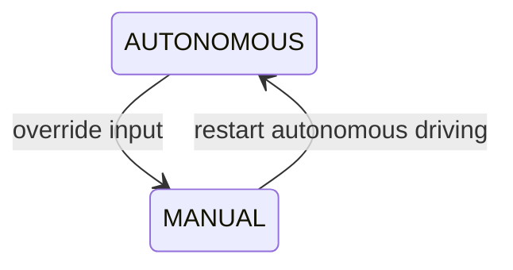
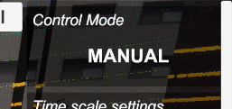
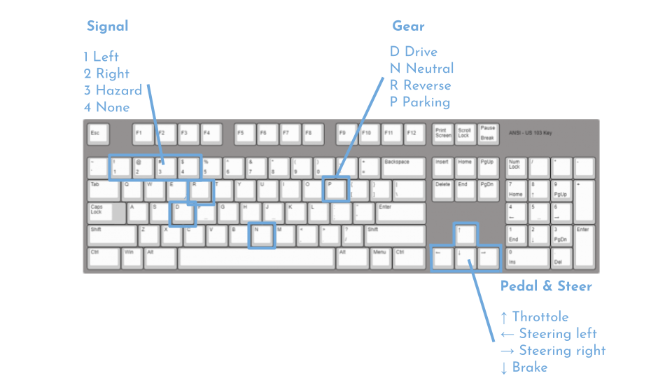
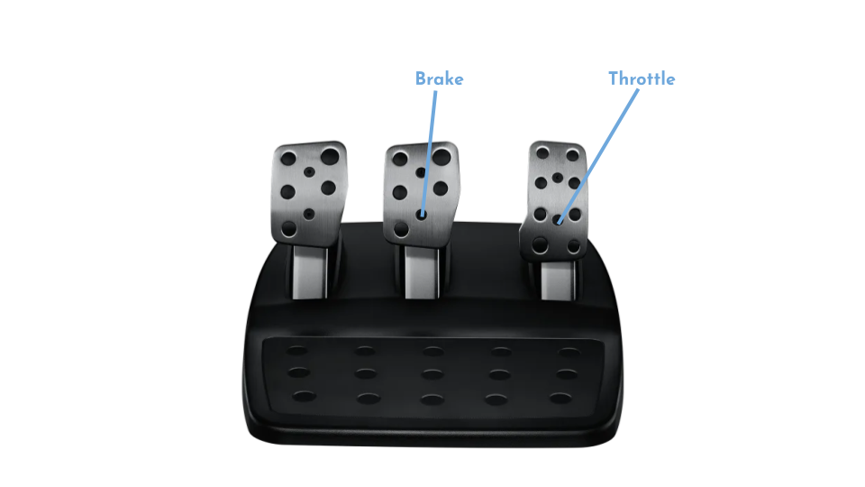
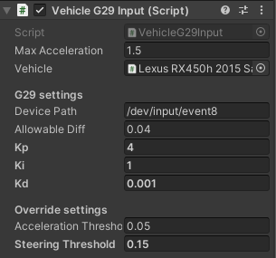

# Vehicle Input

## Simulated Autoware override input

### Overview

Autoware accepts manual steering and pedal control by the driver during Autonomus Driving. This allows the driver to shift from Autoware's Autonomous driving to Driver's Manual driving.



Q. How to override input ?  
A. Control steering and pedals with any device.

Q. How to restart autonomous driving ?  
A. subscribe to ``vehicle/engage`` topic with true.  

!!! info
    
    sample engage command  
    ```ros2 topic pub /vehicle/engage autoware_vehicle_msgs/msg/Engage '{engage: True}' -1```

!!! warning

    It will be changed from the `vehicle/engage` topic in the near future.

In the real world, Autoware switches modes by publishing **ControlMode(AUTONOMOUS or MANUAL)** from the vehicle, and AWSIM simulates this as well. Current ControlMode can be checked from the AWSIM UI.


|AUTONOMOUS|MANUAL|
|:--|:--|
|||

ControlMode at AWSIM start is AUTONOMOUS.

## AWSIM supports these device inputs

### Keyboard

#### key assign


| Button             | Feature                                 |
|-:-:----------------|-:---------------------------------------|
| `D`                | Switch to move forward (drive gear)     |
| `R`                | Switch to move backwards (reverse gear) |
| `N`                | Switch to neutral                       |
| `P`                | Switch to parking gear                  |
| `Up arrow `        | Forward acceleration                    |
| `Down arrow`       | Reverse acceleration (decelerate)       |
| `Left/Right arrow` | Turning                                 |
| `1`                | Turn left blinker on (right off)        |
| `2`                | Turn right blinker on (left off)        |
| `3`                | Turn on hazard lights                   |
| `4 `               | Turn off blinker or hazard lights       |

### Logitech G29 (Linux only)

AWSIM supports the [Logitech G29](https://www.logitechg.com/en-us/products/driving/driving-force-racing-wheel.html) device.

#### Key assign



| Button           | Feature                                 |
|--:-:-------------|--:--------------------------------------|
| `Triangle`       | Switch to move forward (drive gear)     |
| `Square`         | Switch to move backwards (reverse gear) |
| `Circle`         | Switch to neutral                       |
| `Cross`          | Switch to parking gear                  |
| `Accel pedal`    | Forward acceleration                    |
| `Brake pedal`    | Reverse acceleration (decelerate)       |
| `Steering wheel` | Turning                                 |
| `Right arrow`    | Turn left blinker on (right off)        |
| `Left arrow`     | Turn right blinker on (left off)        |
| `Up arrow`       | Turn on hazard lights                   |
| `Down arrow`     | Turn off blinker or hazard lights       |

#### How to setup Logitech G29

1. Connect the Logitech G29 to your PC
1. Check the device path for G29. For example, use the `$ evtest` command to get a path such as `/dev/input/event*`
1. Apply G29 device path to AWSIM. If you run `AutowareSimulation.unity` in the demo player (AWSIM.x86_64) or UnityEditor, it is configurable in JSON.  
Set the path to G29DevicePath in [config.json](https://github.com/tier4/AWSIM/blob/main/Assets/AWSIM/Scenes/Main/AutowareSimulation/config.json). e.g. `"G29DevicePath": "/dev/input/event8`

1. Start AWSIM and select Logitech G29 from the UI. If "connected" is displayed, the vehicle can be controlled by Logitech g29.  
    

#### Advanced configuration



The following parameters can be adjusted in VehicleG29Input.cs


|parameter|feature|
|:--|:--|
|Device Path|Device Event Path|
|Allowable Diff|Difference in steering determined to be an override (0:min, 1:max)|
|Kp|PID Gain Proportinal Parameters of FFB|
|Ki|PID Gain Integral Parameters of FFB|
|Kd|PID Gain Derivative Parameters of FFB|
|Acceleration Threshold|Override Judgment Value due to Accelerator Pedal Depression (0:min, 1:max)|
|Steering Threshold|Override Judgment Value due to Steering (0:min, 1:max)|


    