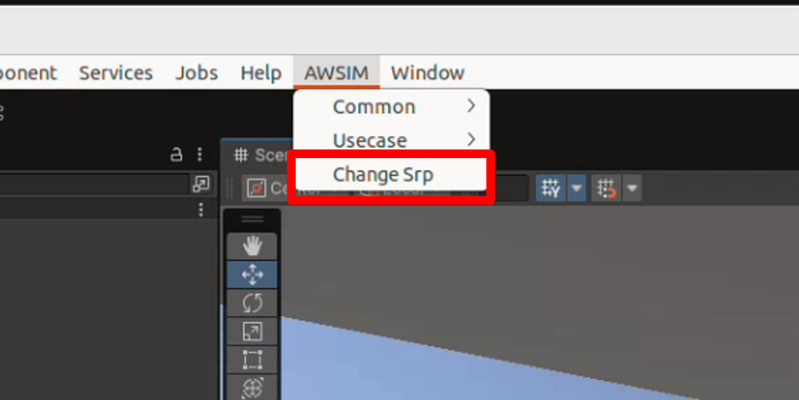
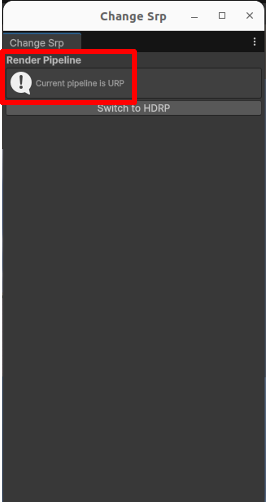

# Change SRP

## What's SRP?
SRP (Scriptable Render Pipeline) is a programmable rendering architecture provided by Unity that allows developers to customize rendering behavior based on project requirements. Unity officially offers two main SRP implementations:

- URP (Universal Render Pipeline): Optimized for cross-platform performance, suitable for most projects.
- HDRP (High Definition Render Pipeline): Prioritizes high visual fidelity, ideal for high-end platforms and photorealistic projects.

## How to Check the Current Render Pipeline
You can check which render pipeline your project is currently using by following these steps:

1. Open the Unity Editor and go to Edit > Project Settings > Graphics


1. Look at the Set Default Render Pipeline Asset field:

    - If it shows a HDRenderPipelineAsset, the project is using HDRP

    
    
    - If it shows a UniversalRenderPipelineAsset, the project is using URP
    

## Change rendering pipeline
In this project, both HDRP and URP scenes are preconfigured separately.

=== "URP to HDRP"
    1. Change the `Default Render Pipeline` in Edit -> ProjectSettings -> Graphics, and set it to `HDRenderPipelineAsset`.
    

    1. Open the AutowareSimulationDemo scene.
    

    1. Add Scripting Define Symbols  
    After switching the render pipeline, you need to change the scripting define symbol from URP to HDRP to enable HDRP-specific conditional compilation.  
        - In the Unity Editor, go to Edit -> Project Settings -> Player

        - In the right panel, expand Other Settings

        - Find the Scripting Define Symbols field under the Script Compilation section

        - Remove URP and add HDRP
        

    1. Restart the Unity Editor after changing the render pipeline.
        - Especially when switching from URP to HDRP, the following error may occur:
        ```
        Exception: Invalid import, you are importing a texture handle that wraps a RenderTargetIdentifier. The render graph can't know the properties of these textures so please use the ImportTexture overload that takes a RenderTargetInfo argument instead.
        ```
        - This is caused by leftover SRP cache and materials not being refreshed.

        - Scene materials may appear broken (e.g., white), even without error logs when switching from HDRP to URP.

        - Restarting Unity Editor helps avoid unknown issues and ensures proper scene rendering.

=== "HDRP to URP"
    1. Change the `Default Render Pipeline` in Edit -> ProjectSettings -> Graphics, and set it to `UniversalRenderPipelineAsset`.
    

    1. Open the AutowareSimulationURPDemo scene.
    
    
    1. Add Scripting Define Symbols  
    After switching the render pipeline, you need to change the scripting define symbol from HDRP to URP to enable URP-specific conditional compilation.  
        - In the Unity Editor, go to Edit -> Project Settings -> Player

        - In the right panel, expand Other Settings

        - Find the Scripting Define Symbols field under the Script Compilation section

        - Remove HDRP and add URP
        
    
    1. Restart the Unity Editor after changing the render pipeline.
        - Especially when switching from URP to HDRP, the following error may occur:
        ```
        Exception: Invalid import, you are importing a texture handle that wraps a RenderTargetIdentifier. The render graph can't know the properties of these textures so please use the ImportTexture overload that takes a RenderTargetInfo argument instead.
        ```
        - This is caused by leftover SRP cache and materials not being refreshed.

        - Scene materials may appear broken (e.g., white), even without error logs when switching from HDRP to URP.

        - Restarting Unity Editor helps avoid unknown issues and ensures proper scene rendering.

    1. Check the lighting configuration:
    

## Use the Editor Extension to Switch SRP Automatically
To simplify the SRP switching process, we provide an Editor extension named "Change SRP", available in the Unity Editor menu.

- This tool automates the following steps:
    - Switching the default render pipeline asset (Graphics settings)

    - Updating scripting define symbols (Player settings)

    - Prompting for Unity Editor restart to avoid rendering glitches


## How to Use
1. In the Unity Editor, go to AWSIM > Change SRP from the top menu.


1. A window will appear, showing the currently active render pipeline.


1. Based on the current state, the button will display one of the following:
    - If the current pipeline is HDRP, the button will say HDRP → URP
        - Click to switch to URP.
    - If the current pipeline is URP, the button will say URP → HDRP
        - Click to switch to HDRP.  

1. After clicking the button, a confirmation dialog will appear asking whether to restart the Unity Editor immediately.  


1. Click Yes, and Unity will automatically restart to ensure the changes take effect and to prevent rendering issues.  
