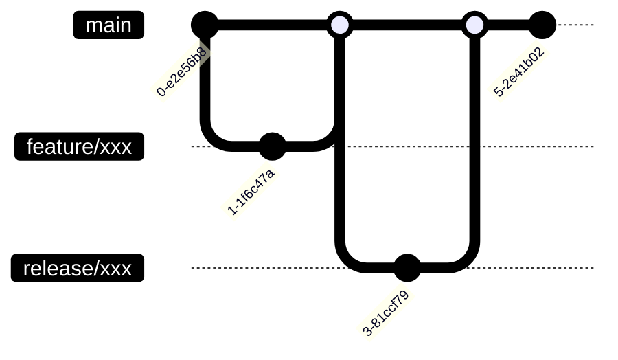

# Git 

AWSIM is managed by [git](https://git-scm.com/) and [GitHub](https://github.com/).

## Policy

- All git commit history is not modified
- Disallow `git rebase`
- Disallow `git push --force`
- Fast forward recommended
- Include `.meta` files

## Branch

|Branch|Explain|
|:--|:--|
|main|Mainstream branch. Latest each AWSIM features and Lexus demo binary scene are included.|
|feature/*|Feature development branch created from the `main` branch.|
|release/*|Release branch of AWSIM. New AWSIM Lexus demo binary is created for each release.|
|gh-pages|Documantation hosted on GitHub pages (This web site).  When committed to the main branch, the documentation will be deployed by [GitHub-Actions](https://github.com/tier4/AWSIM/blob/main/.github/workflows/documentation_generation.yml).|