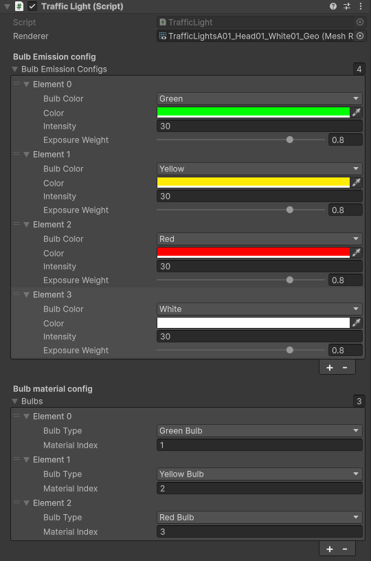
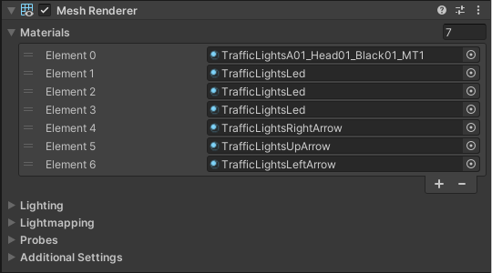

AWSIM supports traffic light control in accordance with the [Vienna Convention](https://en.wikipedia.org/wiki/Vienna_Convention_on_Road_Signs_and_Signals#Traffic_lights). The TrafficLight class allows for both vehicular and pedestrian traffic lights.

- Vehicle traffic light

    

- Pedestiran traffic light

    

## Bulb

*Traffic Light* (script) is a component added to every `TrafficLight` on the scene.
It is responsible for configuring the `TrafficLight` behavior - the bulbs and their colors.

The `Renderer` filed points to the renderer that should be configured - in this case it is always a `TrafficLight` renderer.

`Bulbs Emission Config` is a list describing available colors for this Traffic Light.
Every element of this list configures the following

- `Bulb Color` - the name of the configured color that will be used to reference this color
- `Color` - the actual color with which a bulb should light up
- `Intensity` - the intensity of the color
- `Exposure Weight` - how bright should the color be when lighting up

The `Bulb Material Config` is a list of available bulbs in a given Traffic Light.
Every element describes a different bulb.
Every bulb has the following aspects configured

- `Bulb Type` - the name that will be usd to reference the configured bulb
- `Material Index` - The index of a material of the configured bulb.
    This is an index of a sub-mesh of the configured bulb in the Traffic Light mesh.

## Material

An important element set in the TrafficLights object is the material of the mesh renderer component. The material at index 0 always applies to the housing of the light. Subsequent elements correspond to successive slots of the light source (round luminous object). They start at the upper left corner of the object, go to the right, down, and back to the left corner. These indices are used in the script “Traffic Light” (script).