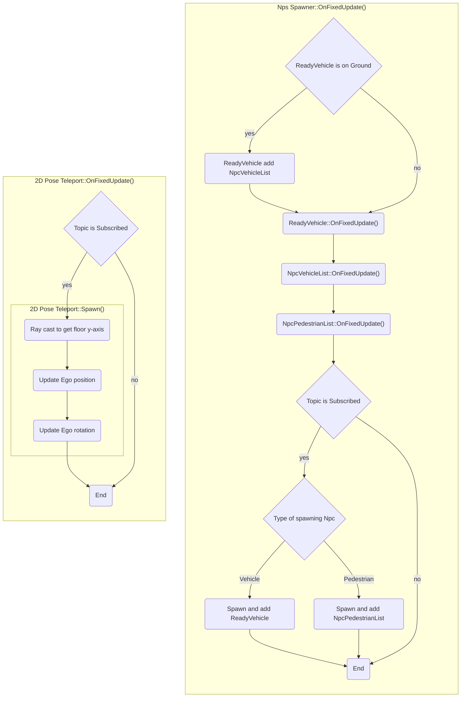

# AwsimRvizPlugins
Feature to operate AWSIM environment from the Rviz plugins.

<popup-img src="./npc_spawner.png" alt="AwsimRvizPlugins"></popup-img>

The following features are implemented:

- `2D Pose Teleport`: Teleport AWSIM EGO pose from Rviz GUI tool
- `Npc Spawner`: Spawn AWSIM Npc using Rviz GUI tool

Rviz plugins are implemented in the following repositories:

- [https://github.com/tier4/AwsimRvizPlugins](https://github.com/tier4/AwsimRvizPlugins)

!!!info
    If you want to **use** `AwsimRvizPlugins` with `AWSIM`, see [here](../../../../GettingStarted/Advanced/AwsimRvizPlugins/index.md).

## Abstract

### 2D Pose Teleport
Teleport AWSIM EGO using Rviz GUI tool.
<popup-img src="./2d_pose_teleport.png" alt="2D Pose Teleport"></popup-img>

`awsim_rviz_plugins/2dPoseTeleport` tool gets position and orientation by dragging on the map displayed in Rviz, and publishes those as a `/awsim/awsim_rviz_plugins/pose_teleport/pose_with_covariance` topic.

AWSIM subscribes this topic and updates the coordinates of the EGO.

y-axis of destination position of teleport is calculated using ray-casting.  
The highest object at the specified x-z coordinates is considered the ground.

### Nps Spawner
Spawn AWSIM Npc using Rviz GUI tool.
Type and velocity of spawned Npc is specified from Rviz display.

<popup-img src="./npc_spawner.png" alt="Npc Spawner"></popup-img>

`awsim_rviz_plugins/NpsSpawner` tool gets position and orientation by dragging on the map displayed in Rviz, and publishes those as a `/awsim/awsim_rviz_plugins/npc_spawner/pose_with_covariance` topic.

AWSIM subscribes this topic and spawn Npc on the coordinates.

y-axis of destination position of teleport is calculated using ray-casting.  
The highest object at the specified x-z coordinates is considered the ground.

`awsim_rviz_plugins/NpsSpawnerStatus` display is entered Npc type (drop down list) and velocity, and publishes those as a `/awsim/awsim_rviz_plugins/npc_spawner/npc_name` and `/awsim/awsim_rviz_plugins/npc_spawner/npc_velocity` topic.

AWSIM subscribes those topics and specify type and velocity of spawned Npc.

Spawnable Npc is listed in `AutowreSimulationDemo/Function/AwsimRvizPluginsClient/`.  
AWSIM publishes name of spawnable Npc as `/awsim/awsim_rviz_plugins/npc_spawner/npc_name_list` topic.  
`awsim_rviz_plugins/NpsSpawnerStatus` display subscribes this topic and update drop down list of Npc type.  

### Overview
`Awsim Rviz Plugins` consists of the following flow:

### Configuration
`Awsim Rviz Plugins` can be configured from `AwsimRvizPluginsClient` component.

<popup-img src="./config.png" alt="Configulations"></popup-img>

The configurable elements are listed in the following table:

2D Pose Teleport

| Parameter | Description |
|---|---|
| Ego Transform | Ego vehicle which is controlled by this plugin. |
| Ego Position Topic | Name of topic about position which Ego teleport. |

Npc Spawner Settings

| Parameter | Description |
|---|---|
| Npc Vehicle Prefabs | List of Npc vehicle. Each element have identifier (`Name`) and reference (`Prefab`). |
| Npc Pedestrian Prefabs | List of Npc pedestrian. Each element have identifier (`Name`) and reference (`Prefab`). |
| Npc Position Topic | Name of topic about position which Npc spawn. |
| Npc Name Topic | Name of topic about type of spawned Npc. |
| Npc Velocity Topic |Name of topic about velocity of spawned Npc. |
| Npc Name List Topic | Name of topic about list of vehicle names in `Rviz`. |

## Instruction
To use `Awsim Rviz Plugins`, please follow the steps below.

<popup-img src="./instruction.png" alt="Instruction"></popup-img>

### 1. Place `AwsimRvizPluginsClient`
Please create `AwsimRvizPluginsClient` component as the following:

1. Create empty `GameObject` (should be named `AwsimRvizPluginsClient`)
2. Attach this object to `AwsimRvizPluginsClient` component
3. Fill in `Ego Transform` field with EGO vehicle

### 2. Fill in `Npc Spawner Settings`
Please configure `Npc Spawner Settings` component as the following:

1. Add and fill list element of `Npc Vehicle Prefabs`
    1. Fill in `Name` field with any name (prefab name recommended)
    2. Fill in `Prefab` field with vehicle prefab which is attached `PoseVehicle` component
2. Add and fill list element of `Npc Pedestrian Prefabs`
    1. Fill in `Name` field with any name (prefab name recommended)
    2. Fill in `Prefab` field with vehicle prefab which is attached `Pedestrian` component
