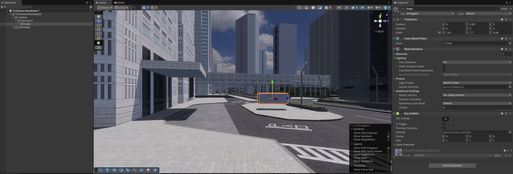
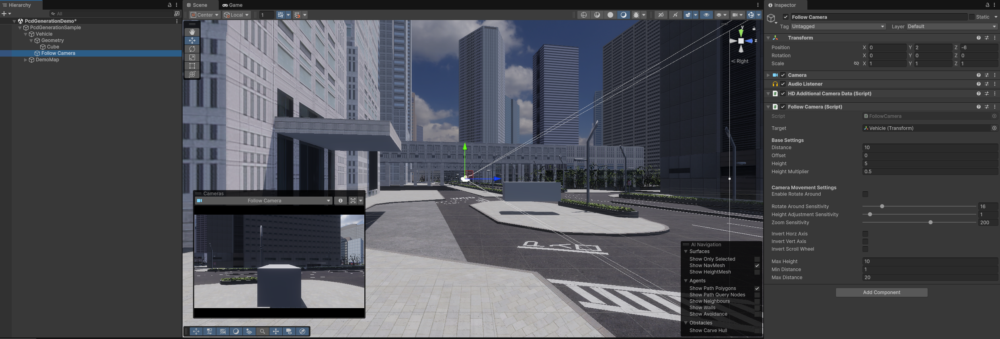
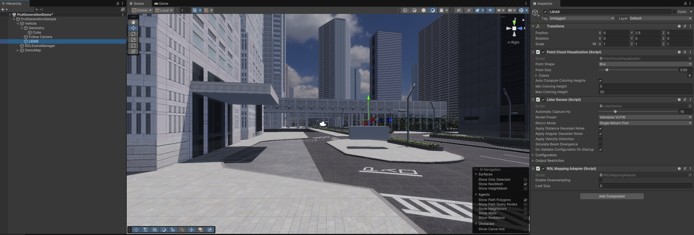

# PcdGeneration

## Abstract
`Pcd Generation` is a tool for a vehicle based point cloud mapping in a simulation environment. 
It is useful when you need a point cloud based on some location, but are not able to conduct physically mapping on the real place. 

When `Pcd Generation` is conducted, `Vehicle` object (carring `LiDAR`) is warped along all centerlines of lanelets in the imported `OSM` map.
Point cloud map is generated to record points by `LiDAR` on `Vehicle` object on each centerlines of lanelets.

### Overview

### Configuration
`PcdGeneration` can be configured from `PcdGenerator` and `RGLMappingAdapter` components.

The configurable elements are listed in the following table:

PcdGenerator

| Parameter | Description |
|---|---|
| Osm Data Container | Imported `OSM` file. |
| Vehicle Transform | Game object containing sensors to capture pointcloud. |
| Rgl Mapping Adapter | Reference of `LiDAR` object which is attached `RGLMappingAdapter`. |
| Output Pcd File Path | Result `PCD` file name. On captured, it will be saved in `Assets/[Output Pcd File Path]` |
| Capture Location Interval | Distance in meters between consecutive warps along the centerline of a lanelet. |
| World Origin ROS | World origin in ROS coordinate systems, will be added to every point coordinates. |

RGLMappingAdapter

| Parameter | Description |
|---|---|
| Enable Downsampling | Enable/disable point cloud data downsampling. |
| Leaf Size | Resolution of point cloud data downsampling. |

## Instruction
To use `Scenario Simulator Connection`, please follow the steps below.

For the preparation, the following must be prepared:

- 3D map (.fbx)
- lanelet map (.osm)
- LiDAR sensor

!!! info
    AWSIM includes `AutowareSimulationDemo` scene. 
    Please refer to: 
    * `Assets/Awsim/Scenes/PcdGenerationDemo.unity`

### 1. Add a `Vehicle` objecr
Add `Vehicle` object to carry LiDAR and capture points. 
In addition, visual elements of `Vehicle` if needed.

Please create `Vehicle` object as the following:

1. Create empty `GameObject` (should be `Vehicle`)
2. (optional) Create empty `GameObject` (should be `Vehicle/Geometry`)
    1. If needed, visual elements of `Vehicle` added here
    2. Visual element can even be a simple `Cube` object as the sample image

### 2. Add a `Camera`
Add Unity `Camera` to visualize recording process.

Please create Unity `Camera` as the following:

1. Create `Camera` object (should be `Vehicle/Follow Camera`)
2. Attach `FollowCamera` component to `Follow Camera`
3. Fill in `Target` field with `Vehicle`

### 3. Add a `LiDAR` related objects
Add `LiDAR` object and configure components to record points.

#### LiDAR object

Please create and configure `LiDAR` object as the following:

1. Create `LiDAR` object (should be `Vehicle/LiDAR`)
2. Attach `PointCloudVisualization` component to `LiDAR`
3. Attach `LidarSensor` component to `LiDAR`
    1. Select `Model Preset` (`VelodyneVLP16` and `VelodyneVLS128` is recommended)
        1. `VelodyneVLS128` can create more detail maps than `VelodyneVLP16`
        2. `VelodyneVLP16` can work lighter than `VelodyneVLS128`
    2. Set `Apply Distance Gaussian Noise` and `Apply Angular Gaussian Noise` `False`
4. Attach `RGLMappingAdapter` component to `LiDAR`

#### RGLSceneManager

Please create `SceneManager` object as the following:

5. Create empty `GameObject` (should be `RGLSceneManager`)
6. Attach `SceneManager` component to `RGLSceneManager`

### 4. Setup `PcdGenerator`
Add `PcdGenerator` component to manage above objects and create point cloud map.

1. Create empty `GameObject` (should be `PcdGenerator`)
2. Attach `PcdGenerator` component to `PcdGenerator`
3. Fill in `Osm Data Container` field with `.osm` file
    1. If there is not `.osm` file in project, move `.osm` file to `Assets/Awsim/Externals` directory using file expoler
4. Fill in `Vehicle Transform` field with `Vehicle`
5. Fill in `Rgl Mapping Adapter` field with `LiDAR`
6. (optional) Fill in `World Origin ROS` field if your map has `Mgrs Position` component

### 7. Call methods of `PcdGenerator` and `FollowCamera`
Some methods of `PcdGenerator` and `FollowCamera` should be called from callback of `MonoBehaviour` to enable `Pcd Generation`.

Please implement as the following:

1. Create or open class which is inherit `MonoBehaviour`
2. Make fields of `PcdGenerator` and `FollowCamera`
3. Add description of calling method of `PcdGenerator` and `FollowCamera`

The method should be called are listed in the following table:

`ScenarioSimulatorClient`

| Method | Description |
|---|---|
| Initialize() | Should be called Start() callback. |
| OnUpdate() | Should be called Update() callback. |

`FollowCamera`

| Method | Description |
|---|---|
| Initialize() | Should be called Start() callback. |
| OnUpdate() | Should be called Update() callback. |

!!! info
    AWSIM includes `AutowareSimulationDemo` scene. 
    Please refer to: 
    * `Assets/Awsim/Scenes/PcdGenerationDemo/PcdGenerationDemo.cs` 
    * `Assets/Awsim/Scenes/PcdGenerationDemo.unity` scene

## Verify and modify `PCD` files