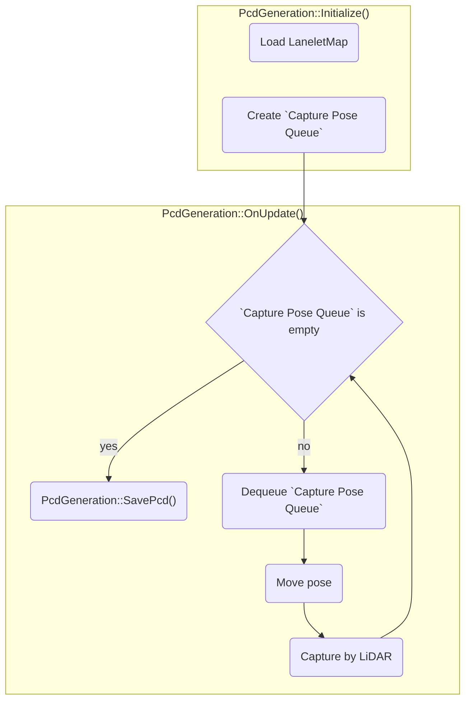

# PcdGeneration

## Abstract
`Pcd Generation` is a tool for a vehicle based point cloud mapping in a simulation environment.<br>
It is useful when you need a point cloud based on some location, but are not able to conduct physically mapping on the real place.<br>

<popup-img src="./top.png" alt="Pcd Generation"></popup-img>

When `Pcd Generation` is conducted, `Vehicle` object (carrying `LiDAR`) is warped along all centerlines of lanelets in the imported `OSM` map.
Point cloud map is generated to record points by `LiDAR` on `Vehicle` object on each centerlines of lanelets.

### Overview
`Traffic Simulation` consists of the following flow:



### Configuration
`PcdGeneration` can be configured from `PcdGenerator` and `RGLMappingAdapter` components.

The configurable elements are listed in the following table:

PcdGenerator

| Parameter | Description |
|---|---|
| Osm Data Container | Imported `OSM` file. |
| Vehicle Transform | Game object containing sensors to capture pointcloud. |
| Rgl Mapping Adapter | Reference of `LiDAR` object which is attached `RGLMappingAdapter`. |
| Output Pcd File Path | Result `PCD` file name.<br>On captured, it will be saved in `Assets/[Output Pcd File Path]` |
| Capture Location Interval | Distance in meters between consecutive warps along the centerline of a lanelet. |
| World Origin ROS | World origin in ROS coordinate systems, will be added to every point coordinates. |

RGLMappingAdapter

| Parameter | Description |
|---|---|
| Enable Downsampling | Enable/disable point cloud data downsampling. |
| Leaf Size | Resolution of point cloud data downsampling. |

## Execution and Parameters

### Execution
If you play prepared scene, `PcdGenerator` will automatically start mapping.<br>
`PCD` file will be written when you stop scene or all lanelets in the route are captured.

If the `Vehicle` stops moving and you see the following message in the bottom left corner, you can safely stop the scene.

```pcd save success```

The Point cloud (`*.pcd`) file is saved to the location you specified in the `Output Pcd File Path` of `PcdGenerator`.

### Parameters
Following parameters are useful to point cloud map of quality and file size you want to.

#### Leaf Size
Downsampling aims to reduce `PCD` size which for large point clouds may achieve gigabytes in exchange for map details.<br>
It is essential to find the acceptable balance between the file size and details level.

`Leaf Size` can be configured by `RGLMappingAdapter` component.

A small `Leaf Size` results in a more detailed `PCD`, while a large `Leaf Size` could result in excessive filtering such that objects like buildings are not recorded in the `PCD`.

| Leaf Size = 1.0 | Leaf Size = 10.0 | Leaf Size = 100.0 |
|---|---|---|
| <popup-img src="./leaf_size_1.png" alt="Leaf Size 1"></popup-img> | <popup-img src="./leaf_size_10.png" alt="Leaf Size 10"></popup-img> | <popup-img src="./leaf_size_100.png" alt="Leaf Size 100"></popup-img> |

#### Capture Location Interval
If the `Capture Location Interval` is too small, it could result in a sparse `PCD` where some region of the map is captured well but the other regions aren't captured at all.

`Capture Location Interval` can be configured by `PcdGeneration` component.

| Capture Location Interval = 6 | Capture Location Interval = 20 | Capture Location Interval = 100 |
|---|---|---|
| <popup-img src="./interval_6.png" alt="Interval 6"></popup-img> | <popup-img src="./interval_20.png" alt="Interval 20"></popup-img> | <popup-img src="./interval_100.png" alt="Interval 100"></popup-img> |

## Instruction
To use `Pcd Generation`, please follow the steps below.

For the preparation, the following must be prepared:

- 3D map (.fbx)
- lanelet map (.osm)
- LiDAR sensor (.fbx)

!!! info
    AWSIM includes `PcdGenerationDemo` scene.<br>
    Please refer to:<br>
    * `Assets/Awsim/Scenes/PcdGenerationDemo.unity`

### 1. Add a `Vehicle` object
Add `Vehicle` object to carry LiDAR and capture points.<br>
In addition, visual elements of `Vehicle` if needed.

<popup-img src="./vehicle.png" alt="Vehicle"></popup-img>

Please create `Vehicle` object as the following:

1. Create empty `GameObject` (should be `Vehicle`)
2. (optional) Create empty `GameObject` (should be `Vehicle/Geometry`)
    1. If needed, visual elements of `Vehicle` added here
    2. Visual element can even be a simple `Cube` object as the sample image

### 2. Add a `Camera`
Add Unity `Camera` to visualize recording process.

<popup-img src="./camera.png" alt="Camera"></popup-img>

Please create Unity `Camera` as the following:

1. Create `Camera` object (should be `Vehicle/Follow Camera`)
2. Attach `FollowCamera` component to `Follow Camera`
3. Fill in `Target` field with `Vehicle`
4. Modify `Transform`
    5. Using `Cameras` Unity view allows you to check the camera view

### 3. Add a `LiDAR` related objects
Add `LiDAR` object and configure components to record points.

<popup-img src="./lidar.png" alt="LiDAR"></popup-img>

#### LiDAR object

Please create and configure `LiDAR` object as the following:

1. Create `LiDAR` object (should be `Vehicle/LiDAR`)
2. Set `Transform.Position.Y` 2.5
2. Attach `PointCloudVisualization` component to `LiDAR`
3. Attach `LidarSensor` component to `LiDAR`
    1. Select `Model Preset` (`VelodyneVLP16` and `VelodyneVLS128` is recommended)
        1. `VelodyneVLS128` can create more detail maps than `VelodyneVLP16`
        2. `VelodyneVLP16` can work lighter than `VelodyneVLS128`
    2. Set `Apply Distance Gaussian Noise` and `Apply Angular Gaussian Noise` `False`
4. Attach `RGLMappingAdapter` component to `LiDAR`

#### RGLSceneManager

Please create `SceneManager` object as the following:

1. Create empty `GameObject` (should be `RGLSceneManager`)
2. Attach `SceneManager` component to `RGLSceneManager`

### 4. Setup `PcdGenerator`
Add `PcdGenerator` component to manage above objects and create point cloud map.

<popup-img src="./pcd_generator.png" alt="PcdGenerator"></popup-img>

1. Create empty `GameObject` (should be `PcdGenerator`)
2. Attach `PcdGenerator` component to `PcdGenerator`
3. Fill in `Osm Data Container` field with `.osm` file
    1. If there is not `.osm` file in project, move `.osm` file to `Assets/Awsim/Externals` directory using file expoler
4. Fill in `Vehicle Transform` field with `Vehicle`
5. Fill in `Rgl Mapping Adapter` field with `LiDAR`
6. (optional) Fill in `World Origin ROS` field if your map has `Mgrs Position` component
<popup-img src="./mgrs_position.png" alt="Mgrs Position"></popup-img>

### 5. Call methods of `PcdGenerator` and `FollowCamera`
Some methods of `PcdGenerator` and `FollowCamera` should be called from callback of `MonoBehaviour` to enable `Pcd Generation`.

Please implement as the following:

1. Create or open class which is inherit `MonoBehaviour`
2. Make fields of `PcdGenerator` and `FollowCamera`
3. Add description of calling method of `PcdGenerator` and `FollowCamera`

The method should be called are listed in the following table:

`Pcd Generation`

| Method | Description |
|---|---|
| Initialize() | Should be called Start() callback. |
| OnUpdate() | Should be called Update() callback. |

`FollowCamera`

| Method | Description |
|---|---|
| Initialize() | Should be called Start() callback. |
| OnUpdate() | Should be called Update() callback. |

!!! info
    AWSIM includes `AutowareSimulationDemo` scene.<br>
    Please refer to:<br>
    * `Assets/Awsim/Scenes/PcdGenerationDemo/PcdGenerationDemo.cs`<br>
    * `Assets/Awsim/Scenes/PcdGenerationDemo.unity` scene

## Modify and Verify `PCD` files

### Modify `PCD`
Generated `PCD` files should be downsample because they are typically too large.<br>
In addition, they should be converted to ASCII format because `Autoware` accepts only this format. (`Pcd Generation` returns PCD in binary format)

The tool (`DownsampleLargePCD`) can realize downsampling and converting `PCD` files.
Please clone and build `DownsampleLargePCD` tool following [Github repository](https://github.com/RobotecAI/downsample-large-pcd).

Please use `DownsampleLargePCD` tool as the following:

1. Change the working directory to the location with `DownsampleLargePCD` tool.
2. Use `DownsampleLargePCD` tool to downsample and save `PCD` in `ASCII` format.
    ```
    ./DownsampleLargePCD -in <PATH_TO_INPUT_PCD> -out <PATH_TO_OUTPUT_PCD> -leaf 0.2,0.2,0.2
    ```
    - You can also save `PCD` in binary format by adding `-binary 1` option.

!!!note
    If you don't want to downsample but want to convert `PCD` file to `ASCII`, you should use `pcl_convert_pcd_ascii_binary` tool.<br>
    This tool is available in the `pcl-tools` package and can be installed on Ubuntu with the following command:
    ```
    sudo apt install pcl-tools
    ```
    To convert your PCD use command:
    ```
    pcl_convert_pcd_ascii_binary <PATH_TO_INPUT_PCD> <PATH_TO_OUTPUT_PCD> 0
    ```

### Verify `PCD`
To verify your `PCD` you can launch the `Autoware*`(https://github.com/autowarefoundation/autoware).

Please verify `PCD` as the following:

1. Copy your `PCD` from the `AWSIM` project directory to the `Autoware` map directory
    ```
    cp <PATH_TO_PCD_FILE> <PATH_TO_AUTOWARE_MAP>/
    ```

2. Source the `ROS` and `Autoware`
    ```
    source /opt/ros/humble/setup.bash
    source <PATH_TO_AUTOWARE>/install/setup.bash
    ```

3. Launch the `planning simulation` with the map directory path (`map_path`) and PCD file (`pointcloud_map_file`) specified
    ```
    ros2 launch autoware_launch planning_simulator.launch.xml \
    vehicle_model:=sample_vehicle \
    sensor_model:=sample_sensor_kit \
    map_path:=<ABSOLUTE_PATH_TO_AUTOWARE_MAP> \
    pointcloud_map_file:=<PCD_FILE_NAME>
    ```

    !!! note "PCD file location"
        The PCD file needs to be located in the Autoware map directory and as a `pointcloud_map_file` parameter you only supply the file name, not the path.

    !!! warning "Absolute path"
        When launching `Autoware` never use `~/` to specify the home directory.
        Either write the full absolute path or use `$HOME` environmental variable.

4. Wait for the `Autoware` to finish loading and inspect the `PCD` visually given the effect of `Leaf Size` and effect of `Capture Location Interval`.
