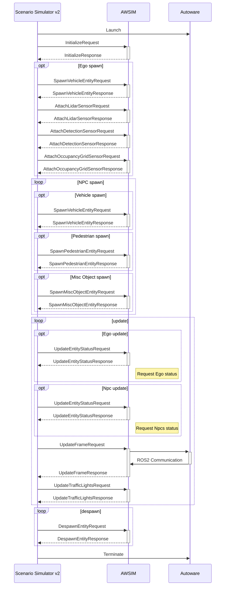

# ScenarioSimulatorConnection
`Scenario Simulator Connection` is a scene setting for connecting `Scenario Simulator v2`.<br>
This page provides an overview of connecting to `Scenario Simulator v2` and instruction of the scene.

<popup-img src="./top.png" alt="Traffic Simulation"></popup-img>

!!!info
    If you want to **use** `OpenSCENARIO` with `AWSIM`, see [here](../../../../GettingStarted/Advanced/UsingOpenScenario/index.md).

## Abstract
[`Scenario Simulator v2`](https://tier4.github.io/scenario_simulator_v2-docs/) (`SS2`) is a scenario testing framework specifically developed for `Autoware`.<br>
It serves as a tool for `Autoware` developers to conveniently create and execute scenarios across different simulators. 

`Scenario Simulator Connection` uses [`ZeroMQ`](https://tier4.github.io/scenario_simulator_v2-docs/developer_guide/ZeroMQ/) Inter-Process communication for seamless interaction between the `AWSIM` and the `SS2`.<br>
To ensure synchronous operation of the `SS2`, `Scenario Simulator Connection` utilizes the `Request/Reply` sockets provided by `ZeroMQ` and exchanges binarized data through `Protocol Buffers`.<br>
This enables the `SS2` to run in a synchronized manner, enhancing the accuracy and reliability of scenario testing.

!!!note
    If you would like to see how `SS2` works with `Autoware` using default build-in simulator - [`simple_sensor_simulator`](https://tier4.github.io/scenario_simulator_v2-docs/developer_guide/SimpleSensorSimulator/) (without running AWSIM) - we encourage you to read this [tutorial](https://autowarefoundation.github.io/autoware-documentation/main/tutorials/scenario-simulation/planning-simulation/scenario-test-simulation/).

### Overview
In the following sequence diagram describes responsible and communication of `SS2`, `AWSIM` and `Autoware`.

Communication between `SS2` and `AWSIM` takes place via `Request-Response` messages, and is as follows:

| Sequence | Description |
|---|---|
| Launch | `Autoware` is started and initialized. |
| Initialize | the environment in `AWSIM` is initialized, basic parameters are set. |
| opt Ego spawn | optional, `EgoEntity` (with sensors) is spawned in the configuration defined in the scenario. |
| opt NPC spawn loop | optional, all `Entities` (`NPCs`) defined in the scenario are spawned, the scenario may contain any number of each `Entity` type. |
| update loop | this is the main loop where scenario commands are executed. It include updating `EgoEntity`, `SS2` status, `Entities`, simulation frame and traffic light state. |
| despawn loop | after the end of the scenario, all `Entities` spawned on the scene are despawned (including `EgoEnity`). |
| Terminate | *Autoware* is terminated. |

Documentation of the commands used in the sequence is available [here](https://tier4.github.io/scenario_simulator_v2-docs/proto_doc/protobuf/).



### Configuration
`Scenario Simulator Connection` can be configured from `ScenarioSimulatorClient` component.

The configurable elements are listed in the following table:

| Parameter | Description |
|---|---|
| Server Response Address | Tcp address to connect `Scenario Simulator v2`. |
| Traffic Lights In Scene | Traffic lights which is controlled. |
| Entity Prefabs | List of Ego and Npc prefabs.<br>Each element have identifier (`Asset Key`) and reference (`Prefab`). |
| Entites Root | Hierarchy where Npc spawn. |
| Ego Follow Camera | Reference of `Follow Camera` object. |
| Step Execution | Enable the checkbox to perform step execution. |
| Step Duration In Percentage | On step execution, frames between each step. |

## Instruction
To use `Scenario Simulator Connection`, please follow the steps below.

For the preparation, the following must be prepared:

- 3D map (.fbx)
- lanelet map (.osm)

!!! info
    AWSIM includes `IntegrateScenarioSimulatorDemo` scene.<br>
    Please refer to:<br>
    * `Assets/Awsim/Scenes/IntegrateScenarioSimulatorDemo.unity`

### 1. Placement and settings of `ScenarioSimulatorClient`
`ScenarioSimulatorClient` component can mange and connect scenario simulation.

<popup-img src="./ss2_client.png" alt="Configure ss2"></popup-img>

Please create and configure `ScenarioSimulatorClient` component as the following:

1. Create empty `GameObject` (should be `Function/ScenarioSimulatorClient`)
<popup-img src="./hierarchy.png" alt="Hierarchy"></popup-img>
2. Attach this object to `ScenarioSimulatorClient` component
3. Fill in `Entities Root` field with `ScenarioSimulatorClient` object itself

### 2. Configuration of `Entity Prefabs`
Configure `ScenarioSimulatorClient` to be able to use entity in Unity.

<popup-img src="./entity_prefabs.png" alt="Entity Prefabs"></popup-img>

Please configure `Entity Prefabs` field of `ScenarioSimulatorClient` as the following:

1. Fill in `Entity Prefabs` field with vehicle prefabs what you want to use
    1. Fill `Asset Key` field with name for identifying prefab
    2. Fill `Prefab` field with Ego and Npc prefab
        1. Ego prefabs is in `Assets/Awsim/Prefabs/Entity/Npc/Vehicle/`
        2. Npc prefabs is in `Assets/Awsim/Scenes/IntegrateScenarioSimulatorDemo/`

### 3. Camera setting of `ScenarioSimulatorClient`
Add `Camera` component in Unity scene to visualize scenario simulation in `AWSIM`.

<popup-img src="./camera.png" alt="Camera"></popup-img>

Please create and configure `FollowCamera` component as the following:

1. Create `Camera` object (should place on `Function/`)
2. Attach this object to `FollowCamera` component
3. Fill in `Ego FollowCamera` field of `ScenarioSimulatorClient` with this `Camera` object

### 4. `LaneletTrafficLight` settings
Attach and configure `LaneletTrafficLight` script to all traffic light in the scene.

<popup-img src="../TrafficSimulation/traffic_light.png" alt="Traffic Light"></popup-img>

Please configure `LaneletTrafficLight` components as the following:

1. Attach `LaneletTrafficLight` to traffic light objects of all traffic light object in the scene
2. Modify `Bulb Material Config` as follow images<br>
vehicle raffic light<br>
<popup-img src="../TrafficSimulation/bulb_vehicle.png" alt="Bulb Vehicle"></popup-img>
pedestrian traffic light<br>
<popup-img src="../TrafficSimulation/bulb_pedestrian.png" alt="Bulb Pedestrian"></popup-img>
    1. If there are wrong order of bulb, modify each `Bulb Material Config`
3. Fill in `Traffic Lights In Scene` field of `ScenarioSimulatorClient` with all traffic light object in the scene

!!! info
    For detailed settings of `Bulb Material Config`, see [here](../../Entity/Infra/TrafficLight/index.md).

### 5. Load lanelet
`LaneletLoader` can load a lanelet map and set parameter of traffic rules to traffic lights.<br>
`LaneletLoader` can be performed by opening `AWSIM -> Common -> Load Lanelet` at the toolbar of Unity Editor.

<popup-img src="../TrafficSimulation/load_lanelet_tool_bar.png" alt="Tool Bar"></popup-img>

Please use `LaneletLoader` as the following:

1. Fill in `Osm` field with a lanelet map (`.osm`) you prepared
2. Adjust `Waypoint settings` parameters for the loading process if needed
3. To load the lanelet map, please click `Load` button<br>
<popup-img src="./load_lanelet.png" alt="Load Lanelet"></popup-img>
4. Delete `TrafficLanes` and `StopLines` object what is generated by `LaneletLoader`

The `Waypoint settings` parameters are listed in the following table:

| Parameter | Description |
|---|---|
| Resolution | Resolution of resampling. Lower values provide better accuracy at the cost of processing time. |
| Min Delta Length | Minimum length(m) between adjacent points. |
| Min Delta Angle | Minimum angle(deg) between adjacent edges.<br>Lowering this value produces a smoother curve. |

### 6. Placement of `ClockRos2Publisher`
Add `ClockRos2Publisher` component to synchronize the ROS2 clock of `AWSIM` and `Scenario Simulator v2`.

<popup-img src="./clock_publisher.png" alt="Clock Publisher"></popup-img>

Please create and configure `ScenarioSimulatorClient` component as the following:

1. Create empty `GameObject` (should be `Common/ClockRos2Publisher`)
2. Attach this object to `ClockRos2Publisher` component

### 7. Call methods of `ScenarioSimulatorClient` and `ClockRos2Publisher`
Some methods of `ScenarioSimulatorClient` and `ClockRos2Publisher` should be called from callback of `MonoBehaviour` to enable `Scenario Simulator Client`.

Please implement as the following:

1. Create or open class which is inherit `MonoBehaviour`
2. Make fields of `ScenarioSimulatorClient` and `ClockRos2Publisher`
3. Add description of calling method of `ScenarioSimulatorClient` and `ClockRos2Publisher`

The method should be called are listed in the following table:

`ScenarioSimulatorClient`

| Method | Description |
|---|---|
| Initialize() | Should be called Start() callback. |
| OnUpdate() | Should be called Update() callback. |
| OnFixedUpdate() | Should be called FixedUpdate() callback. |

 `ClockRos2Publisher`

| Method | Description |
|---|---|
| Initialize() | Should be called Start() callback. |
| OnUpdate() | Should be called Update() callback. |

!!! info
    AWSIM includes `AutowareSimulationDemo` scene.<br>
    Please refer to:<br>
    * `Assets/Awsim/Scenes/IntegrateScenarioSimulatorDemo/IntegrateScenarioSimulatorDemo.cs`<br>
    * `Assets/Awsim/Scenes/IntegrateScenarioSimulatorDemo.unity` scene

## Scenario preparation
Scenario file should be modified to work `Scenario Simulator v2` with `AWSIM`.<br>
Note that scenario file must be YAML file that follows [`TIER IV Scenario Format version 2.0`](https://tier4.github.io/scenario_simulator_v2-docs/developer_guide/TIERIVScenarioFormatVersion2/).

### 1. `model3d` parameter
`model3d` parameter must be added to `Vehicle` parameter of scenario file to link prefabs in `AWSIM`.<br>
If value of `model3d` corresponds to `Asset Key` of `ScenarioSimulatorClient`, the prefab is spawned in `AWSIM` when scenario running.

The description example is as follows:

```
Vehicle:
  name: sample_vehicle
  vehicleCategory: car
  model3d: "small_car"
```

### 2. Entities parameters
`Vehicle` parameter of scenario file should be match that of prefab in `AWSIM`.<br>
Especially, `BoundingBox` parameter is crucial to validate the collisions correctly.

The entity parameters of default `AWSIM` assets are listed in the following table:

Ego Vehicle Entity

| model name    | boundingbox size (m)                                  | wheel base(m) | front tread(m) | rear tread(m) | tier diameter(m) | max steer(deg) |
|---------------|-------------------------------------------------------|---------------|----------------|---------------|------------------|----------------|
| lexus_rx450h  | width : 1.920 <br> height : 1.700 <br> length : 4.890 | 2.105         | 1.640          | 1.630         | 0.766            | 35             |

NPC Vehicle Entity

| model name | boundingbox size (m)                                  | wheel base(m) | front tread(m) | rear tread(m) | tier diameter(m) | max steer(deg) |
|------------|-------------------------------------------------------|---------------|----------------|---------------|------------------|----------------|
| taxi       | width : 1.695 <br> height : 1.515 <br> length : 4.590 | 2.680         | 1.460          | 1.400         |  0.635           | 35             |
| truck_2t   | width : 1.695 <br> height : 1.960 <br> length : 4.685 | 2.490         | 1.395          | 1.240         | 0.673            | 40             |
| hatchback  | width : 1.695 <br> height 1.515 <br> length : 3.940   | 2.550         | 1.480          | 1.475         | 0.600            | 35             |
| van        | width : 1.880 <br> height : 2.285 <br> length : 4.695 | 2.570         | 1.655          | 1.650         | 0.600            | 35             |
| small_car  | width : 1.475 <br> height 1.800 <br> length : 3.395   | 2.520         | 1.305          | 1.305         | 0.557            | 35             |

NPC Pedestrian Entity

| model name | boundingbox size (m)                                  |
|------------|-------------------------------------------------------|  
| human      | width : 0.400 <br> height : 1.800 <br> length : 0.300 |

Misc Object Entity

| model name | boundingbox size (m)                               |
|------------|----------------------------------------------------|  
| sign_board | width : 0.31 <br> height : 0.58 <br> length : 0.21 |

!!!note
    If you use prefabs which is no listed above, you need to determine entities parameters by your 3d models.
