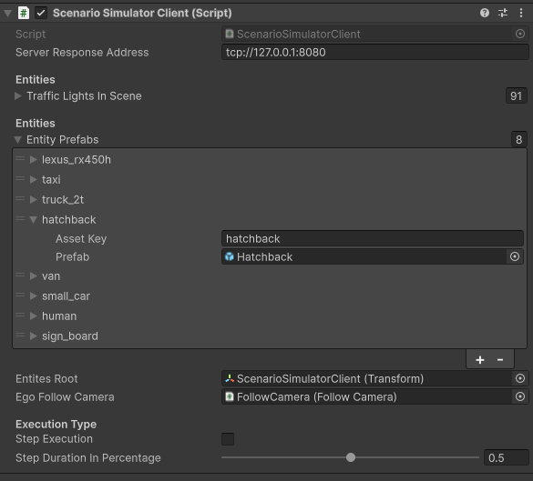
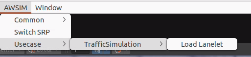
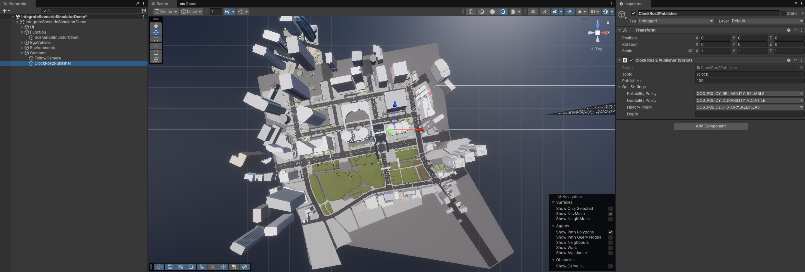

# ScenarioSimulatorConnection

## Abstract
`Scenario Simulator Connection` is a scene setting for connecting `Scenario simulator v2`.<br>
Spawn points (Spawnable Lanes) and spawnable vehicles can be configured using components and `Traffic Simulation` simulates traffic situation following configuration.


### Overview
`Scenario Simulator Connection` consists of the following components:

| Component | Description |
|---|---|
| TrafficSimulator | Collecting all traffic simulators and managing the spawning and simulating process. |
| NpcVehicleSpawner | Get Npc vehicle states and updating simulation steps. |
| NpcVehicleSimulator | Spawning random Npc vehicle in spawning lanes. |
| RandomTrafficSimulator | Managing lifecycle of NPCs and simulating NPC behaviours. |
| TrafficLane<br>TrafficLight<br>TrafficIntersection<br>StopLine | Traffic entities. |
| NpcVehicle | Vehicle models (NPCs) controlled by `RandomTrafficSimulator`. |

### Configuration
`Scenario Simulator Connection` can be configured from `ScenarioSimulatorClient` component.

The configurable elements are listed in the following table:

| Parameter | Description |
|---|---|
| Server Response Address | Tcp address to connect `Scenario simulator v2`. |
| Traffic Lights In Scene | Traffic lights which is controlled. |
| Entity Prefabs | List of Ego and Npc prefabs.<br>Each element have identifier (`Asset Key`) and reference (`Prefab`). |
| Entites Root | Hierarchy where Npc spawn. |
| Ego Follow Camera | Reference of `Follow Camera` object. |
| Step Execution | Enable the checkbox to perform step execution. |
| Step Duration In Percentage | On step execution, frames between each step. |

## Instruction
To use `Scenario Simulator Connection`, please follow the steps below.

For the preparation, the following must be prepared:

- 3D map (.fbx)
- lanelet map (.osm)

### 1. Placement and settings of `ScenarioSimulatorClient`
`ScenarioSimulatorClient` component can mange and connect scenario simulation.



Please create and configure `ScenarioSimulatorClient` component as the following:

1. Create empty `GameObject` (should be `Function/ScenarioSimulatorClient`)

2. Attach this object to `ScenarioSimulatorClient` component
3. Fill in `Entities Root` field with `ScenarioSimulatorClient` object itself

### 2. Configuration of `Entity Prefabs`
To be able to use entity in Unity, you can configure `ScenarioSimulatorClient`.


Please configure `Entity Prefabs` field of `ScenarioSimulatorClient` as the following:

1. Fill in `Entity Prefabs` field with vehicle prefabs what you want to use
    1. Fill `Asset Key` field with name for identifying prefab
    2. Fill `Prefab` field with Ego and Npc prefab
        1. Ego prefabs is in `Assets/Awsim/Prefabs/Entity/Npc/Vehicle/`
        2. Npc prefabs is in `Assets/Awsim/Scenes/IntegrateScenarioSimulatorDemo/`

### 3. Camera setting of `ScenarioSimulatorClient`
To visualize scenario simulation in `AWSIM`, you can use `Camera` component in Unity.


Please create and configure `FollowCamera` component as the following:

1. Create `Camera` object (should place on `Function/`)
2. Attach this object to `FollowCamera` component
3. Fill in `Ego FollowCamera` field of `ScenarioSimulatorClient` with this `Camera` object

### 4. `LaneletTrafficLight` settings
Please attach and configure `LaneletTrafficLight` script to all traffic light in the scene.


Please configure `LaneletTrafficLight` components as the following:

1. Attach `LaneletTrafficLight` to traffic light objects of all traffic light object in the scene
2. Modify `Bulb Material Config` as follow images<br>
vehicle raffic light<br>
<br>
pedestrian traffic light<br>

    1. If there are wrong order of bulb, modify each `Bulb Material Config`
3. Fill in `Traffic Lights In Scene` field of `ScenarioSimulatorClient` with all traffic light object in the scene

!!! info
    For detailed settings of `Bulb Material Config`, see [here](../../Entity/Infra/TrafficLight/index.md).

### 5. Load lanelet
`LaneletLoader` can load a lanelet map and set parameter of traffic rules to traffic lights.<br>
`LaneletLoader` can be performed by opening `AWSIM -> Common -> Load Lanelet` at the toolbar of Unity Editor.



Please use `LaneletLoader` as the following:

1. Fill in `Osm` field with a lanelet map (`.osm`) you prepared
2. Adjust `Waypoint settings` parameters for the loading process if needed
3. To load the lanelet map, please click `Load` button<br>

4. Delete `TrafficLanes` and `StopLines` object what is generated by `LaneletLoader`

The `Waypoint settings` parameters are listed in the following table:

| Parameter | Description |
|---|---|
| Resolution | Resolution of resampling. Lower values provide better accuracy at the cost of processing time. |
| Min Delta Length | Minimum length(m) between adjacent points. |
| Min Delta Angle | Minimum angle(deg) between adjacent edges.<br>Lowering this value produces a smoother curve. |

### 6. Placement of `ClockRos2Publisher`
To synchronize the ROS2 clock of `AWSIM` and `Scenario simulator v2`, you can use the `ClockRos2Publisher` component.



Please create and configure `ScenarioSimulatorClient` component as the following:

1. Create empty `GameObject` (should be `Common/ClockRos2Publisher`)
2. Attach this object to `ClockRos2Publisher` component

### 7. Call methods of `ScenarioSimulatorClient` and `ClockRos2Publisher`
To enable `Scenario Simulator Client`, some methods of `ScenarioSimulatorClient` and `ClockRos2Publisher` should be called from callback of `MonoBehaviour`.

Please implement as the following:

1. Create or open class which is inherit `MonoBehaviour`
2. Make fields of `ScenarioSimulatorClient` and `ClockRos2Publisher`
3. Add description of calling method of `ScenarioSimulatorClient` and `ClockRos2Publisher`

The method should be called are listed in the following table:

`ScenarioSimulatorClient`

| Method | Description |
|---|---|
| Initialize() | Should be called Start() callback. |
| OnUpdate() | Should be called Update() callback. |
| OnFixedUpdate() | Should be called FixedUpdate() callback. |

 `ClockRos2Publisher`

| Method | Description |
|---|---|
| Initialize() | Should be called Start() callback. |
| OnUpdate() | Should be called Update() callback. |

!!! info
    AWSIM includes `AutowareSimulationDemo` scene.<br>
    Please refer to:<br>
    * `Assets/Awsim/Scenes/IntegrateScenarioSimulatorDemo/IntegrateScenarioSimulatorDemo.cs`<br>
    * `Assets/Awsim/Scenes/IntegrateScenarioSimulatorDemo.unity` scene

## Scenario preparation
To work `Scenario simulator v2` with `AWSIM`, [TIER IV Scenario Format](https://tier4.github.io/scenario_simulator_v2-docs/developer_guide/TIERIVScenarioFormatVersion2/) file should be modified.

### 1. `model3d` parameter
You must add `model3d` parameter to `Vehicle` parameter of scenario file to link prefabs in `AWSIM`.<br>
If value of `model3d` corresponds to `Asset Key` of `ScenarioSimulatorClient`, the prefab is spawned in `AWSIM` when scenario running.

The description example is as follows:

```
Vehicle:
  name: sample_vehicle
  vehicleCategory: car
  model3d: "small_car"
```

### 2. Entities parameters
`Vehicle` parameter of scenario file should be match that of prefab in `AWSIM`.<br>
Especially, `BoundingBox` parameter is crucial to validate the collisions correctly.

The entitiy parameters of default `AWSIM` assets are listed in the following table:

Ego Vehicle Entity

| model name    | boundingbox size (m)                                  | wheel base(m) | front tread(m) | rear tread(m) | tier diameter(m) | max steer(deg) |
|---------------|-------------------------------------------------------|---------------|----------------|---------------|------------------|----------------|
| lexus_rx450h  | width : 1.920 <br> height : 1.700 <br> length : 4.890 | 2.105         | 1.640          | 1.630         | 0.766            | 35             |

NPC Vehicle Entity

| model name | boundingbox size (m)                                  | wheel base(m) | front tread(m) | rear tread(m) | tier diameter(m) | max steer(deg) |
|------------|-------------------------------------------------------|---------------|----------------|---------------|------------------|----------------|
| taxi       | width : 1.695 <br> height : 1.515 <br> length : 4.590 | 2.680         | 1.460          | 1.400         |  0.635           | 35             |
| truck_2t   | width : 1.695 <br> height : 1.960 <br> length : 4.685 | 2.490         | 1.395          | 1.240         | 0.673            | 40             |
| hatchback  | width : 1.695 <br> height 1.515 <br> length : 3.940   | 2.550         | 1.480          | 1.475         | 0.600            | 35             |
| van        | width : 1.880 <br> height : 2.285 <br> length : 4.695 | 2.570         | 1.655          | 1.650         | 0.600            | 35             |
| small_car  | width : 1.475 <br> height 1.800 <br> length : 3.395   | 2.520         | 1.305          | 1.305         | 0.557            | 35             |

NPC Pedestrian Entity

| model name | boundingbox size (m)                                  |
|------------|-------------------------------------------------------|  
| human      | width : 0.400 <br> height : 1.800 <br> length : 0.300 |

Misc Object Entity

| model name | boundingbox size (m)                               |
|------------|----------------------------------------------------|  
| sign_board | width : 0.31 <br> height : 0.58 <br> length : 0.21 |

!!!note
    If you use prefabs which is no listed above, you need to determine entities parameters by your 3d models.
