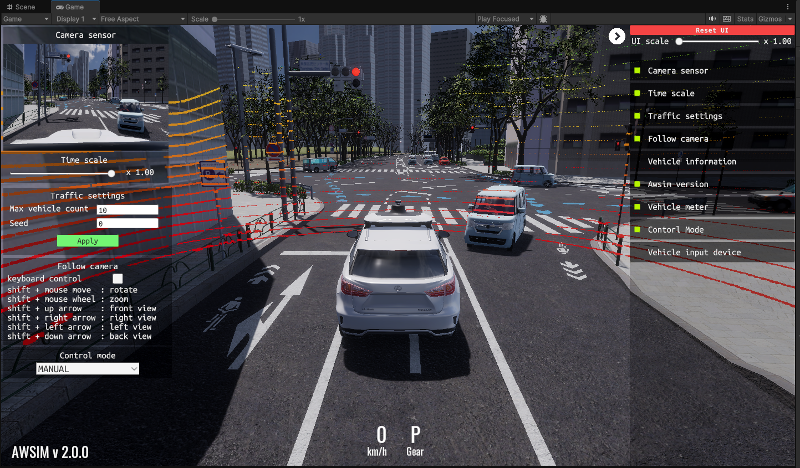
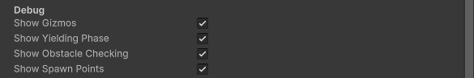
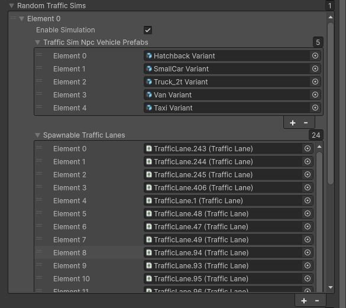

# Traffic Simulation
`Traffic Simulation` simulates traffic situation follow traffic rules. 
Spawn points (Spawnable Lanes) and spawnable vehicles can be configured using components and `Traffic Simulation` simulates traffic situation following configuration.

!!! note
    To enable `Traffic Simulation` for new scene, please see [here](../Instruction/index.md)

## Overview

## Configuration
`Traffic Simulation` can be configured from `TrafficSimulator` component.

The configurable elements are listed in the following table:

### General Settings

| Parameter | Description |
|---|---|
| Ego Vehicle | Ego vehicle handler. If not set, the manager creates a dummy ego. This reference is also set automatically when the Ego spawns via the traffic simulator |
| Seed | Seed value for random generator |
| Traffic Intersections | The field that is set `TrafficIntersection` objects. `TrafficIntersection` to be set is controlled by `Traffic Simulation` |

### NPC Vehicle Settings

| Parameter | Description |
|---|---|
| Vehicle Config | Parameters for NPC vehicle control `Sudden Deceleration` is a deceleration related to emergency braking |
| Obstacle Layer Mask | The obstacle layer for raytracing the collision distances |
| Ground Layer Mask | The Ground layer for raytracing the collision distances |
| Max Vehicle Count | The maximum number of vehicles that can simultaneously live in the scene. Lowering this value results in less dense traffic but improves the simulator's performance |
| Spawn Distance To Ego | The minimal distance between the EGO and the NPC to spawn |

### Debug

| Parameter | Description |
|---|---|
| Show Gizmos | Enable the checkbox to show all visualization using editor gizmos |
| Show Yielding Phase | Enable the checkbox to show editor gizmos that visualize `Yielding Phase` of NPCs |
| Show Obstacle Checking | Enable the checkbox to show editor gizmos that visualize `Obstacle Checking` phase of NPCs |
| Show Spawn Points | Enable the checkbox to show editor gizmos that visualize `Spawn Points` where NPCs is generated |

### Random Traffic Sims

| Parameter | Description |
|---|---|
| Enable Simulation | Enable the checkbox to `Random Traffic Sims` which spawn NPC vehicles randomly |
| TrafficSim Npc Vehicle Prefabs| Prefabs representing controlled vehicles.  They must have `NPCVehicle` component attached |
| Spawnable TrafficLanes | `TrafficLane` components where NPC vehicles can be spawned during traffic simulation |
| Enable Spawn Count Limit | Enable the checkbox to limit of vehicle spawning |
| Spawn Count Limit | The number of limit of vehicles spawning |

## Gizmos
Gizmos are useful for checking current behavior of NPCs and its causes. 
Gizmos have a high computational load so please disable them if the simulation is laggy.

The visualizable elements are listed in the following table:

| Shape | Description |
|---|---|
| Rectangle | `Yielding Phase` of each NPCs to avoid colliding with the other NPCs |
| Arrow | `Obstacle Checking` of each NPCs to stop in front of the obstacle |
| Diamond | `Spawn Points` where NPCs is generated by `Random Traffic Sims` |

