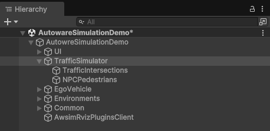
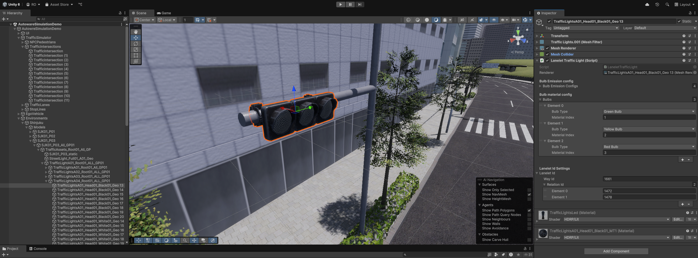

# Instruction
To use `Traffic Simulation`, please follow the steps below.

For the preparation, the following must be prepared:

- 3D map
- lanelet map (.osm)

## Locate Traffic Simulator
Create empty `GameObject` (should be named `TrafficSimulator`). 
Attach this object to `TrafficSimulator` component.

(optional) To place objects which is generated later, you may creat empty objects named `TrafficIntersections` and `NPCPedestrians`.

## Environment (3D Map) setting

## TrafficIntersection and LaneletTrafficLight settings
Please place intersection objects and attach `LaneletTrafficLight` script. 
Then, please you set traffic lights to intersection.

Please configure `TrafficIntersection` and `LaneletTrafficLight` components as the following:

1. Add a empty `GameObject` as a child object of `TrafficIntersections` hierarchy
    1. The `GameObject` should be named `TrafficIntersection.x`
    2. The `Transform` of `GameObject` should be set on the target intersection
2. Attach a `TrafficIntersection` component to the intersection game object
3. Attach `LaneletTrafficLight` to traffic light objects placed on the target intersection

4. Modify `Bulb Material Config` as follow images
vehicle raffic light 
 
pedestrian traffic light 

    1. If there are wrong order of bulb, modify each `Bulb Material Config`
5. Set traffic light objects attached `LaneletTrafficLight` in step. 3 to `TrafficLightGroups` in `TrafficIntersection`
    1. Traffic lights which should light same sequences should be set on same `TrafficLightGroups`
6. (optional) Modify the signal control pattern in `Lighting Sequences`

!!! warning
    Do not attach `LaneletTrafficLight` to traffic lights which are not set to `TrafficIntersection`. 
    It causes errors.

## Load lanelet
`LaneletLoader` can load a lanelet map and create `TrafficLane` and `StopLine`.
In addition, `LaneletLoader` set parameter of traffic rules to `TrafficLane`, `StopLine` and traffic lights. 
`LaneletLoader` can be performed by opening `AWSIM -> Random Traffic -> Load Lanelet` at the toolbar of Unity Editor.

Please use `LaneletLoader` as the following:
1. Fill in `Osm` field with a lanelet map (`.osm`) you prepared, `Root Object` field with a `TrafficSimulator` object. 
2. Adjust `Waypoint settings` parameters for the loading process if needed. 
3. To load the lanelet map, please click `Load` button.

The `Waypoint settings` parameters are listed in the following table:

| Parameter | Description |
|---|---|
| Resolution | Resolution of resampling. Lower values provide better accuracy at the cost of processing time |
| Min Delta Length | Minimum length(m) between adjacent points |
| Min Delta Angle | Minimum angle(deg) between adjacent edges Lowering this value produces a smoother curve |

`TrafficLane`, `StopLine` and `TrafficLight` will be generated and placed as child objects of the `Root Object`. 
You can check their visual representation by clicking consecutive elements in the scene hierarchy.

## TrafficSimulator setting

Please configure `TrafficSimulator` component as the following:

1. Fill in `Ego Vehicle` field with EGO vehicle
    1. Example: `EgoVehicle/Lexus RX450h 2015`
2. Change `Obstacle Layer Mask` and `Ground Layer Mask` field to `Everything`
3. Fill in `Traffic Intersections` field with `TrafficIntersection` objects
4. Fill in `Random Traffic Sims` field
    1. Fill in `Traffic Sim Npc Vehicle Prefab` field with vehicle prefabs what you want to spawn
        1. Prefabs is in `Assets/Awsim/Prefabs/Usecase/TrafficSimulation/`
    2. Fill in `Spawnable Traffic Lanes` field with `TrafficLane` where you want to spawn vehicles

For detailed settings, see [here](../Abstract/index.md#configulations)

## Locate Pedestrian (optional)
You can place pedestrian NPCs if needed. 
Pedestrians can animated and walk around where they are placed. 
Direction which pedestrian start to walking can be set in `Transform` of it.

Please configure pedestrian NPCs as the following:

1. Locate pedestrian prefabs on a scene
    1. Prefabs is in `Assets/Awsim/Prefabs/Entity/Npc/Pedestrian/`
    2. Pedestrians should be child object of `NPCPedestrians` hierarchy
2. Attach `SimplePedestrianWalkerController` component to pedestrians
3. (optional) Configure parameters of `SimplePedestrianWalkerController`

The parameters of `SimplePedestrianWalkerController` are listed in the following table:

| Parameter | Description |
|---|---|
| Duration | Duration at which the pedestrian walk |
| Speed | Speed at which the pedestian walk |

## Reference Components
To enable `Traffic Simulation`, please fill in following fields in `AutowareSimulationDemo.cs`.

Please fill in `Traffic Simulator` field in `AutowareSimulationDemo.cs` with a object which is attached `TrafficSimulator.cs`.

Please fill in `Simple Pedestrian Walker Controller` list in  `AutowareSimulationDemo.cs` with `Pedestrian` if you placed.