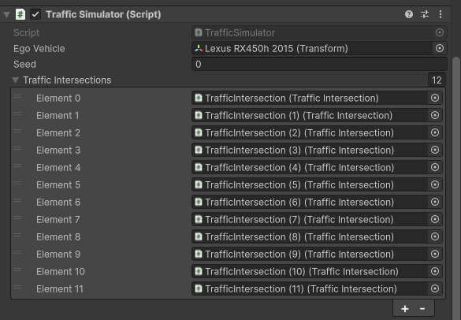
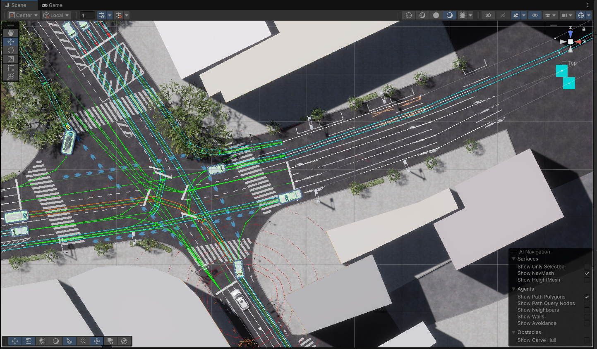

# Traffic Simulation
The `Traffic Simulation` simulates traffic situation follow traffic rules. 
Spawn point (Spawnable Lanes) and spawnable vehicle can be configured in `Unity Editor` component and `Traffic Simulation` simulates traffic situation following configuration.

## Overview

## Configulations
`Traffic Simulation` can be configured from `Unity Editor` component (`TrafficSimulator.cs`).

The configurable elements are listed in the following table:

### General Settings

| Parameter | Description |
|---|---|
| Ego Vehicle | Ego vehicle handler. If not set, the manager creates a dummy ego. This reference is also set automatically when the Ego spawns via the traffic simulator |
| Seed | Seed value for random generator |
| Traffic Intersections | The field that is set `TrafficIntersection` objects. `TrafficIntersection` to be set is controlled by `Traffic Simulation` |

### NPC Vehicle Settings

| Parameter | Description |
|---|---|
| Vehicle Config | Parameters for NPC vehicle control `Sudden Deceleration` is a deceleration related to emergency braking |
| Obstacle Layer Mask | Obstacle layer for raytracing the collision distances |
| Ground Layer Mask | Ground layer for raytracing the collision distances |
| Max Vehicle Count | A maximum number of vehicles that can simultaneously live in the scene. Lowering this value results in less dense traffic but improves the simulator's performance |
| Spawn Distance To Ego | A minimal distance between the EGO and the NPC to spawn |

### Debug

| Parameter | Description |
|---|---|
| Show Gizmos | Enable the checkbox to show all visualization using editor gizmos |
| Show Yielding Phase | Enable the checkbox to show editor gizmos that visualize `Yielding Phase` (to the other NPCs) of NPCs |
| Show Obstacle Checking | Enable the checkbox to show editor gizmos that visualize `Obstacle Checking` phase of NPCs |
| Show Spawn Points | Enable the checkbox to show editor gizmos that visualize `Spawn Points` where NPCs is generated |

### Random Traffic Sims

| Parameter | Description |
|---|---|
| Enable Simulation | Prefabs representing controlled vehicles.  They must have `NPCVehicle` component attached |
| TrafficSim Npc Vehicle Prefabs| Prefabs representing controlled vehicles.  They must have `NPCVehicle` component attached |
| Spawnable TrafficLanes | `TrafficLane` components where NPC vehicles can be spawned during traffic simulation |
| Enable Spawn Count Limit | `TrafficLane` components where NPC vehicles can be spawned during traffic simulation |
| Spawn Count Limit | `TrafficLane` components where NPC vehicles can be spawned during traffic simulation |

## Gizmos
Gizmos are useful for checking current behavior of NPCs and its causes. 
Gizmos have a high computational load so please disable them if the simulation is laggy.

The visualizable elements are listed in the following table:

| Shape | Description |
|---|---|
| Rectangle | `Yielding Phase` of each NPCs to avoid colliding with the other NPCs |
| Arrow | `Obstacle Checking` of each NPCs to stop in front of the obstacle |
| Diamond | `Spawn Points` where NPCs is generated by `Traffic Simulator` |

# Instruction

## Preparation
To enable `Traffic Simulation`, the following must be prepared

- 3D map
- lanelet map (.osm)

## Environment (3D Map) setting

## TrafficLight setting
Please attach `LaneletTrafficLight` component to all traffic light included in `3D Map`.

[img]

## Load lanelet
`LaneletLoader` can load lanelet and set parameter of traffic rules to `TrafficLane`, `StopLine` and `TrafficLight`. 
`LaneletLoader` can be performed by opening `AWSIM -> Random Traffic -> Load Lanelet` at the toolbar of Unity Editor.

[img]

Please fill in `a` field with lanelet map (`.osm`) you prepared, in `a` field with `b` object. 
Please adjust the parameters for the loading process if needed. 
To load lanelet map, please click `Load` button.

[img]

The `Waypoint settings` parameters are listed in the following table:

| Parameter | Description |
|---|---|
| Resolution | Resolution of resampling. Lower values provide better accuracy at the cost of processing time |
| Min Delta Length | Minimum length(m) between adjacent points |
| Min Delta Angle | minimum angle(deg) between adjacent edges. Lowering this value produces a smoother curve |

Environment components should be generated and placed as child objects of the Environment GameObject. 
You can check their visual representation by clicking consecutive elements in the scene hierarchy.

## TrafficIntersection setting
Please locate intersection object and set traffic lights to it.

[img]

Please configure `TrafficIntersection` component sas the following:

1. Add a `GameObject` as a child object of the `TrafficIntersections`
    1. the `GameObject` should be named `TrafficIntersection.x`
    2. the `Transform` of `GameObject` should be set on target intersection
2. Attach a `TrafficIntersection` component to the `GameObject`
3. Set `TrafficLightGroups` to object attached `LaneletTrafficLight` component replaced on target intersection
    1. traffic lights which should light same sequences should be set on same `TrafficLightGroups`
4. (optional) Modify the signal control pattern in `Lighting Sequences`

## TrafficSimulator setting

[img]

Please configure the `TrafficSimulator` component as the following:

1. Fill in the `Traffic Intersections` field with `TrafficIntersection` objects
2. Fill in `Random Traffic Sims` field
    1. Fill in `Traffic Sim Npc Vehicle Prefab` field with vehicle prefab what you want to spawn
    2. Fill in `Spawnable Traffic Lanes` field with `TrafficLane` where you want to spawn vehicles

## Locate Pedestrian (optional)
You can locate pedestrian NPC if you need. 
Pedestrian can animated and walk around where they are located. 
Direction which pedestrian start to walking can be set in `Transform` of it.

[img]

Please configure Pedestrian NPCs component as the following:

1. Locate pedestrian prefab on scene
    1. Prefab is in `Assets/Awsim/Prefabs/Entity/Npc/Pedestrian/`
    2. Pedestrian should be child object of `NPCPedestrians` hierarchy
2. Attach `SimplePedestrianWalkerController` component to pedestrian
3. (optional) Configure parameters of `SimplePedestrianWalkerController`

The parameters of `SimplePedestrianWalkerController` are listed in the following table:

| Parameter | Description |
|---|---|
| Duration | Duration in which the pedestrian animate |
| Speed | Speed at which the pedestian walk |

## Reference Components
To enable `Traffic Simulation`, please fill in following fields in `AutowareSimulationDemo.cs`.

[img]

### TrafficSimulator
Please fill in `a` field in `AutowareSimulationDemo.cs` with a object which is attached `TrafficSimulator.cs`.

### NPCPedestrians (optional)
Please fill in `a` list in  `AutowareSimulationDemo.cs` with `Pedestrian` if you located.
