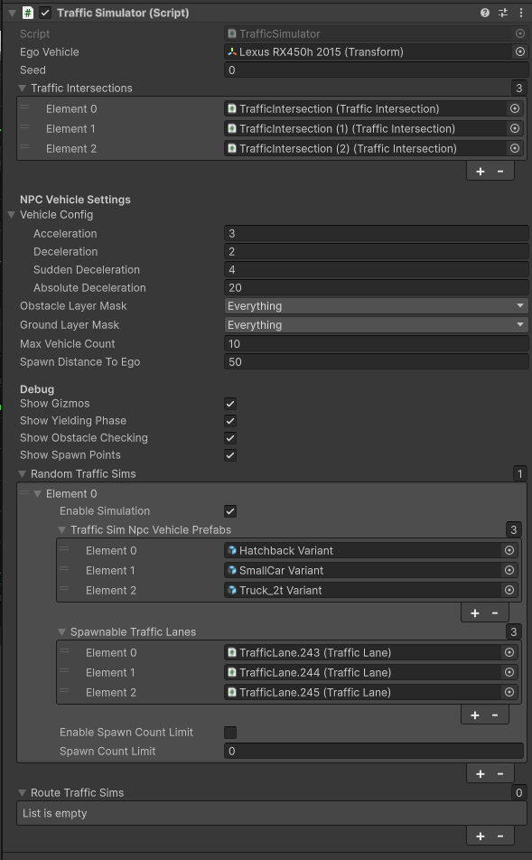

# Traffic Simulation
The `Traffic Simulation` simulates traffic situation follow traffic rules.  
Spawn point (Spawnable Lanes) and spawnable vehicle can be configured in `Unity Editor` component and `Traffic Simulation` simulates traffic situation following configuration.

## Overview

## Configulations
`Traffic Simulation` can be configured from `Unity Editor` component (`TrafficSimulator.cs`).

The configurable elements are listed in the following table:

| Parameter | Description |
|---|---|
| **General Settings** | |
| Ego Vehicle | Ego vehicle handler. If not set, the manager creates a dummy ego. This reference is also set automatically when the Ego spawns via the traffic simulator |
| Seed | Seed value for random generator |
| Traffic Intersections | The field that is set `TrafficIntersection` objects. `TrafficIntersection` to be set is controlled by `Traffic Simulation` |
| **NPC Vehicle Settings** | |
| Vehicle Config | Parameters for NPC vehicle control `Sudden Deceleration` is a deceleration related to emergency braking |
| Obstacle Layer Mask | Obstacle layer for raytracing the collision distances |
| Ground Layer Mask | Ground layer for raytracing the collision distances |
| Max Vehicle Count | A maximum number of vehicles that can simultaneously live in the scene. Lowering this value results in less dense traffic but improves the simulator's performance |
| Spawn Distance To Ego | A minimal distance between the EGO and the NPC to spawn |
| **Debug** | |
| Show Gizmos | Enable the checkbox to show all visualization using editor gizmos |
| Show Yielding Phase | Enable the checkbox to show editor gizmos that visualize `Yielding Phase` (to the other NPCs) of NPCs |
| Show Obstacle Checking | Enable the checkbox to show editor gizmos that visualize `Obstacle Checking` phase of NPCs |
| Show Spawn Points | Enable the checkbox to show editor gizmos that visualize `Spawn Points` where NPCs is generated |
| **Random Traffic Sims** | |
| Enable Simulation | Prefabs representing controlled vehicles.  They must have `NPCVehicle` component attached |
| TrafficSim Npc Vehicle Prefabs| Prefabs representing controlled vehicles.  They must have `NPCVehicle` component attached |
| Spawnable TrafficLanes | `TrafficLane` components where NPC vehicles can be spawned during traffic simulation |
| Enable Spawn Count Limit | `TrafficLane` components where NPC vehicles can be spawned during traffic simulation |
| Spawn Count Limit | `TrafficLane` components where NPC vehicles can be spawned during traffic simulation |

## Gizmos
Gizmos are useful for checking current behavior of NPCs and its causes.  
Gizmos have a high computational load so please disable them if the simulation is laggy.

The visualizable elements are listed in the following table:

| Shape | Description |
|---|---|
| Rectangle | `Yielding Phase` of each NPCs to avoid colliding with the other NPCs |
| Arrow | `Obstacle Checking` of each NPCs to stop in front of the obstacle |
| Diamond | `Spawn Points` where NPCs is generated by `Traffic Simulator` |

# Instruction

## Preparation
### Environment
### Lanelet

## TrafficLight setting

## Locate Pedestrian (optional)

## Lanelet setting

## TrafficSimulator setting

## TrafficIntersection setting

## Reference Components
### TrafficSimulator
### NPCPedestrians (optional)