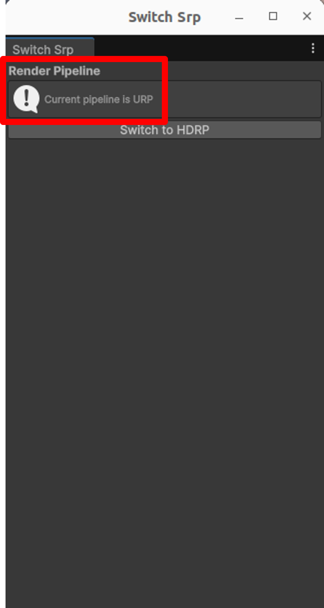
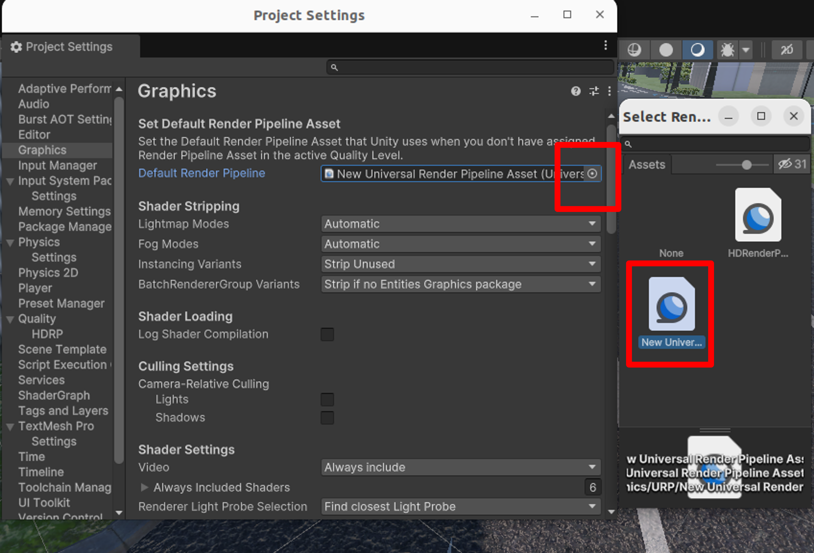
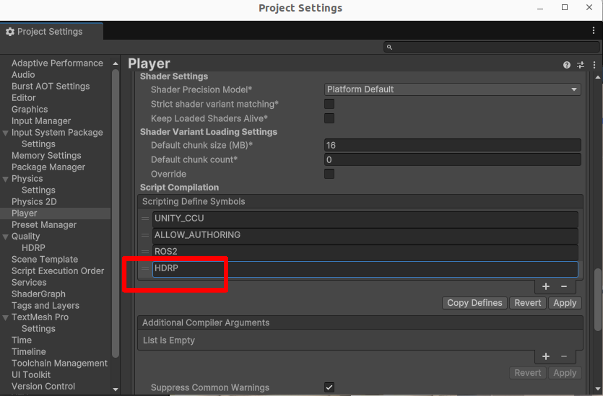

# Switch SRP

## What's SRP?
SRP (Scriptable Render Pipeline) is a programmable rendering architecture provided by Unity that allows developers to customize rendering behavior based on project requirements. Unity officially offers two main SRP implementations:

- URP (Universal Render Pipeline): Optimized for cross-platform performance, suitable for most projects.
- HDRP (High Definition Render Pipeline): Prioritizes high visual fidelity, ideal for high-end platforms and photorealistic projects.

## Switch SRP (Use editor extension)
To simplify the SRP switching process, we provide an Editor extension named "Switch SRP", available in the Unity Editor menu.

- This tool automates the following steps:
    - Switching the default render pipeline asset (Graphics settings)

    - Updating scripting define symbols (Player settings)

    - Prompting for Unity Editor restart to avoid rendering glitches

1. In the Unity Editor, go to AWSIM -> Switch SRP from the top menu.
<a href="image_10.png" data-lightbox="Graphics Settings 0" data-title="Graphics Settings 0" data-alt="Graphics Settings 0"></a>

1. A window will appear, showing the currently active render pipeline.
<a href="image_11.png" data-lightbox="Graphics Settings 1" data-title="Graphics Settings 1" data-alt="Graphics Settings 1"></a>

1. Based on the current state, the button will display one of the following:
    - If the current pipeline is HDRP, the button will say HDRP → URP
        - Click to switch to URP.
    - If the current pipeline is URP, the button will say URP → HDRP
        - Click to switch to HDRP.  

1. After clicking the button, a confirmation dialog will appear asking whether to restart the Unity Editor immediately.  
<a href="image_12.png" data-lightbox="Graphics Settings" data-title="Graphics Settings" data-alt="Graphics Settings"></a>

1. Click Yes, and Unity will automatically restart to ensure the changes take effect and to prevent rendering issues.  

## Switch SRP (Manually)
In this project, both HDRP and URP scenes are preconfigured separately.

=== "URP to HDRP"
    1. Open the Unity Editor and go to Edit > Project Settings > Graphics
    <a href="image_0.png" data-lightbox="Graphics Settings" data-title="Graphics Settings" data-alt="Graphics Settings"></a>

    1. Switch the `Default Render Pipeline` in Edit -> ProjectSettings -> Graphics, and set it to `HDRenderPipelineAsset`.
    <a href="image_7.png" data-lightbox="Graphics Settings" data-title="Graphics Settings" data-alt="Graphics Settings"></a>

    1. Open the AutowareSimulationDemo scene.
    <a href="image_6.png" data-lightbox="Graphics Settings" data-title="Graphics Settings" data-alt="Graphics Settings"></a>

    1. Add Scripting Define Symbols  
    After switching the render pipeline, you need to update the scripting define symbol from URP to HDRP to enable HDRP-specific conditional compilation.  
        - In the Unity Editor, go to Edit -> Project Settings -> Player

        - In the right panel, expand Other Settings

        - Find the Scripting Define Symbols field under the Script Compilation section

        - Remove URP and add HDRP
        <a href="image_9.png" data-lightbox="Graphics Settings" data-title="Graphics Settings" data-alt="Graphics Settings"></a>

    1. Restart the Unity Editor after switching the render pipeline.
        - Especially when switching from URP to HDRP, the following error may occur:
        ```
        Exception: Invalid import, you are importing a texture handle that wraps a RenderTargetIdentifier. The render graph can't know the properties of these textures so please use the ImportTexture overload that takes a RenderTargetInfo argument instead.
        ```
        - This is caused by leftover SRP cache and materials not being refreshed.

        - Scene materials may appear broken (e.g., white), even without error logs when switching from HDRP to URP.

        - Restarting Unity Editor helps avoid unknown issues and ensures proper scene rendering.

=== "HDRP to URP"
    1. Open the Unity Editor and go to Edit > Project Settings > Graphics
    <a href="image_0.png" data-lightbox="Graphics Settings" data-title="Graphics Settings" data-alt="Graphics Settings"></a>

    1. Switch the `Default Render Pipeline` in Edit -> ProjectSettings -> Graphics, and set it to `UniversalRenderPipelineAsset`.
    <a href="image_3.png" data-lightbox="Graphics Settings" data-title="Graphics Settings" data-alt="Graphics Settings"></a>

    1. Open the AutowareSimulationURPDemo scene.
    <a href="image_4.png" data-lightbox="Graphics Settings" data-title="Graphics Settings" data-alt="Graphics Settings"></a>
    
    1. Add Scripting Define Symbols  
    After switching the render pipeline, you need to switch the scripting define symbol from HDRP to URP to enable URP-specific conditional compilation.  
        - In the Unity Editor, go to Edit -> Project Settings -> Player

        - In the right panel, expand Other Settings

        - Find the Scripting Define Symbols field under the Script Compilation section

        - Remove HDRP and add URP
        <a href="image_8.png" data-lightbox="Graphics Settings" data-title="Graphics Settings" data-alt="Graphics Settings"></a>
    
    1. Restart the Unity Editor after switching the render pipeline.
        - Especially when switching from URP to HDRP, the following error may occur:
        ```
        Exception: Invalid import, you are importing a texture handle that wraps a RenderTargetIdentifier. The render graph can't know the properties of these textures so please use the ImportTexture overload that takes a RenderTargetInfo argument instead.
        ```
        - This is caused by leftover SRP cache and materials not being refreshed.

        - Scene materials may appear broken (e.g., white), even without error logs when switching from HDRP to URP.

        - Restarting Unity Editor helps avoid unknown issues and ensures proper scene rendering.

    1. Check the lighting configuration:
    <a href="image_5.png" data-lightbox="Graphics Settings" data-title="Graphics Settings" data-alt="Graphics Settings"></a>
    