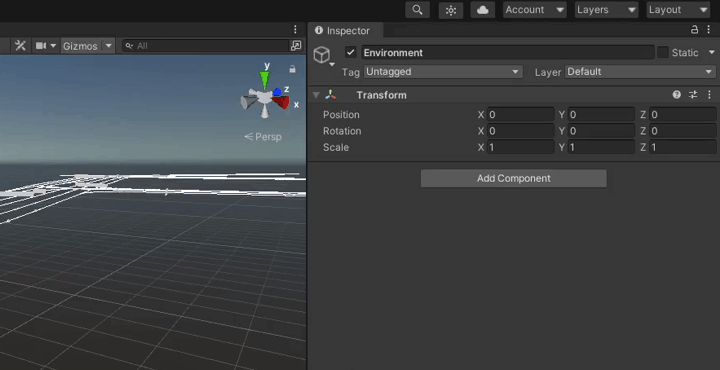
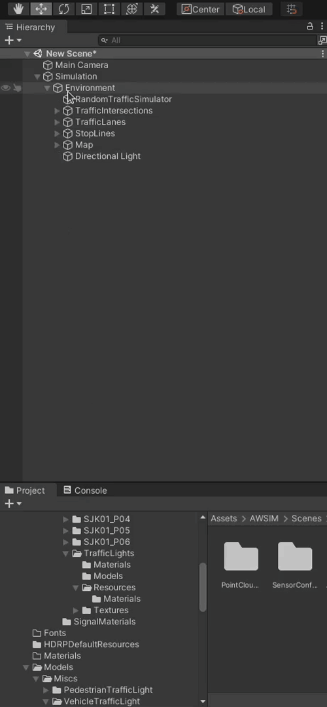
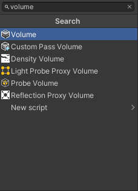

Environment is an important part of a Scene in AWSIM.
Every aspect of the simulated surrounding world needs to be included in an Environment.

If you want to learn more about an Environment please visit [this page](../../../../UserGuide/ProjectGuide/Components/Environment/).

## Create a *lanelet2*
Create a *Lanelet2* using [VectorMapBuilder](https://tools.tier4.jp/feature/vector_map_builder/) from the *PCD* obtained from real-life *LiDAR* sensor.
For details please visit the [official guide](https://tools.tier4.jp/vector_map_builder/user_guide/).

!!! warning "*lanelet2* positioning"
    *Lanetet2* should be created in [MGRS coordinates](https://en.wikipedia.org/wiki/Military_Grid_Reference_System) of the real place you are recreating.
    Please position your *lanelet2* relative to the origin (bottom left corner) of the MGRS Grid Zone with the 100 km Square ID in which the location lays.

    You can think of the *Grid Zone* as a local coordinate system.
    Instead of making global (0,0) point (crossing of Equator and Prime Median) our coordinate system origin we take a closer one.
    The MGRS Grid Zone with 100 km Square ID code designates a 100x100 km square on the map and we take its bottom left corner as our local origin.

    Lets examine one node from an example *lanelet2* map:

    ```xml
    <node id="4" lat="35.68855194431519" lon="139.69142711058254">
        <tag k="mgrs_code" v="54SUE815501"/>
        <tag k="local_x" v="81596.1357"/>
        <tag k="local_y" v="50194.0803"/>
        <tag k="ele" v="34.137"/>
    </node>
    ```

    The node *4* position is described as absolute coordinates given in the `<node>`.
    In this example the coordinates are as follows `lat="35.68855194431519" lon="139.69142711058254`.

    It is also described as local transformation defined as a translation relative to the origin of the MGRS Grid Zone with 100 km Square ID (bottom left corner).
    The MGRS Grid Zone Designation with 100 km Square ID in this case is equal to `54SUE` (check [this page](https://en.wikipedia.org/wiki/Military_Grid_Reference_System) for more details on MGRS coordinates).
    In this example the offset in the *X axis* is as follows `k="local_x" v="81596.1357"`
    and the offset in the *Y axis* is as follows `k="local_y" v="50194.0803"`.

    Note that elevation information is also included.

The most important in this step to accurately represent the road situation with elements available in the Builder.
Especially important are Traffic Lanes created in VMB as connected Road Nodes and Stop Lines created in VMB as Road Surface Stoplines.

## Create 3D models
!!! info "Notes for creating 3D models of the environment"
    - Creating a 3D model based on actual point cloud data makes it more realistic.
    - *AWSIM* is created using *HDRP* (High Definition Rendering Pipeline) which performs better when object meshes are merged.
    - Occlusion culling and flutter culling cannot be used because the sensors detection target will disappear.
    - Each traffic light should have a separate GameObject. Also, each light in the traffic light should be split into separate materials.

You can create 3D models of an Environment as you wish.
It is advised however, to prepare the models in form of `.fbx` files.
Additionally you should include materials and textures in separate directories.

Many models are delivered in this format.
This file format allows you to import models into Unity with materials and replace materials while importing.

You can learn more about it [here](https://unity.com/how-to/work-assets-between-unity-and-autodesk).

### Guidelines
<!-- TODO: here you should add tips in consultation with Piotr Rząd and report from Unity -->
To improve performance of the simulation in your Environment please keep in mind some of these tips when creating 3D models.

1. Prefer more smaller models over a few big ones.

    In general it is beneficial for performance when you make one small mesh of a object like tree and reuse it on the scene placing many prefabs instead of making one giant mesh containing all trees on the given scene.
    Even in situations when you are not reusing meshes it is beneficial.
    Lets say you have a city with many buildings - and every one of those buildings is different - it is still advised to model those building individually and make them separate Game Objects.

2. Choose texture resolution appropriately.

    Always have in mind what is the target usage of your texture.
    Avoid making a high resolution texture for a small object or the one that will always be far away from the camera.
    This way you can save some computing power by not calculating the details that will not be seen because of the screen resolution.

## Create an Environment prefab
### Add a 3D models
In this section we will add roads, buildings, greenery, signs, road markings etc. to our scene.

!!! tip "Positioning"
    When adding elements to the Scene that are part of the static world (like 3D models of buildings, traffic lights etc.) it is good practice to collect them in one parent *Object* called `Map` or something similar.

    By doing this you can set a transformation of the parent *Object* `Map` to adjust the world pose in reference to e.g. loaded objects from *lanelet2*.

Most often your models will be saved in the `.fbx` format.
If so, you can customize the materials in the imported model just before importing it.
Sometimes it is necessary as models come with placeholder materials.

!!! note
    You can either

    - replace materials for every added *Object* into the Scene
    - or replace materials for one *Object* and save this object as a prefab to easily load it later

In order to add 3D models from the `.fbx` file to the Scene please do the following

1. In the *Project* view navigate to directory where the model is located and click on the model file.
2. Now you can customize the materials used in the model in the *Inspector* view.
3. Drag the model into the Scene where you want to position it.
4. Move the *Object* in the *Hierarchy* tree appropriately.
5. (optional) Now you can save this model configuration as a *prefab* to easily reuse it.
    Do this by dragging the *Object* from the Scene into the *Project* view.
    When you get a warning make sure to select you want to create an original new prefab.

!!! warning "Remember to unpack"
    Please remember to unpack all *Object* added into the scene.
    If you don't they will change materials together with the `.fbx` model file as demonstrated in the example below.

??? example
    In this example we will first position the model on the Scene and only then change the materials to visualize the difference.

    

    

When creating a complex *Environment* with many elements you should group them appropriately in the Hierarchy view.
This depends on the individual style you like more, but it is a good practice to add all repeating elements into one common *Object*.
E.g. all identical traffic lights grouped in *TrafficLights* Object.
The same can be done with trees, buildings, signs etc.

You can group Objects as you like, but at the end remember to group all top level Environment Objects into a *Map* object as explained in the beginning of this section.

### Add an Environment Script
Add an `Environment Script` as component in the `Environment` object.

1. Click on the *Add Component* button in the `Environment` object.

    

1. Search for `Environment` and select it.

    

1. Set the [`MGRS`](https://en.wikipedia.org/wiki/Military_Grid_Reference_System) to the offset of your Environment as explained [in this section](../../../../UserGuide/ProjectGuide/Components/Environment/#environment-script).

    

2. Due to the differences between *VectorMapBuilder* and *Unity*, it may be necessary to set the transform of the `Environment` object.
The transform in Environment should be set in such a way that the Traffic Lanes match the modeled roads. Most often it is necessary to set the positive `90` degree rotation over `Y` axis.

    

### Add a Directional Light

1. Create a new child Object of the Environment and name it `Directional Light`.

    

1. Click `Add Component` button, search for `light` and select it. 

    

2. Change light Type to `Directional`.
3. Now you can configure the directional light as you wish. E.g. change the intensity or orientation.

    

!!!tip
    For more details on lighting check out [official Unity documentation](https://docs.unity3d.com/Manual/Lighting.html).
### Add a Volume

1. Create a new child object of the Environment and name it `Volume`.

    

1. Click `Add Component` search for `volume` and select it.

    

1. Change the Profile to `Volume Profile` and wait for changes to take effect.

    

1. Now you can configure the Volume individually as you wish.

!!!tip
    For more details on volumes checkout [official Unity documentation](https://docs.unity3d.com/Packages/com.unity.render-pipelines.high-definition@11.0/manual/Volumes.html).
### Add NPCPedestrians
1. Make NPCPedestrians parent object.

    

2. Open `Assets/AWSIM/Prefabs/NPCs/Pedestrians` in Project view and drag a humanElegant into the NPCPedestrians parent object.

    

    

1. Click `Add Component` in the humanElegant object and search for `Simple Pedestrian Walker Controller` Script and select it.

    This is a simple Script that makes the pedestrian indefinitely walk straight and turn around.
    You can configure pedestrian behavior with 2 parameters.

    - Duration: how long will the pedestrian walk straight
    - Speed: how fast will the pedestrian walk straight

    !!!tip
        The `Simple Pedestrian Walker Controller` Script is best suited to be used on pavements.

    

    

2. Finally position the NPCPedestrian on the scene where you want it to start walking.

    !!! warning
        Remember to set correct orientation, as the NPCPedestrian will walk straight from the starting position with the starting orientation.

!!! success
    Once you've added the Environment, you need to add and configure Traffic Lights.
    For details please visit [this tutorial](../AddTrafficLights/).
