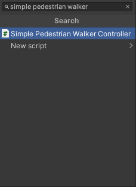

## Create a lanelet2
<!-- TODO -->

## Create a prefab

### Guidelines for making 3d models
<!-- TODO -->

### Add a Environment Script
Add en Environment Script into an Environment Object which should be a child of your Simulation Object.

1. Click on the 'Add Component' button in the Environment object

    

1. Search for `Environment` and select it

    

1. Set the MGRS offset position to the global coordinates in which models are created

    

1. For the Traffic Lanes to be positioned accurately you also need to set a positive 90 degree rotation over Y axis to an Environment Object

    

### Localization information
In AWSIM all objects are located with their real world coordinates.
This way the real world is represented accurately.

When adding some static element to your scene that is a part of the world (like 3D models of buildings, traffic lights etc.) it is a good practice to aggregate them in one parent Object called `Map` or something similar.

Then you can set a transformation of the parent Object `Map` to adjust the world position in reference to loaded Traffic Lanes from lanelet.

### Add roads, buildings, greenery, signs, road markings…
!!!important
    When adding static elements that belong to a certain map remember to add them to a Map Object as explained [here](#localization-information).

<!-- TODO -->

### Add a Directional Light
!!!tip
    For more details on lighting check out [official Unity documentation](https://docs.unity3d.com/Manual/Lighting.html).

1. Create a new child Object of the Environment and name it `Directional Light`

    

1. Click `Add Component` button, search for `light` and select it. 

    

2. Change light Type to `Directional`.
3. Now you can configure the directional light as you wish. E.g. change the intensity or orientation.

    

### Add a Volume
!!!tip
    For more details on volumes checkout [official Unity documentation](https://docs.unity3d.com/Packages/com.unity.render-pipelines.high-definition@11.0/manual/Volumes.html).

1. Create a new child object of the Environment and name it `Volume`

    

1. Click `Add Component` search for `volume` and select it.

    

1. Change the Profile to `Volume Profile` and wait for changes to take effect.

    

1. Now you can configure the Volume individually as you wish.

### Add NPCPedestrians
1. Make NPCPedestrians parent object.

    

2. Open `Assets/AWSIM/Prefabs/NPCs/Pedestrians` in Project view and drag a humanElegant into the NPCPedestrians parent object

    

    

1. Click `Add Component` in the humanElegant object and search for `Simple Pedestrian Walker Controller` Script and select it.

    This is a simple Script that makes the pedestrian indefinitely walk straight and turn around.
    You can configure pedestrian behavior with 2 parameters.

    - Duration: how long will the pedestrian walk straight
    - Speed: how fat will the pedestrian walk straight

    !!!tip
        The `Simple Pedestrian Walker Controller` Script is best suited to be used on pavements.

    

    

2. Finally position the NPCPedestrian on the scene where you want it to start walking.

    !!!note
        Remember to set correct orientation, as the NPCPedestrian will walk straight from the starting position with the starting orientation.

### Add a RandomTraffic
For information about how to add a Random Traffic to a scene please visit [this section](../AddARandomTrafficToScene/)

## Create a PCD from Mesh
<!-- TODO -->
