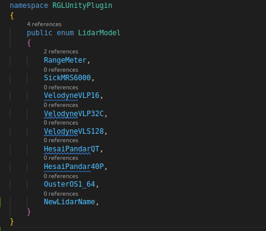
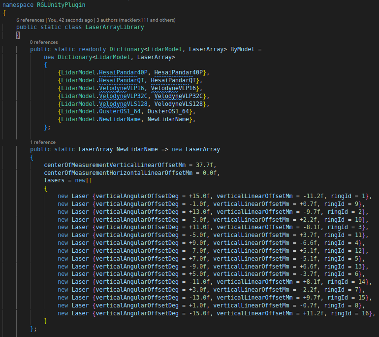
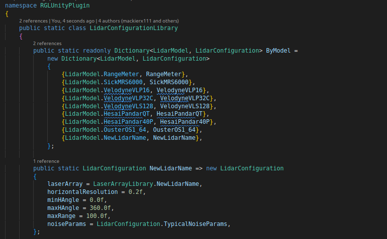

# Add new LiDAR
This section describes how to add a new *LiDAR* model that works with `RGL`, then create a prefab for it and add it to the scene.

!!! warning "Supported LiDARs"
    Not all lidar types are supported by `RGL`. Unfortunately, in the case of `MEMs` *LiDARs*, there is the non-repetitive phenomenon - for this reason, the current implementation is not able to reproduce their work.
## 1. Add new LiDAR model
The example shows the addition of a *LiDAR* named `NewLidarModel` using the `VelodyneVLP16` parameters.

To add a new *LiDAR* model, perform the following steps:

1. Add its name to the `LidarModels.cs`

1. If the *LiDAR* has a non-uniform laser array construction (e.g. different linear / angular spacing between lasers), add an entry to the `LaserArrayLibrary`, otherwise, skip this step.

1. Add an entry to `LidarConfigurationLibrary`. If the *LiDAR* has a uniform laser generate a uniform one using static method `LaserArray.Uniform()` - just like the `RangeMeter`.

1. Done. New LiDAR preset should be available via Unity Inspector.

## 2. Create new LiDAR prefab

1. Create an empty object and name it appropriately according to the *LiDAR* model.
1. Attach script `LidarSensor.cs` to created object.
1. Set the new added *LiDAR* model in `Model Preset` field, check if the configuration loads correctly. You can now customize it however you like.
1. `PointCloudVisualization.cs` will be added automatically, however, you can disable it.
1. For publishing point cloud via *ROS2* attach script `RglLidarPublisher.cs` script to created object.
1. Set the topics on which you want the data to be published and their frame.
2. Save the prefab in the project.

## 3. Scene preparation

The native `RGL` library needs a once-per-scene preparation to access models on the scene from the native library:

1. If you don't have one main parent with all *models* - create an empty object and name it `AutowareSimulation`.
2. Attach script `SceneManager.cs` to the main parent object.
3. Make sure that all model objects with Meshes in the scene are added as children of the created `AutowareSimulation` object.
4. Add the prepared *LiDAR* prefab by drag the prefab file and drop it into a scene

5. A *LiDAR* *GameObject* should be instantiated automatically

6. Now you can run the scene and check how your *LiDAR* works.

!!! success
    We encourage you to develop a vehicle using the new *LiDAR* you have added - learn how to do this [here](../../Tutorials/AddANewVehicle/).
