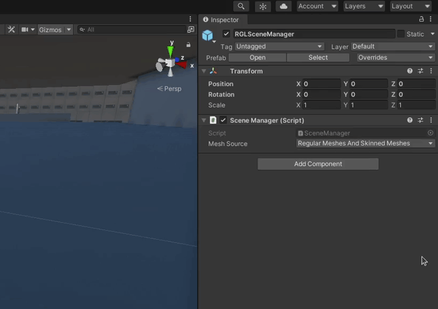

`SceneManager` is available as a prefab in the *AWSIM* project.
The prefab is located in the directory `Assets/AWSIM/Prefabs` in the *Project* tree.

`SceneManager` (`RGLSceneManager`) is used for synchronizing model data between *Unity* and [RobotecGPULidar](https://github.com/RobotecAI/RobotecGPULidar). You can read more about this in this [section](../../../../UserGuide/ProjectGuide/ExternalLibraries/RGLUnityPlugin/). 

!!! warning "Usage requirements"
    Before adding `SceneManager`, check that all objects in the scene meet the requirements for use - it is described [here](../../../../UserGuide/ProjectGuide/ExternalLibraries/RGLUnityPlugin/).

## Add a prefab to scene
<!-- TODO: What if I already have such a `AutowareSimulation` object? you don't need to copy the prefab, you can add a component - please split it or explain how do it -->
To add a `SceneManager` prefab to a scene you need to

1. Open the scene

    

1. Find the prefab in the project (`Assets/AWSIM/Prefabs` directory)

    

1. Drag the prefab into a Hierarchy view

    

1. Rename this prefab to something like `AutowareSimulation` or just `Simulation` with preferred prefix or suffix and place all your simulation *GameObjects* as children (if you don't have any yet, this is where you will be placing them).

    

    

## Selection of interaction strategies (Mesh Source)
There are three possible interaction strategies for obtaining *3D* models from *GameObjects*. Details about each source are described [here](../../../../UserGuide/ProjectGuide/ExternalLibraries/RGLUnityPlugin/).

Please see the following on how to select the preferred strategy.

