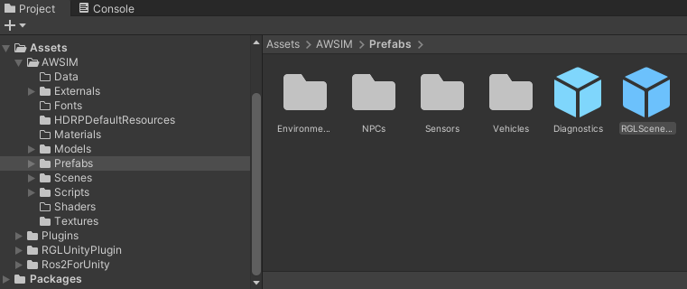
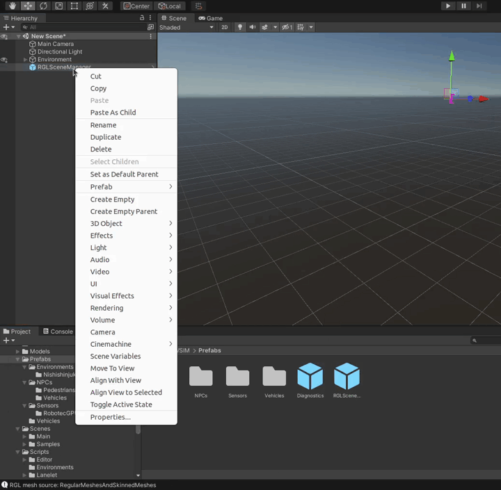
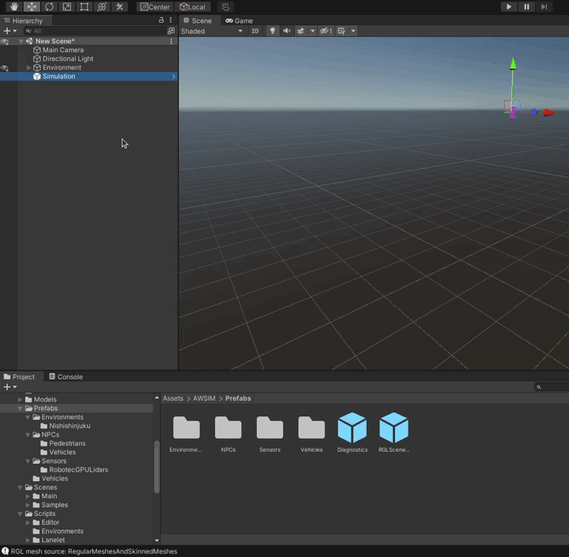
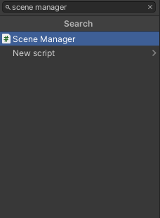

!!! info ""
    You can skip this section if you are not using LiDARs in your simulation.

`SceneManager` (`RGLSceneManager`) is used for synchronizing model data between *Unity* and [RobotecGPULidar](https://github.com/RobotecAI/RobotecGPULidar) to simulate LiDARs on the GPU. You can read more about this in this [section](../../../../UserGuide/ProjectGuide/ExternalLibraries/RGLUnityPlugin/).

!!! warning "Usage requirements"
    Before adding `SceneManager`, check that all objects in the scene meet the requirements for use - it is described [here](../../../../UserGuide/ProjectGuide/ExternalLibraries/RGLUnityPlugin/).

`SceneManager` can be added to the scene in two ways: [by using a prefab](#add-scenemanager-by-using-a-prefab) or [by adding a component](#add-scenemanager-by-adding-a-component).

## Add SceneManager by using a prefab
To add a `SceneManager` prefab to a scene you need to

1. Open the scene

    

1. Find the `RGLSceneManager` prefab in the project (`Assets/AWSIM/Prefabs` directory)

    

1. Drag the prefab into a Hierarchy view

    

1. `SceneManager` can be located anywhere on the scene, but it is recommended to place it in the highest hierarchy level. Rename this prefab with your simulation name and place all your simulation *GameObjects* as children (if you don't have any yet, this is where you will be placing them).

    

    

## Add SceneManager by adding a component

1. Add an empty game object and name it with your simulation name (e.g., `Simulation`)

1. Click on the `Simulation` *Object*

1. Click 'Add Component', search for `Scene Manager` and select it.

    

    

