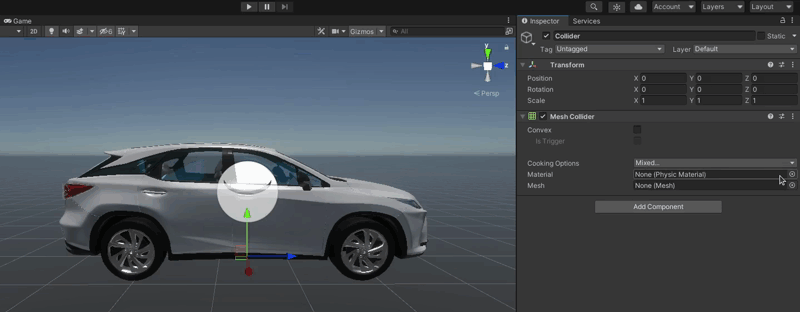
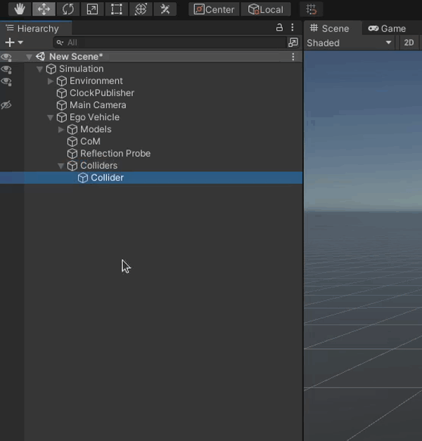
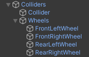

Next you need to add Colliders to your Vehicle.
To do this follow the steps below.

1. Add a child *Object* called `Colliders` to the `EgoVehicle` *Object*.

    

1. Shift parent *Object* `Colliders` accordingly as in earlier steps where we [shifted `Models`](./../AddVisualElements/#move-the-models).

### Add a Vehicle Collider
1. Add a child *Object* `Collider` to the `Colliders` *Object*.

    

1. Add a `Mesh Collider` component to the `Collider` *Object* by clicking on the 'Add Component' button in the *Inspector* view and searching for it.

    

1. Click on the arrow in mesh selection field and from the pop-up window select your collider mesh.
    Next click on the check-box called `Convex`, by now your collider mesh should be visible in the editor.

    

### Add Wheel Colliders
1. Add a child *Object* `Wheels` to the `Colliders` *Object*.

    

!!!note
    In this tutorial we will add only one wheel collider, but you should repeat the step for all 4 wheels.
    That is, follow the instructions that follow this message for every wheel your Vehicle has.

    - Front Left Wheel
    - Front Right Wheel
    - Rear Left Wheel
    - Rear Right Wheel

1. Add a child *Object* `FrontLeftWheel` to the `Wheels` *Object*.

    

2. Add a `Wheel Collider` component to the `FrontLeftWheel` *Object* by clicking 'Add Component' and searching for it.

    

3. Add a `Wheel` Script to the `FrontLeftWheel` *Object* by clicking 'Add Component' and searching for it.

    

4. Drag `FrontLeftWheel` *Object* from the `WheelVisuals` to the `Wheel Visual Transform` field.

    

5. Add a `Wheel Collider Config` Script to the `FrontLeftWheel` *Object* by clicking 'Add Component' and searching for it.

    

6. Configure the `Wheel Collider Config` Script so that the Vehicle behaves as you wish.

    

7. Set the Transform of `FrontLeftWheel` *Object* to match the visuals of your Vehicle.

    

!!! success "Successful configuration"
    If you have done everything right your `Colliders` *Object* should look similar to the one following.

    
