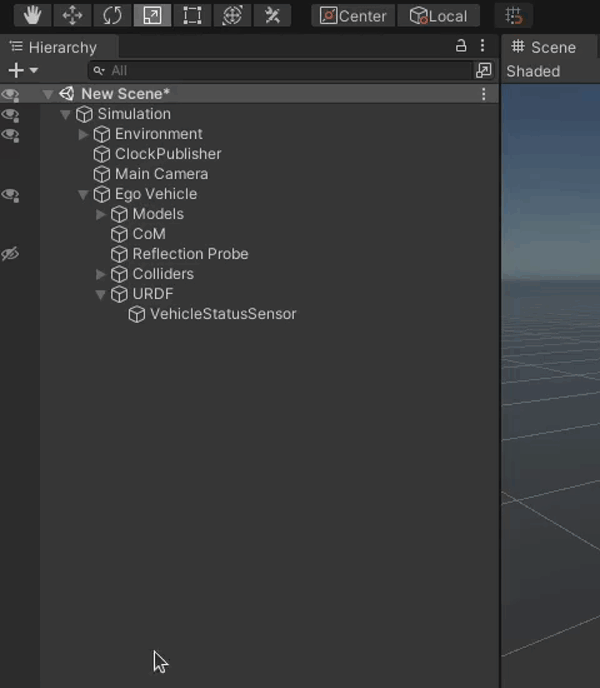
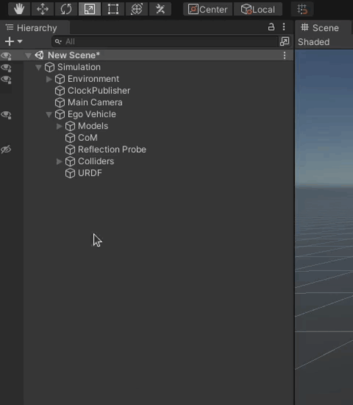
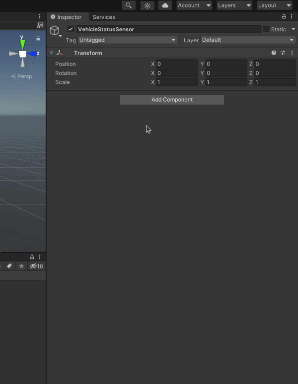
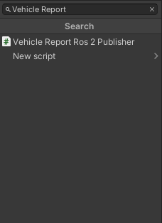
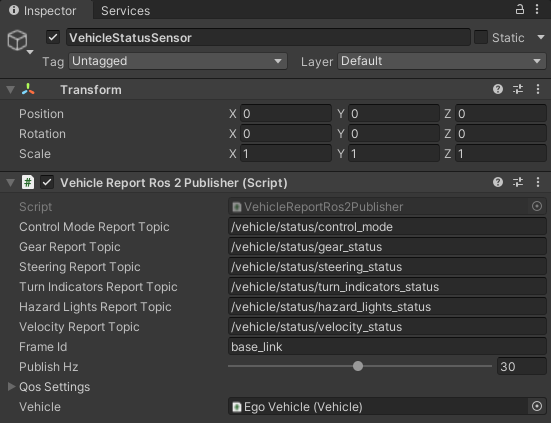

## AWSIM Sensors
<!-- TODO: ad links to sensors -->
There is a number of different sensors available in *AWSIM*.
Below we present a list of sensors with links to their individual pages

- [Vehicle Status Sensor](../../../UserGuide/ProjectGuide/Components/Sensors/VehicleStatus/)
- [GNSS](../../../UserGuide/ProjectGuide/Components/Sensors/Gnss/)
- [LiDAR](../../../UserGuide/ProjectGuide/Components/Sensors/Lidar/)
- [IMU](../../../UserGuide/ProjectGuide/Components/Sensors/Imu/)
- [Camera](../../../UserGuide/ProjectGuide/Components/Sensors/Camera/)
- [Pose Sensor](../../../UserGuide/ProjectGuide/Components/Sensors/GroundTruths/Pose/)

## Add links for sensors
Best practice is to replicate a *ROS* sensors transformations tree in Unity using *Objects*.

### Coordinate system conversion
Please note that Unity uses less common *left-handed* coordinate system.
Please keep this in mind while defining transformations.
More details about right-handed and left-handed systems can be found [here](https://en.wikipedia.org/wiki/Right-hand_rule).

To simplify the conversion process always remember that any point in ROS coordinate system `(x, y, z)` has an equivalent in the Unity coordinate system being `(-y, z, x)`.

The same can be done with the rotation.
ROS orientation described with roll, pitch and yaw `(r, p, y)` can be translated to Unity Rotation as follows `(p, -y, -r)`.

!!! danger "Unit conversion"
    Please remember to convert the rotation units.
    *ROS* uses radians and *Unity* uses degrees.
    The conversion from radians (`rad`) to degrees (`deg`) is as follows.
    
    ```
    deg = rad * 180 / PI
    ```

### Add transformations tree
!!! warning "URDF"
    Before following this tutorial please make sure you have an `URDF` *Object* like it is shown shown in [this section](../#add-a-base-for-sensors-urdf).

First we will have to add a `base_link` which is the root of all transformations.

Add a `base_link` *Object* as a child to the `URDF` *Object*.



!!!info "`base_link` transformation"
    Please remember to set an appropriate transformation of the `base_link` *Object* so that it is identical as the `base_link` used in *ROS* in reference to the Vehicle.
    
    This is very important, as a mistake here will result in all subsequent sensors being misplaced.

Inside the `base_link` we will represent all transformations contained in the *ROS* transformations tree.

You will have to check your Vehicle specific configuration.
You can do this in many ways, for example:

- Check the ROS specific `.yaml` parameter files containing information about each transformation.

    Here we see an example `.yaml` file containing transformation from the `base_link` to the `sensor_kit_base_link`:

    ```yaml
    base_link:
        sensor_kit_base_link:
            x: 0.9
            y: 0.0
            z: 2.0
            roll: -0.001
            pitch: 0.015
            yaw: -0.0364
    ```

- Check the values with *ROS* command line tools (for more information on these please visit [official ROS 2 documentation](https://docs.ros.org/en/foxy/Tutorials/Intermediate/Tf2/Introduction-To-Tf2.html)).

    You can run a command like the following to check a transformation between two frames.

    ```bash
    ros2 run tf2_ros tf2_echo [source_frame] [target_frame]
    ```

    Here we see an example command with the output containing transformation from the `base_link` to the `sensor_kit_base_link` (note that the line after `$` sign is the executed command):

    ```log
    $ ros2 run tf2_ros tf2_echo base_link sensor_kit_base_link
    [INFO] [1686654712.339110702] [tf2_echo]: Waiting for transform base_link ->  sensor_kit_base_link: Invalid frame ID "base_link" passed to canTransform argument target_frame - frame does not exist
    At time 0.0
    - Translation: [0.900, 0.000, 2.000]
    - Rotation: in Quaternion [-0.000, 0.008, -0.018, 1.000]
    - Rotation: in RPY (radian) [-0.001, 0.015, -0.036]
    - Rotation: in RPY (degree) [-0.057, 0.859, -2.086]
    - Matrix:
    0.999  0.036  0.015  0.900
    -0.036  0.999  0.000  0.000
    -0.015 -0.001  1.000  2.000
    0.000  0.000  0.000  1.000
    ```

#### Add one sensor link
!!!note
    In this step we will only add one sensor link.
    You will have to repeat this step for every sensor you want to add to your Vehicle.

Let's say we want to add a LiDAR that is facing right.

We have the following configuration files.

```yaml
base_link:
    sensor_kit_base_link:
        x: 0.9
        y: 0.0
        z: 2.0
        roll: -0.001
        pitch: 0.015
        yaw: -0.0364
```

```yaml
sensor_kit_base_link:
    velodyne_right_base_link:
        x: 0.0
        y: -0.56362
        z: -0.30555
        roll: -0.01
        pitch: 0.71
        yaw: -1.580
```

We can clearly see the structure of transformation tree.
The transformations are as follows.

```
base_link -> sensor_kit_base_link -> velodyne_right_base_link
```

We need to start adding these transformation from the root of the tree.
We will start with the `sensor_kit_base_link`, as the `base_link` already exists in our tree.

1. The first step is to add an *Object* named the same as the transformation frame (`sensor_kit_base_link`).

    

1. Next we have to convert the transformation from *ROS* standard to the *Unity* standard.
    This is done with the formulas show in [this section](#coordinate-system-conversion).

    The result of conversion of the coordinate systems and units is shown below.

    ```
    Position:
    (0.9, 0.0, 2.0)             ->  (0.0, 2.0, 0.9)
    Rotation:
    (-0.001, 0.015, -0.0364)    ->  (0.8594, 2.0856, 0.0573)
    ```

    The resulting `sensor_kit_base_link` *Object* transformation is shown below.

    

Now the same has to be done with the `velodyne_right_base_link`.

1. Add transformation *Object* (`velodyne_right_base_link`).

    !!!info
        Remember to correctly set the child *Object*, in this case we use `sensor_kit_base_link` as a child, because this is what the `.yaml` file says.

    

2. Convert the transformation into *Unity* coordinate system.

    The correct transformation is shown below.

    ```
    Position:
    (0, -0.56362, -0.30555)     ->  (0.56362, -0.30555, 0)
    Rotation:
    (-0.01, 0.71, -1.580)       ->  (40.68, 90.5273, 0.573)
    ```

    The final `velodyne_right_base_link` *Object* transformation is shown below.

    

!!!success
    If you have done everything right, after adding all of the sensor links your `URDF` *Object* tree should look something like the one following.

    

## Add sensors
After [adding links for all sensors](#add-links-for-sensors) you need to add the actual sensors into your Vehicle.

### Add a Vehicle Status Sensor

1. First add a `VehicleStatusSensor` *Object* as a child to the `URDF` *Object*.

    

2. Next add a `Vehicle Report Ros 2 Publisher` Script by clicking 'Add Component' button in the `VehicleStatusSensor` *Object*, searching for the script and selecting it like shown below.
    You will also need to specify your Vehicle in the Script.

    

    

3. The Script should be configured to work with *Autoware* by default.
    Such a configuration is shown below.

    

    If you need to, you can change the topics of communication with your autonomous driving software stack.

    !!! note "Frame Id"
        Please note that in this example we did not change the *Frame Id* field.
        This is the Frame Id used in the Header of the velocity messages.

        Frame Id is the name of frame of reference in which the received velocity will be interpreted by the autonomous driving software stack.
        Remember that the Frame Id must exist internally in the ROS transformations tree.

### Add a Pose Sensor
Drag a prefab called the same into the `base_link` *Object*.
You can locate it in the `Assets/AWSIM/Prefabs/Sensors` directory.


The `PoseSensor` is configured to work with *Autoware* by default.
If you wish to use different autonomous driving software stack you will have to change the configuration.
